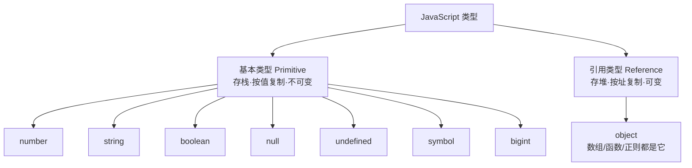

# 1.1 语言基础与类型系统

> 卷:卷一 · JavaScript 语言内核
> 难度:⭐ 基础 | 阅读时间:20min | 状态:已深化

---

## 引言:变量里到底装着什么

写 React、写 Vue、写 Node 之前,先得说清一件事:**变量里装着什么类型**。类型决定了它怎么存、怎么比较、怎么运算、怎么传参。后面闭包、原型、异步,全建立在"这个值是什么类型"之上。

---

## 一、7 种基本类型 + 1 种引用类型



| 类型 | 说明 | 示例 |
|------|------|------|
| `number` | 64 位双精度浮点 | `1`、`0.5`、`NaN`、`Infinity` |
| `string` | 不可变字符串 | `'hi'` |
| `boolean` | `true`/`false` | `true` |
| `null` | 空,原型链终点 | `null` |
| `undefined` | 声明未赋值 | `undefined` |
| `symbol` (ES6) | 唯一标识 | `Symbol('x')` |
| `bigint` (ES2020) | 大整数 | `9007199254740993n` |

> `typeof [] === "object"`、`typeof function(){} === "function"`——函数/数组本质都是 `object` 的子类型。

---

## 二、`typeof` 的两个著名坑

```js
typeof null      // "object"  ← 历史 bug,至今未改
typeof NaN       // "number"  ← NaN 是数字家族一员
```

**为什么 `typeof null === "object"`?**
早期 JS 用二进制低位的"类型标签"区分类型,对象的标签是 `000`,`null` 的机器码恰好全为 0,被 `typeof` 误判成对象。这是语言级历史遗留,只能"将错就错"。

> 判断 `null` 用 `x === null`;数组用 `Array.isArray`;引用类型用 `typeof x === "object" && x !== null`。

---

## 三、原始值 vs 引用值:栈与堆

| | 原始值 | 引用值 |
|---|--------|--------|
| 存储 | 栈,变量直接存值 | 堆,变量存**地址** |
| 复制 | 复制值本身 | 复制地址(指向同一块堆) |
| 可变性 | 不可变 | 可变 |

```js
let a = 1, b = a; b = 2;
console.log(a); // 1  ← 原始值互不影响

let o1 = { n: 1 }, o2 = o1; o2.n = 9;
console.log(o1.n); // 9  ← 引用值共享同一对象
```

**为什么这样设计?** 原始值大小固定、频繁创建销毁,放**栈**上"即用即弃"最快;对象大小不定、可能很大,放**堆**上、栈里只存地址(引用),避免反复搬运大对象。这个"栈存值、堆存对象"的模型,也解释了为什么 Vue3 的 `reactive` 只对对象有效、`ref` 才能包原始值。

---

## 四、值传递:函数传参的本质

JS 传参**统一是"值传递"**:把栈里的值复制一份传进去。

```js
function change(prim, ref) {
  prim = 100;             // 基本类型:改副本,不影响外部
  ref.name = "changed";   // 引用类型:改属性 → 影响外部
  ref = { name: "new" };  // 重新赋值:只改局部指向,不影响外部
}
let num = 1, obj = { name: "old" };
change(num, obj);
console.log(num, obj.name); // 1 "changed"
```

> 一句话:**基本类型改不动外部,对象能改"内容"但不能改"指向"。**

---

## 五、隐式类型转换(ToPrimitive)

**对象 → 原始值**:先 `valueOf()`,不行再 `toString()`。

**`+` 的两条规则:**

```js
1 + '2'      // "12"   ← 有字符串就拼接
1 + true     // 2      ← 无字符串转数字相加
1 + null     // 1      ← null 转 0
1 + undefined // NaN   ← undefined 转 NaN
```

**`==` vs `===`:** `==` 比较前做类型转换,易错;`===` 不做转换。

```js
null == undefined  // true(特例,只等于对方和自己)
'0' == false       // true
[] == false        // true
```

> **工程铁律:永远用 `===`。** 除非明确要 `null == undefined` 的"都是空值"判断。

---

## 六、Truthy 与 Falsy

记住 **8 个 falsy**,其余全 truthy:

```js
false, 0, -0, 0n, "", null, undefined, NaN
```

```js
if ("0") {}  // truthy(非空字符串)
if ([]) {}   // truthy(空数组)
if ({}) {}   // truthy(空对象)
```

> 判空数组用 `arr.length === 0`,判空对象用 `Object.keys(obj).length === 0`。

---

## 七、`number` 的精度问题

JS 数字统一是 **IEEE 754 双精度(64 位)**,因此:

```js
0.1 + 0.2 === 0.3  // false,实际 0.30000000000000004
```

**根因**:十进制小数转二进制时,很多是无限循环小数(如 0.1),64 位截断产生误差。

**安全整数**:`Number.MAX_SAFE_INTEGER === 2^53 - 1`。超出失真:

```js
9007199254740992 + 1 === 9007199254740992  // true
```

**解法**:小数比较用 `Math.abs(a-b) < Number.EPSILON`;金额放大为分或 `bigint`;大整数用 `bigint`。

---

## 八、`NaN` 与 `Infinity`

```js
NaN === NaN        // false  ← 唯一"不等于自己"的值
Number.isNaN(NaN)  // true   ← 用这个,别用全局 isNaN(会先转数字)
1 / 0              // Infinity
Infinity - Infinity // NaN
```

---

## 九、小结

```
类型:基本(7,存栈按值)+ 引用(1,object 存堆按址)
陷阱:typeof null === "object"、NaN !== NaN、0.1+0.2 !== 0.3
运算:ToPrimitive 隐式转换 + Truthy/Falsy → 工程统一用 ===
```

---

## 十、面试题

**Q1:`typeof typeof 1` 输出什么?**

```js
typeof 1      // "number"
typeof "number" // "string"  ← 答案是 "string"
```

**Q2:如何精确判断一个值的类型?**

```js
Object.prototype.toString.call(x)
// "[object Number]"/"[object Array]"/"[object Null]"...
// 比 typeof/instanceof 更全更准
```

**Q3:`const` 声明的对象为什么还能改属性?**

`const` 约束的是"变量与地址的绑定"不能变,而对象内部的堆内存仍可变——印证了栈/堆模型(第三节)。

---

📎 参考:ECMA-262 Type 章节、MDN《JavaScript 数据类型和数据结构》