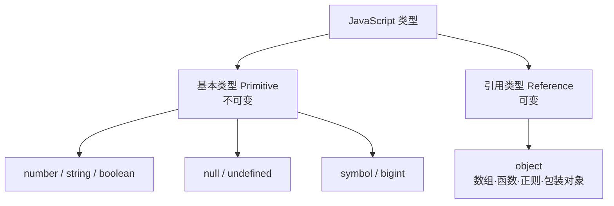
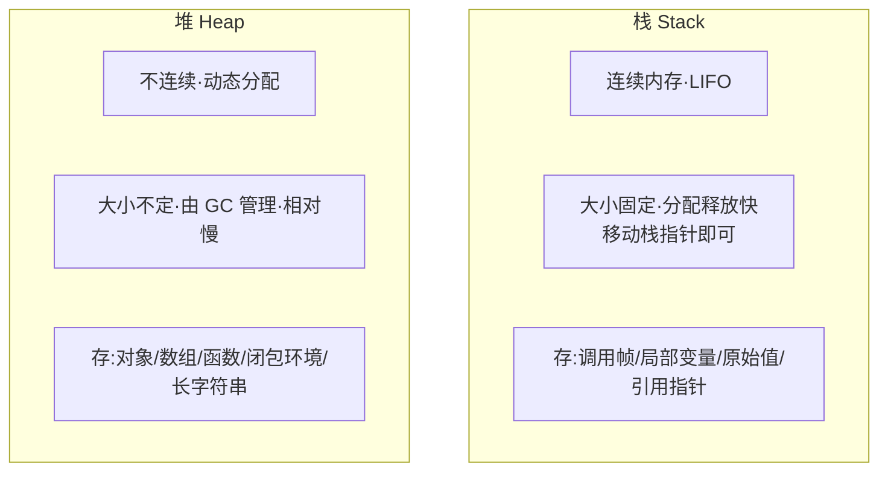

# 1.1 语言基础与类型系统

> 卷:卷一 · JavaScript 语言内核
> 阅读时间:40min

---

## 引言:变量里装着什么,以及它们"住"在哪里

类型系统决定变量怎么存、怎么比、怎么传;而**内存模型(栈与堆)**决定这些值"物理上"如何存放、何时回收。这两层是理解闭包、GC、性能、深拷贝的根基。本章把类型 + 内存一起讲透。

---

## 一、7 种基本类型 + 1 种引用类型



| 类型 | 说明 | 示例 |
|------|------|------|
| `number` | 64 位双精度浮点 | `1`、`0.5`、`NaN`、`Infinity` |
| `string` | 不可变 | `'hi'` |
| `boolean` | `true`/`false` | `true` |
| `null` | 空,原型链终点 | `null` |
| `undefined` | 声明未赋值 | `undefined` |
| `symbol` | 唯一标识(ES6) | `Symbol('x')` |
| `bigint` | 大整数(ES2020) | `9007199254740993n` |

> `typeof [] === "object"`、`typeof function(){} === "function"`——数组/函数本质都是 `object` 的子类型。

---

## 二、内存模型:栈与堆(核心深化)

这是类型系统背后真正的"物理层"。搞懂它,才能回答"原始值和引用值为什么行为不同"。

### 2.1 两者对比



| | 栈(Stack) | 堆(Heap) |
|---|-----------|----------|
| 结构 | 连续、后进先出 | 不连续、动态 |
| 大小 | 固定、小 | 不固定、大 |
| 速度 | **快**(移动栈指针) | 慢(需分配 + GC) |
| 生命周期 | 函数返回即弹出 | GC 判定 |
| 存什么 | 原始值、引用指针、调用帧 | 对象、大/可变数据 |

### 2.2 函数调用栈(Call Stack)

每次函数调用,在栈上压入一个**栈帧(frame)**,存局部变量、参数、返回地址;函数返回则弹出:

```js
function a() { const x = 1; b(); }
function b() { const y = 2; }
a();   // 栈:global → a 帧 → b 帧 → (b 返回弹出)→ (a 返回弹出)
```

**栈溢出(Stack Overflow):** 递归过深或局部变量过大,栈空间耗尽:

```js
function recurse() { recurse(); }
recurse(); // RangeError: Maximum call stack size exceeded
```

### 2.3 为什么分"栈"和"堆"

> **核心矛盾:快 vs 灵活。**
> - **栈**快,但要求"大小可静态确定、生命周期可预测"(函数返回即死),适合小且短命的原始值;
> - **堆**灵活,能存大小不定、生命周期不定(可能被多处引用、被函数返回后继续用)的数据。
> 一个对象可能"逃逸"出创建它的函数(被 return 出去、被闭包捕获),**不能放栈**(函数返回栈就清空了),只能放堆,靠 GC 管理。这就是"对象必须住堆"的根本原因。

### 2.4 V8 的实际存储(比"原始值存栈"更细)

"原始值存栈、对象存堆"是**教学简化**。V8 实际更细:

1. **不是所有原始值都在栈**:它们作为**局部变量**时在栈(小整数、布尔);但长字符串、大数值可能也在堆上分配
2. **闭包变量"逃逸"到堆**:一个局部变量被闭包捕获后,即使函数返回,它也不能随栈帧销毁,会搬进堆(这正是 1.2 里"闭包让 count 不被回收"的底层原因)
3. **全局变量存堆**
4. **逃逸分析(Escape Analysis)**:V8 会分析局部对象是否"逃逸出函数",若不逃逸,就**直接在栈上分配**,省掉堆分配和 GC——这就是"对象未必都在堆"的优化

```js
function makePoint() {
  const p = { x: 1, y: 2 };   // 若 p 不逃逸,V8 可能栈上分配
  return p.x;
}
```

> 变量"逻辑上"分原始/引用,但"物理上"住栈还是堆,由**生命周期 + 大小 + 是否逃逸**决定,由引擎动态调度。

---

## 三、深拷贝 vs 浅拷贝(堆引用的直接后果)

引用值复制时只复制地址(共享堆对象),于是有了拷贝之分:

```js
const obj = { name: "a", info: { age: 18 } };

// 浅拷贝:只复制第一层,嵌套对象仍共享
const shallow = { ...obj };
shallow.info.age = 99;
console.log(obj.info.age); // 99 ← !!!嵌套被共享,被改了
```

```js
// 深拷贝:递归复制所有层级(示例地址)
const deep = structuredClone(obj);   // 现代原生深拷贝
deep.info.age = 1;
console.log(obj.info.age); // 18 ← 互不影响
```

**`JSON.parse(JSON.stringify(obj))` 的三个坑:**

```js
const o = { a: undefined, b: function(){}, c: NaN };
JSON.parse(JSON.stringify(o)); // { } ← undefined/函数丢失;NaN 变 null
// 还会:循环引用直接报错;Date 变字符串
```

**`structuredClone` 的底层原理(结构化克隆算法):**

`structuredClone` 不是"JSON 序列化",而是**结构化克隆算法(structured clone algorithm)**——按对象实际结构**递归复制整个对象图**:

- ✅ **支持循环引用**(对象引用自身不报错;JSON 法会 `TypeError`)
- ✅ **保留类型**:`Date`/`RegExp`/`Map`/`Set`/`ArrayBuffer`/`TypedArray`/`Blob` 等原样克隆(JSON 法会丢/转错)
- ❌ **不支持**:函数、DOM 节点、`Error` 对象(抛 `DataCloneError`)
- 可选第二参 `transferList`:把 `ArrayBuffer` 等**转移所有权(零拷贝)**而非复制(同 2.7 Worker 的 Transferable)

> 选择:简单纯数据用 `JSON` 法;要**完整类型 + 循环引用**用 `structuredClone`;要处理函数/极致性能则手写递归 + `WeakMap`。

📎 官方:MDN《structuredClone()》 https://developer.mozilla.org/zh-CN/docs/Web/API/structuredClone

---

## 四、装箱与拆箱(Boxing / Unboxing)

**疑问:原始 string 为什么能调 `.length`?**

```js
"abc".length;   // 3 —— 原始值没有属性,为什么能访问?
// 因为"自动装箱":JS 临时把原始值包成对应的「包装对象」String,取完再丢弃
```

```js
const s = new String("abc");  // 显式装箱 → 是对象!
typeof s;                     // "object"
s === "abc";                  // false(对象 ≠ 原始值)
```

**其他原语也有包装对象:** `Number`、`Boolean`、`String`、`Symbol`、`BigInt`(`null`/`undefined` 没有)。

**数字字面量装箱的坑:**

```js
1.toString();   // ❌ 语法错误(解析成小数点了)
(1).toString(); // "1" ✅
1..toString();  // "1" ✅
```

> **工程启示:永远用原始值,别用 `new String()`/`new Number()`**——包装对象是对象,`===` 判断会出错,还拖性能。

---

## 五、`typeof` 的两个著名坑

```js
typeof null      // "object"  ← 历史 bug(二进制类型标签全 0)
typeof NaN       // "number"  ← NaN 是数字家族
```

**为什么 `typeof null === "object"` 不改?** 早期 JS 用二进制低位"类型标签"区分类型,对象标签 `000`,`null` 机器码恰好全 0 被误判。修复会**破坏海量历史代码的兼容性**,所以只能保留这个历史行为。

---

## 六、类型判断的完整方案(四种对比)

```js
const v = [];
typeof v;                        // "object"(只够查基础类型)
v instanceof Array;              // true(沿原型链查,受原型修改影响)
Array.isArray(v);                // true(数组专用,最稳)
Object.prototype.toString.call(v); // "[object Array]"(万能,最全最准)
```

| 方法 | 能力 | 局限 |
|------|------|------|
| `typeof` | 查基础类型 + function | `null`→object;引用全→object |
| `instanceof` | 查原型链归属 | 跨 iframe/realm 失效;篡改原型受影响 |
| `Object.prototype.toString` | **最全最准** | 需 `.call` 借用 |

```js
// 封装一个万能类型判断
const getType = (v) => Object.prototype.toString.call(v).slice(8, -1).toLowerCase();
getType(null);   // "null"
getType([]);     // "array"
getType(new Date()); // "date"
```

**`Object.prototype.toString` 的底层原理:**

它读取对象的内部槽 **`[[Class]]`**(或 `Symbol.toStringTag`)拼成 `[object Xxx]` 字符串。与 `typeof`/`instanceof` 不同:它**不关心原型链、不受篡改影响**,直接读内部标记,所以能精准区分 `null`/数组/日期等。自定义对象可设 `Symbol.toStringTag` 改变它:

```js
const o = { [Symbol.toStringTag]: "MyObj" };
Object.prototype.toString.call(o); // "[object MyObj]"
```

📎 官方:[MDN《Object.prototype.toString》](https://developer.mozilla.org/zh-CN/docs/Web/JavaScript/Reference/Global_Objects/Object/toString) · [MDN《Symbol.toStringTag》](https://developer.mozilla.org/zh-CN/docs/Web/JavaScript/Reference/Global_Objects/Symbol/toStringTag)

---

## 七、值传递:函数传参的本质

JS 传参**统一是"值传递"**(复制栈里的值):

```js
function change(prim, ref) {
  prim = 100;             // 基本类型:改副本
  ref.name = "changed";   // 引用类型:改属性 → 影响外部
  ref = { name: "new" };  // 重新赋值:只改局部指向
}
let num = 1, obj = { name: "old" };
change(num, obj);
console.log(num, obj.name); // 1 "changed"
```

> **基本类型改不动外部;对象能改"内容"(堆)但不能改"指向"(栈引用)。**

---

## 八、隐式类型转换(ToPrimitive 完整规则)

**对象 → 原始值(ToPrimitive),完整顺序:**

1. 若 `Symbol.toPrimitive` 存在,调用它(最高优先)
2. 否则按 hint:默认顺序 `valueOf()` → `toString()`(Date 特殊:先 `toString`)
3. `Symbol` 转原始值时用加法会**直接抛错**(不隐式转)

```js
const obj = {
  [Symbol.toPrimitive](hint) { return hint === "number" ? 42 : "obj"; },
};
obj + 1;   // "obj1"(hint=default)
+obj;      // 42(hint=number)
```

**`+` 的两条规则:**

```js
1 + '2'       // "12"(有字符串就拼)
1 + true      // 2(无字符串转数字)
1 + null      // 1(null→0)
1 + undefined // NaN(undefined→NaN)
1 + Symbol()  // TypeError(Symbol 不隐式转)
```

**`==` 的宽松相等(易错):**

```js
null == undefined  // true(特例)
'0' == false       // true
[] == false        // true(空数组 toString→""→0)
```

> **铁律:永远用 `===`**;`==` 的价值只剩 `x == null` 这个"同时判断 null 和 undefined"的惯用法(`x == null` 等价 `x === null || x === undefined`)。

---

## 九、Truthy 与 Falsy

8 个 falsy:`false, 0, -0, 0n, "", null, undefined, NaN`,其余全 truthy。

```js
if ("0") {}  // truthy(非空字符串)
if ([]) {}   // truthy(空数组)
if ({}) {}   // truthy(空对象)
```

> 判空数组 `arr.length === 0`;判空对象 `Object.keys(obj).length === 0`。

---

## 十、`number` 精度与 BigInt

64 位双精度带来的经典问题:

```js
0.1 + 0.2 === 0.3  // false,实际 0.30000000000000004
```

**根因**:十进制小数转二进制多是无限循环,64 位截断产生误差。

**安全整数**:`Number.MAX_SAFE_INTEGER === 2^53 - 1`,超出失真:

```js
9007199254740992 + 1 === 9007199254740992  // true
```

**解法:** 小数比较 `Math.abs(a-b) < Number.EPSILON`;金额放大为分或 decimal 库;大整数用 `bigint`。

```js
10n + 20n;          // 30n(精确)
1n + 1;             // TypeError(BigInt 不能与 Number 混算)
BigInt(9007199254740992) + 1n; // 9007199254740993n
```

---

## 十一、特殊值:`NaN` / `Infinity` / `null` vs `undefined`

```js
NaN === NaN        // false(唯一不等于自己的值)
Number.isNaN(NaN)  // true(用这个,别用全局 isNaN)
1 / 0              // Infinity
Infinity - Infinity // NaN
```

**`null` vs `undefined`:**

| | `null` | `undefined` |
|---|--------|-------------|
| 含义 | 人为置空(有意的"无") | 系统缺省(声明的"无值") |
| `typeof` | "object"(bug) | "undefined" |
| 惯用 | 手动赋空、原型终点 | 参数缺失、访问不存在的属性 |

---

## 十二、小结

```
类型:基本(7,不可变)+ 引用(1,object 可变)
内存:栈(快·小·调用帧/原始值/指针)vs 堆(慢·大·对象/闭包环境,GC 管)
     └─ 真相:住哪由生命周期/大小/逃逸决定;闭包变量逃逸到堆;逃逸分析可栈上分配对象
派生:深/浅拷贝(引用共享)、装箱拆箱(原语.方法)、栈溢出(递归过深)
判断:typeof / instanceof / Array.isArray / Object.prototype.toString(最准)
转换:ToPrimitive(Symbol.toPrimitive > valueOf > toString)、+两条规则、===铁律
数字:0.1+0.2 误差、2^53 安全整数、BigInt(不与 Number 混算)
```

---

## 十三、面试题

**Q1:`typeof null` 为什么是 `"object"`?为什么至今不修?**

早期 JS 用二进制低位"类型标签"区分类型,对象标签是 `000`,`null` 的机器码恰好全 0 被误判。修复会破坏海量历史代码的兼容性,只能保留。

**Q2:详细说明"引用传递"和"值传递",JS 到底是哪个?**

JS **统一是值传递**:传参时复制栈里的值。基本类型复制值本身(改动不影响外部);引用类型复制的是**地址**(传的是引用的副本),所以能改堆里的属性、但不能改外部的指向。严格说 JS 没有"引用传递"(C++ 的引用语义),是"共享引用 + 值传递"。

**Q3:`JSON.parse(JSON.stringify(obj))` 深拷贝的三个致命坑?**

① `undefined`、函数、`Symbol` 会**丢失**;② `NaN`/`Infinity` 变 `null`;③ **循环引用**直接报错;`Date` 变字符串。需要完整拷贝用 `structuredClone` 或手写递归 + WeakMap。

**Q4:为什么"基本类型不可变"?举例说明**

基本类型一旦创建,值不能被原地修改;"修改"其实是在创建新值:

```js
let s = "abc";
s[0] = "z";        // 无效(严格模式报错)
console.log(s);    // "abc"
s = "zbc";         // 这是重新赋值,指向新字符串,旧字符串没变
```

**Q5:栈溢出的原因和常见触发场景?**

函数调用在栈上压栈帧,递归过深或局部变量过大时栈空间耗尽报 `Maximum call stack size exceeded`。常见:无限递归、深递归未用尾递归/迭代、超大规模局部数组。

---

📎 参考:ECMA-262(类型系统 / ToPrimitive)、MDN《JavaScript 数据类型和数据结构》、V8《Memory management》/《escape analysis》