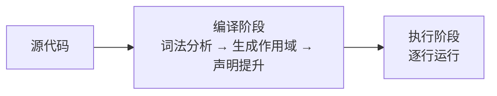
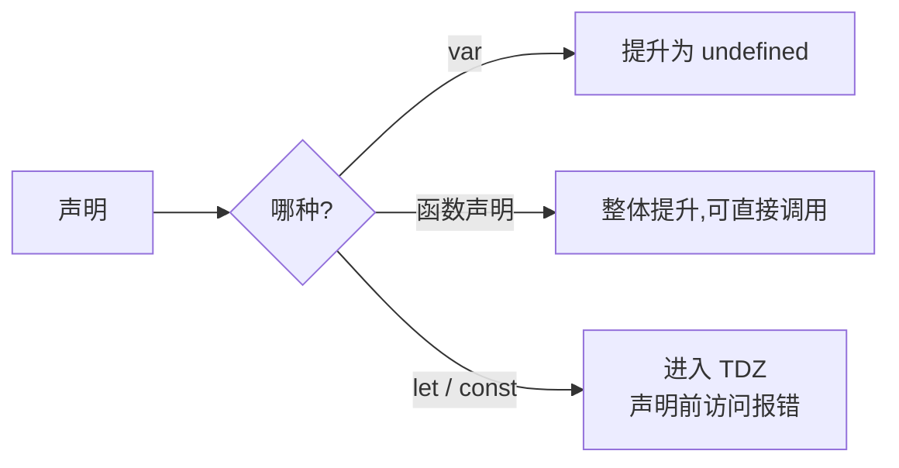
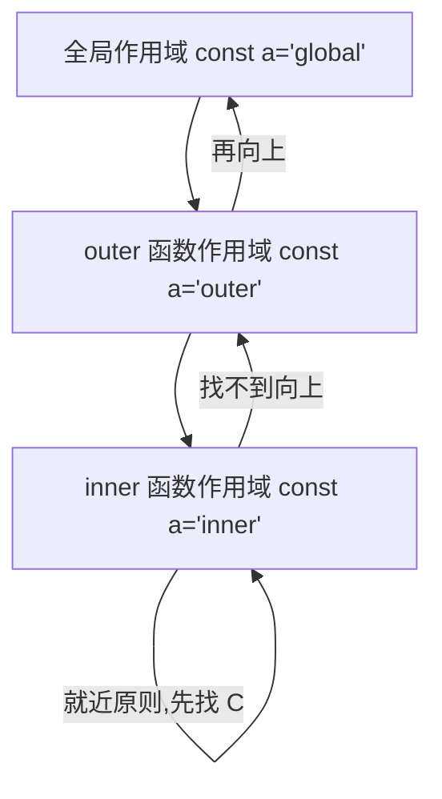

# 1.2 作用域与闭包

> 卷:卷一 · JavaScript 语言内核
> 难度:⭐⭐ 进阶 | 阅读时间:25min | 状态:已深化

---

## 引言:变量在哪里能访问,谁访问到了谁

作用域决定了"变量在哪里能访问";它背后藏着四个高频考点:**变量提升、暂时性死区、作用域链、闭包**。而闭包又是 Vue 响应式、React Hooks、防抖节流的底层机制,绕不开。

---

## 一、JS 是"编译型"语言(先编译,再执行)

标准引擎(V8)的执行分两步:



**正是这个"先编译",产生了「变量提升」。**

```js
console.log(a); // undefined ← 不是报错!var a 已提升但未赋值
var a = 1;
```

---

## 二、三种作用域

| 作用域 | 边界 | 说明 |
|--------|------|------|
| 全局 | 整个脚本 | 挂 `window`(浏览器) |
| 函数 | `function` 内 | `var` 属于这一层 |
| 块级 | `{ }` 内 | `let`/`const` 属于这一层(ES6) |

```js
var x = 1;
function foo() {
  var y = 2;        // 函数作用域
  if (true) {
    let z = 3;      // 块级
    var w = 4;      // var 无视块级!仍是函数作用域
  }
  console.log(w); // 4
  // console.log(z); // ReferenceError
}
```

---

## 三、变量提升与 TDZ

**`var` 提升:只提声明,不提赋值**;函数声明整体提升;`let`/`const` 有提升但进**暂时性死区**:

```js
console.log(b); // ReferenceError: Cannot access 'b' before initialization
let b = 1;
```



> 记忆:var 提升后是 `undefined`,let/const 提升后是"死区报错"。

---

## 四、作用域链:词法作用域

JS 采用**词法作用域(静态作用域)**:作用域由**书写位置**决定,而非调用位置。



```js
const a = "global";
function outer() {
  const a = "outer";
  function inner() {
    const a = "inner";
    console.log(a); // "inner" ← 就近原则
  }
  inner();
}
outer();
```

---

## 五、闭包(Closure)

### 5.1 定义

> **闭包 = 函数 + 它定义时所在「词法作用域」的引用。** 即使外部函数已执行完,内层函数仍"记住"并访问其变量。

```js
function outer() {
  let count = 0;
  return function inner() {
    count++;          // 引用 outer 的 count
    return count;
  };
}
const fn = outer();   // outer 执行完,count 却没销毁
console.log(fn());    // 1
console.log(fn());    // 2
```

**为什么 count 没被回收?** 返回的 `inner` 仍持有 `count` 所在作用域的引用,GC 无法回收它。

### 5.2 三个形成条件

1. 函数**嵌套定义**
2. 内层**引用**外层变量
3. 内层函数被**返回到外部 / 在外层之外调用**

### 5.3 经典 `var` 循环陷阱

```js
for (var i = 0; i < 3; i++) setTimeout(() => console.log(i), 0);
// 3 3 3(共享同一个 i)
```

修复三法:`let`(每次迭代独立作用域)/ IIFE 固化参数 / 闭包快照。

---

## 六、闭包的实际用途

| 场景 | 说明 |
|------|------|
| 数据私有化 | 模拟私有变量 |
| 防抖/节流 | 闭包保存 timer,跨调用共享 |
| 柯里化/偏函数 | 固定部分参数 |
| 函数缓存 | 存计算结果 |
| 模块化 | IIFE + 闭包隔离 |

**手写防抖(闭包核心应用):**

```js
function debounce(fn, delay) {
  let timer = null;              // 闭包保存 timer
  return function (...args) {
    clearTimeout(timer);
    timer = setTimeout(() => fn.apply(this, args), delay);
  };
}
```

---

## 七、闭包的代价:内存泄漏

闭包让外层变量无法被 GC 回收;若闭包本身长期无用却未释放,会泄漏。

```js
let big = { data: new Array(1000000) };
let keep = () => console.log(big.data.length);
// keep 长期无用且未释放 → big 一直被锁
keep = null;   // 用完显式断引用
```

> **闭包本身不必然泄漏**,只有"生命周期过长 + 持有大对象 + 忘记释放"才成问题。

---

## 八、小结

```
作用域:全局 / 函数 / 块级(let/const);查找走词法作用域链(就近)
前置:编译期 → 提升(var=undefined;函数=整体;let/const=TDZ)

闭包 = 函数 + 外部词法作用域的引用
条件:嵌套 + 引用外层 + 返回/外调
用途:私有变量/防抖节流/柯里化/缓存/模块化
代价:持有引用不释放 → 可能泄漏(用完置 null)
```

---

## 九、面试题

**Q1:下面输出什么?**

```js
var a = 1;
function fn() { console.log(a); var a = 2; }
fn(); // undefined(函数内 var a 提升遮蔽外层,打印时未赋值)
```

**Q2:为什么 React 的 Hook 能"记住"上一次的值?**

底层借闭包 + 链表存 hook 状态,每次渲染从"上一次的函数作用域"读状态——正是闭包"跨执行持有变量"在框架层的体现。

**Q3:哪些是闭包?**

```js
function a(){ var x=1; function b(){ return x; } return b; } // ✅
function c(){ var y=1; return y; }                           // ❌ 未返回函数
[1,2,3].map(n => n*2)                                        // ❌ 未引用外层变量
```

---

📎 参考:MDN《闭包》、ECMA-262 Execution Context / Lexical Environment 章节