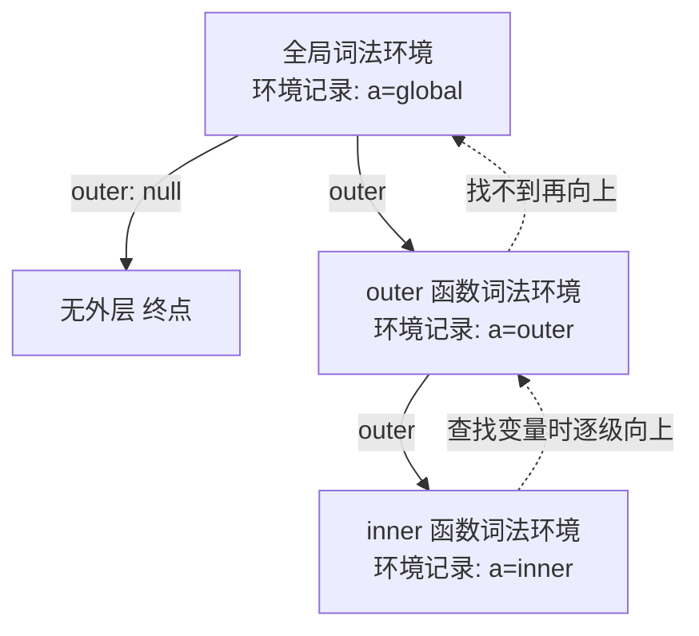
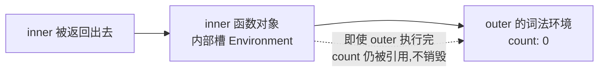

# 1.2 作用域与闭包

## 引言:变量在哪里能访问,谁访问到了谁

作用域决定"变量在哪能访问";闭包是"函数对其定义处变量的引用"。要真正吃透,得往下挖到 **执行上下文与词法环境** 这一层,并从 1.1 的内存模型看闭包到底"把变量存哪了"。

---

## 一、作用域基础

### 1.1 词法作用域(静态作用域)

JavaScript 是**词法作用域(lexical scoping)**:变量的可访问范围由**它在源代码里的声明位置**决定,而不是"函数在哪里被调用"决定。所以嵌套函数能访问其外部作用域里声明的变量:

```js
function init() {
  var name = "Mozilla";        // name 是 init 的局部变量
  function displayName() {
    console.log(name);         // 内部函数能访问父函数的 name
  }
  displayName();
}
init();   // "Mozilla"
```

`displayName()` 没有自己的局部变量,却能访问 `init()` 里的 `name`——这就是词法作用域:"解析器在函数嵌套时,按变量声明的位置决定它在哪里可用"。

### 1.2 三种作用域 + 块级作用域

| 作用域 | 边界 | 说明 |
|--------|------|------|
| 全局 | 整个脚本 | 挂 `window`(浏览器) |
| 函数 | `function` 内 | `var` 属于这一层 |
| 块级 | `{ }` 内 | `let`/`const`(ES6) |

**`var` 不认块**:ES6 之前变量只有函数作用域和全局作用域,花括号 `{}` 不为 `var` 创建作用域:

```js
if (Math.random() > 0.5) {
  var x = 1;
} else {
  var x = 2;
}
console.log(x);   // 1 或 2 —— 块没有隔离 var,x 是全局变量!

// 用 let/const 才是块级作用域:
if (Math.random() > 0.5) {
  const y = 1;
} else {
  const y = 2;
}
console.log(y);   // ReferenceError: y is not defined
```

### 1.3 var / let / const 对比

| | `var` | `let` | `const` |
|---|-------|-------|---------|
| 作用域 | 函数 | 块级 | 块级 |
| 提升 | 提升为 undefined | 提升但 TDZ | 提升但 TDZ |
| 重复声明 | 允许 | 报错 | 报错 |
| 重新赋值 | 允许 | 允许 | 不允许 |
| 挂 window | 是(顶层) | 否 | 否 |
| 必须初始化 | 否 | 否 | 是 |

```js
var a; var a;        // ✅ 允许重复声明
let b; let b;        // ❌ SyntaxError
const c;             // ❌ 必须初始化
const d = 1; d = 2;  // ❌ 不可重新赋值
```

> `const` 的"不可变"只约束**绑定**(不能重新赋值),不约束值本身:`const obj = {}; obj.x = 1` 合法。

### 1.4 函数声明提升 vs 函数表达式

```js
foo();   // "foo" —— 函数声明整体提升,声明前可调用
function foo() { console.log("foo"); }

bar();   // TypeError: bar is not a function
var bar = function () { console.log("bar"); };   // 只提升变量名,函数体留到赋值
```

---

## 二、执行上下文与词法环境(底层核心)

### 2.1 执行上下文(Execution Context)

每次函数调用,都会创建一个**执行上下文**,包含三部分:

```
执行上下文 = 词法环境(LexicalEnvironment)+ 变量环境(VariableEnvironment)+ this
```

- **创建阶段**:建立词法环境、登记所有声明(提升就发生在这一刻)
- **执行阶段**:逐行执行、赋值、调用

### 2.2 词法环境(Lexical Environment)

```
词法环境 = 环境记录(Environment Record:当前作用域的变量)+ 对外层环境的引用 outer
```



**作用域链的本质,就是词法环境的这条 `outer` 引用链。**

### 2.3 变量提升的底层过程

```js
console.log(a);  // undefined
var a = 1;
```

- **编译期(创建环境)**:环境记录里登记 `a`,初始化为 `undefined`
- **执行期**:`var a = 1` 才对 `a` 赋值
- → "提升" = 创建环境时先登记声明,赋值留到执行时

### 2.4 暂时性死区(TDZ)

```js
console.log(b); // ReferenceError(暂时性死区 TDZ)
let b = 1;
```

`let/const` 编译期也登记了,但被标记为"未初始化",声明前访问就抛错。**为什么要有 TDZ?** `var` 提升成 `undefined` 会掩盖"用了未初始化变量"的错误;TDZ 让 `let/const` 在声明前访问直接报错,把 bug 暴露在明处——这是更安全的设计。

---

## 三、闭包是什么

### 3.1 定义

> **闭包 = 函数 + 它定义时所在的词法环境。**

MDN 官方定义:闭包是由"函数"以及"声明该函数的词法环境"组合而成的。这个环境包含了闭包创建时作用域内的所有局部变量。

```js
function makeFunc() {
  const name = "Mozilla";
  function displayName() {
    console.log(name);
  }
  return displayName;      // 内部函数在"执行前"就从外部函数返回了
}
const myFunc = makeFunc();
myFunc();                  // "Mozilla" —— makeFunc 已执行完,name 仍可用
```

`myFunc` 是 `displayName` 实例的引用,它带着**自己的词法环境引用**,`name` 就在那个环境里。所以即使 `makeFunc()` 执行完毕,`myFunc()` 仍能访问 `name`。

### 3.2 类比理解

把闭包比作:你(内部函数)从家里(外部函数)出门,随身带了一把家里的钥匙(引用外部变量);即使走到千里之外(外部函数出栈),只要钥匙还在,就能随时打开家门(访问外部变量)。家里的东西不会因为你出门就消失,因为你还拿着钥匙(闭包引用)。

### 3.3 核心判断标准(两个条件)

同时满足才形成闭包:

1. **函数 A 内部定义了函数 B**
2. **函数 B 访问了 A 作用域内的变量**,且 **B 被暴露到 A 之外**(return 出去 / 赋值给全局 / 作为参数传出去)

```js
function a(){ var x=1; function b(){ return x; } return b; }  // ✅ 嵌套 + 引用 + 返回
function c(){ var y=1; return y; }                            // ❌ 未返回函数
[1,2,3].map(n => n*2)                                        // ❌ 未引用外层变量
```

### 3.4 makeAdder:函数工厂(不同实例,不同词法环境)

```js
function makeAdder(x) {
  return function (y) {
    return x + y;
  };
}
const add5  = makeAdder(5);
const add10 = makeAdder(10);

console.log(add5(2));    // 7
console.log(add10(2));   // 12
```

`makeAdder` 是**函数工厂**:它生产"把参数加固定值"的函数。`add5` 和 `add10` **共享同一个函数体,但保存了不同的词法环境**——`add5` 的环境里 `x=5`,`add10` 的环境里 `x=10`。这是理解"闭包各自独立"最直观的例子。

---

## 四、闭包的底层原理

### 4.1 `[[Environment]]` 内部槽

每个函数对象都有一个内部槽 `[[Environment]]`,指向**它被定义时**所在的词法环境。这个引用让函数即使离开定义处执行,仍能访问当时的变量:



```js
function outer() {
  let count = 0;
  return function inner() {
    count++;
    return count;
  };
}
const fn = outer();
fn(); // 1
fn(); // 2  ← count 被 inner 持续持有
```

### 4.2 内存模型:变量逃逸到堆(呼应 [1.1](/卷一-JavaScript语言内核/1.1-语言基础与类型系统))

**为什么 `outer` 执行完,`count` 没被销毁?** 按 1.1 的栈/堆模型:局部变量本应随 `outer` 的栈帧弹出而销毁;但一旦被 `inner`(它被返回、逃逸了)引用,`count` 就从栈"逃逸"到堆,由嵌套的词法环境持有,GC 要等 `inner` 也不再被引用才回收它。**闭包能"持有"变量的本质,就是变量被引用逃逸到了堆上。**

### 4.3 词法作用域 + GC 规则

闭包能成立,依赖两件事:

- **词法作用域**:内部函数能访问外部函数的变量(定义时确定)
- **GC 规则**:引擎回收"无引用"的变量,但被闭包引用的变量会**保留在内存**里(不会随外部函数出栈而销毁)

### 4.4 闭包捕获的是"引用"而非"值"(重要坑)

闭包记住的是**变量本身**,不是变量的当前值。外部变量后续改了,闭包读到的是新值:

```js
function test() {
  let num = 10;
  const fn = () => console.log(num);
  num = 20;         // 返回前改了
  return fn;
}
const result = test();
result();           // 20(不是 10!闭包读的是 num 的最新值)
```

> 要捕获"当时的固定值",用 IIFE 或 `let` 创建新的变量绑定(见第七节)。

---

## 五、实用闭包

### 5.1 makeSizer:事件回调里的数据关联

闭包把"数据(词法环境)"和"操作数据的函数"绑在一起。下面用闭包做调整字号按钮:

```js
function makeSizer(size) {
  return function () {
    document.body.style.fontSize = `${size}px`;
  };
}
const size12 = makeSizer(12);
const size14 = makeSizer(14);
const size16 = makeSizer(16);

document.getElementById("size-12").onclick = size12;
document.getElementById("size-14").onclick = size14;
document.getElementById("size-16").onclick = size16;
```

### 5.2 私有变量(counter 完整版)

```js
const counter = (function () {
  let privateCounter = 0;              // 私有变量
  function changeBy(val) {             // 私有函数
    privateCounter += val;
  }
  return {
    increment() { changeBy(1); },
    decrement() { changeBy(-1); },
    value()     { return privateCounter; },
  };
})();

console.log(counter.value());  // 0
counter.increment();
counter.increment();
console.log(counter.value());  // 2
counter.decrement();
console.log(counter.value());  // 1
counter.privateCounter;        // undefined —— 外部拿不到
```

**关键点:三个公共函数共享同一个词法环境。** `increment`/`decrement`/`value` 都引用 `privateCounter` 和 `changeBy`,它们被 IIFE 的匿名函数体创建的环境所持有。这是"数据隐藏 + 封装"——闭包模拟了面向对象的好处。

**多个实例彼此独立:**

```js
const makeCounter = function () {
  let privateCounter = 0;
  function changeBy(val) { privateCounter += val; }
  return {
    increment() { changeBy(1); },
    decrement() { changeBy(-1); },
    value()     { return privateCounter; },
  };
};
const c1 = makeCounter();
const c2 = makeCounter();
c1.increment(); c1.increment();
console.log(c1.value());  // 2
console.log(c2.value());  // 0 —— 每个闭包引用不同的 privateCounter,互不影响
```

### 5.3 模块模式(ES6 模块前的主流方案)

```js
const moduleA = (function () {
  const privateVar = "私有数据";
  const privateFn = () => console.log("私有方法");
  return {
    publicFn() {
      console.log(privateVar);   // 闭包访问私有变量
      privateFn();
    },
  };
})();
moduleA.publicFn();         // "私有数据" → "私有方法"
moduleA.privateVar;         // undefined
```

### 5.4 保持状态:记忆化缓存

```js
function createCalculator() {
  const cache = {};                  // 闭包跨调用保留
  return function calculate(num) {
    if (cache[num]) {
      console.log("从缓存取:", num);
      return cache[num];
    }
    const result = num * 2;
    cache[num] = result;
    console.log("计算:", num);
    return result;
  };
}
const calc = createCalculator();
calc(10);   // 计算:10 → 20
calc(10);   // 从缓存取:10 → 20(cache 没丢)
```

### 5.5 防抖与柯里化

```js
function debounce(fn, delay) {
  let timer = null;              // 闭包保存 timer
  return function (...args) {
    clearTimeout(timer);
    timer = setTimeout(() => fn.apply(this, args), delay);
  };
}

function curry(fn) {
  return function curried(...args) {
    if (args.length >= fn.length) return fn(...args);
    return (...rest) => curried(...args, ...rest);
  };
}
```

---

## 六、闭包作用域链

### 6.1 嵌套函数访问全部外部作用域

```js
const e = 10;   // 全局作用域
function sum(a) {
  return function (b) {
    return function (c) {
      return function (d) {
        return a + b + c + d + e;   // 访问所有外层作用域
      };
    };
  };
}
console.log(sum(1)(2)(3)(4));   // 20
```

嵌套函数能访问"外部函数包围的整个作用域链",形成一条**函数作用域链**。

### 6.2 捕获块级作用域

```js
function outer() {
  let getY;
  {
    const y = 6;         // 块级作用域变量
    getY = () => y;      // 闭包捕获块级变量
  }
  console.log(typeof y); // undefined —— 块外访问不到
  console.log(getY());   // 6 —— 但闭包能
}
outer();
```

### 6.3 模块作用域闭包 + 实时绑定

```js
// myModule.js
let x = 5;
export const getX = () => x;        // 闭包捕获模块作用域变量
export const setX = (val) => { x = val; };
```

```js
// 使用方
import { getX, setX } from "./myModule.js";
console.log(getX());   // 5
setX(6);
console.log(getX());   // 6 —— 即使别的模块拿不到 x,也能通过函数读写
```

> 对导入值的闭包是**实时绑定(live binding)**:原模块里 `x` 变了,导入方读到的也是新值。

---

## 7、循环中创建闭包:一个常见错误

### 7.1 经典 DOM 例子(showHelp)

```js
function showHelp(help) {
  document.getElementById("help").textContent = help;
}
function setupHelp() {
  var helpText = [
    { id: "email", help: "你的邮箱地址" },
    { id: "name",  help: "你的全名" },
    { id: "age",   help: "你的年龄(需满 16 岁)" },
  ];
  for (var i = 0; i < helpText.length; i++) {
    var item = helpText[i];                    // 罪魁祸首:var
    document.getElementById(item.id).onfocus = function () {
      showHelp(item.help);                     // 三个闭包共享同一个 item
    };
  }
}
setupHelp();
// ❌ 无论聚焦哪个输入框,都显示"你的年龄"——item 已被循环覆盖成最后一项
```

原因:`var item` 是**函数作用域**,三个 onfocus 闭包共享**同一个** `item` 变量;循环早于事件触发执行完,`item` 已指向 `helpText` 最后一项。

### 7.2 setTimeout 版(同源)

```js
for (var i = 0; i < 3; i++) setTimeout(() => console.log(i), 0);
// 3 3 3(共享同一个 i,回调执行时 i 已是 3)
```

### 7.3 四种解法

```js
// ① 函数工厂:每个回调拥有独立词法环境
function makeHelpCallback(help) {
  return function () { showHelp(help); };
}
for (var i = 0; i < helpText.length; i++) {
  var item = helpText[i];
  document.getElementById(item.id).onfocus = makeHelpCallback(item.help);
}

// ② 匿名闭包(IIFE):立即固化当前值
for (var i = 0; i < helpText.length; i++) {
  (function () {
    var item = helpText[i];
    document.getElementById(item.id).onfocus = function () { showHelp(item.help); };
  })();
}

// ③ let/const:块级作用域,每轮独立变量(最推荐)
for (let i = 0; i < helpText.length; i++) {
  const item = helpText[i];
  document.getElementById(item.id).onfocus = () => showHelp(item.help);
}

// ④ forEach:回调每次拿到独立参数
helpText.forEach(function (text) {
  document.getElementById(text.id).onfocus = function () { showHelp(text.help); };
});
```

```js
// setTimeout 版的修复:
for (let i = 0; i < 3; i++) setTimeout(() => console.log(i), 0);              // 0 1 2
for (var i = 0; i < 3; i++) (function (j) { setTimeout(() => console.log(j), 0); })(i); // 0 1 2
for (var i = 0; i < 3; i++) setTimeout(console.log, 0, i);                    // 0 1 2
```

---

## 八、闭包的坑

### 8.1 内存泄漏

```js
let big = { data: new Array(1000000) };
let keep = () => console.log(big.data.length);
// keep 长期无用却未释放 → big 一直被锁在闭包环境里
keep = null;   // 用完断引用
```

> 闭包**不必然泄漏**,只有"生命周期过长 + 持有大对象 + 忘释放"才成问题。避免:用完显式 `= null`;及时清理定时器/监听器;别把 DOM/大对象塞进长生命周期闭包。

### 8.2 闭包与 this 的坑

```js
const obj = {
  name: "Alice",
  sayHi() {        // 普通函数闭包:this 丢失 → window
    return function () { console.log(this.name); };   // undefined
  },
  sayHello() {     // 箭头函数闭包:this 继承外层 → obj
    return () => { console.log(this.name); };         // "Alice"
  },
};
obj.sayHi()();     // undefined
obj.sayHello()();  // "Alice"
```

### 8.3 性能:方法放 prototype 而非构造函数

每创建一个对象,若把方法定义在构造函数里,每次都会重建一份(多占内存);方法应放到原型上共享:

```js
// ❌ 低效:每次 new 都重建两个函数
function MyObject(name, message) {
  this.name = name.toString();
  this.message = message.toString();
  this.getName = function () { return this.name; };
  this.getMessage = function () { return this.message; };
}
// ✅ 高效:方法共享
function MyObject(name, message) {
  this.name = name.toString();
  this.message = message.toString();
}
MyObject.prototype.getName = function () { return this.name; };
MyObject.prototype.getMessage = function () { return this.message; };
```

> 规则:不需要闭包时,别在函数里不必要地创建函数(处理速度和内存都有代价)。详见 [1.3](/卷一-JavaScript语言内核/1.3-原型与继承)。

---

## 九、如何验证闭包(DevTools 调试)

1. 打开 DevTools(F12)→ Sources 面板
2. 在闭包函数内部打一个**断点**
3. 触发断点后,看右侧 **Scope** 面板:

```
Local   —— 当前函数的局部变量
Closure —— 闭包捕获的外部变量(出现这一栏,就说明存在闭包)
Global  —— 全局变量
```

---

## 十、小结

```
作用域:全局 / 函数(var)/ 块级(let·const);词法作用域(定义时确定)
执行上下文 = 词法环境 + 变量环境 + this;词法环境 = 环境记录 + outer 引用链
提升 = 创建环境时登记声明;TDZ = 登记但标记未初始化
闭包 = 函数的 [[Environment]] 指向定义处词法环境(函数 + 词法环境)
       → 变量从栈逃逸到堆,故不被销毁;捕获的是"引用"而非"值"
用途:私有变量 / 模块模式 / 记忆化缓存 / 防抖柯里化 / 事件回调
坑:内存泄漏 / this 指向 / 循环 var 陷阱 / 方法应放 prototype
```

---

## 十一、面试题

**Q1:详细解释"变量提升"的底层机制?**

JS 分编译、执行两阶段。编译期建立执行上下文、在词法环境的环境记录里**登记所有声明**(`var` 初始化为 `undefined`,函数整体登记,`let/const` 登记但标记未初始化);执行期才逐行赋值。所以"提升"= 声明先登记,赋值后执行。

**Q2:什么是"暂时性死区(TDZ)"?为什么设计它?**

`let/const` 在声明前访问会抛 `ReferenceError` 的这段区域叫 TDZ。因为它们在编译期已被登记、但标记为"未初始化"。设计动机:避免 `var` 那种"静默得到 undefined"掩盖错误,让"用了未初始化变量"显式报错。

**Q3:举一个闭包让变量"逃逸到堆"的例子,并解释内存在哪?**

```js
function makeCounter() {
  let n = 0;                 // 局部变量,本在栈
  return () => ++n;          // 被返回的闭包引用 n
}
const c = makeCounter();     // n 被 c 持有 → 逃逸到堆
```
`makeCounter` 返回后栈帧本该销毁,但 `n` 被返回的闭包引用,就搬到堆上的闭包环境里,直到 `c` 不再被引用才回收。

**Q4:为什么 React 的 Hooks 能"记住"上一次的值?**

Hooks 借**闭包 + 链表**存状态:每次渲染函数执行时,`useState` 从"上一次渲染的函数作用域(闭包环境)"里读出旧值。这是闭包"跨执行持有变量"在框架层的直接应用。

**Q5:`makeAdder(5)` 和 `makeAdder(10)` 返回的函数,共享变量吗?**

不共享。两个调用各自创建**独立的词法环境**:`add5` 的环境里 `x=5`,`add10` 的环境里 `x=10`。它们共享函数体定义,但各自持有不同的 `x`。这正是"闭包彼此独立"的证明。

**Q6:循环里 `var` 创建闭包为什么全输出同一个值?怎么修?**

`var` 是函数作用域,整个循环共享**同一个** `i`;闭包捕获的是**变量引用**,回调执行时 `i` 已是终值。修法:① `let` 每轮独立块级作用域(推荐);② IIFE 固化参数;③ 函数工厂返回新闭包;④ `forEach` 回调参数天然独立。

**Q7:闭包捕获的是"值"还是"引用"?举例说明**

**引用**。闭包记住变量本身,不记住当前值:

```js
let n = 10; const fn = () => n; n = 20;
fn();   // 20 —— 读的是 n 最新值
```
要固定值,用 IIFE 或 `let` 创建新绑定。

**Q8:闭包一定会内存泄漏吗?如何避免?**

不会。只有"生命周期过长 + 持有大对象 + 忘释放"才泄漏。避免:用完 `= null` 断引用、及时清理定时器/监听器、别把 DOM/大对象塞进长生命周期闭包。

**Q9:为什么方法建议放 prototype 而不是构造函数里?**

放构造函数里,每次 `new` 都重建一份函数(浪费内存、慢);放 `prototype` 上则所有实例**共享**同一份方法。不需要闭包时,别在函数里不必要地建函数。

**Q10:闭包里的 `this` 指向谁?**

普通函数闭包被裸调用时 `this` 丢失(非严格是 window、严格是 undefined);箭头函数闭包 `this` 继承**定义处外层作用域**的 this。所以对象方法里要访问 `this.name`,内层函数用箭头函数。

---

📎 参考:[MDN《闭包》](https://developer.mozilla.org/zh-CN/docs/Web/JavaScript/Guide/Closures)、[MDN《let》](https://developer.mozilla.org/zh-CN/docs/Web/JavaScript/Reference/Statements/let)、ECMA-262 Execution Context / Lexical Environment / Function `[[Environment]]` 章节
