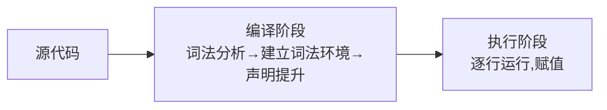
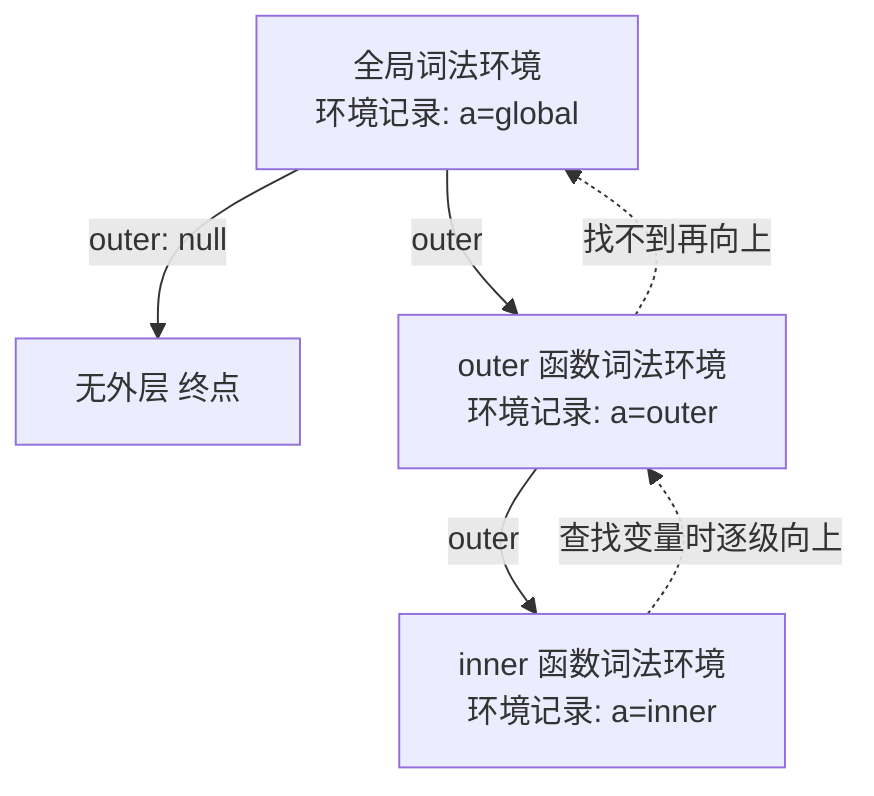

# 1.2 作用域与闭包

> 卷:卷一 · JavaScript 语言内核
> 阅读时间:35min

---

## 引言:变量在哪里能访问,谁访问到了谁

作用域决定"变量在哪能访问";闭包是"函数对其定义处变量的引用"。要真正吃透,得往下挖到 **执行上下文与词法环境** 这一层,并从 1.1 的内存模型看闭包到底"把变量存哪了"。

---

## 一、JS 是"编译型"语言(先编译,再执行)



**正是"先编译",产生了「变量提升」。**

```js
console.log(a); // undefined ← var a 已提升但未赋值
var a = 1;
```

---

## 二、执行上下文与词法环境(底层核心)

### 2.1 执行上下文(Execution Context)

**每次函数调用,都会创建一个「执行上下文」**,它是"这段代码运行时的运行时环境",包含三部分:

```
执行上下文 = 词法环境(LexicalEnvironment)+ 变量环境(VariableEnvironment)+ this
```

- **创建阶段**:建立词法环境、登记所有声明(这就是"提升"发生在这一刻)
- **执行阶段**:逐行执行、赋值、调用

### 2.2 词法环境(Lexical Environment)

词法环境由两部分组成:

```
词法环境 = 环境记录(Environment Record:当前作用域里的变量)+ 对外层环境的引用 outer
```



**作用域链的本质,就是词法环境的这条 `outer` 引用链。**

### 2.3 变量提升的底层过程

```js
console.log(a);  // undefined
var a = 1;
```

- **编译期(创建环境)**:环境记录里登记 `a`,初始化为 `undefined`
- **执行期**:`var a = 1` 才对 `a` 赋值
- → 所以"提升"= 创建环境时先登记声明,赋值留到执行时

**`let/const` 的 TDZ 也是同理**:创建环境时登记了 `b`,但被标记为"未初始化",声明前访问就抛错。

---

## 三、三种作用域 + TDZ

| 作用域 | 边界 | 说明 |
|--------|------|------|
| 全局 | 整个脚本 | 挂 `window`(浏览器) |
| 函数 | `function` 内 | `var` 属于这一层 |
| 块级 | `{ }` 内 | `let`/`const` |

```js
var x = 1;
function foo() {
  var y = 2;       // 函数作用域
  if (true) {
    let z = 3;     // 块级
    var w = 4;     // var 无视块级!仍是函数作用域
  }
  console.log(w); // 4
  // console.log(z); // ReferenceError
}
```

```js
console.log(b); // ReferenceError(暂时性死区 TDZ)
let b = 1;
```

> **为什么要有 TDZ?** `var` 提升成 `undefined` 会掩盖"用了未初始化变量"的错误(静默出错);TDZ 让 `let/const` 在声明前访问**直接报错**,把 bug 暴露在明处——这是更安全的设计。

---

## 四、闭包(Closure)

### 4.1 定义与底层机制

> **闭包 = 函数 + 它定义时所在「词法环境」的引用。**

**底层机制**:每个函数对象都有一个内部槽 `[[Environment]]`,指向**它被定义时**所在的词法环境。这个引用让函数即使离开定义处执行,仍能访问当时的变量。

```mermaid
flowchart LR
    A[inner 函数对象<br/>[[Environment]]] --> B[outer 的词法环境<br/>count: 0]
    C[inner 被返回出去] --> A
    A -.->|即使 outer 执行完<br/>count 仍被引用,不销毁| B
```

```js
function outer() {
  let count = 0;
  return function inner() {
    count++;          // 通过 [[Environment]] 找到 count
    return count;
  };
}
const fn = outer();
fn(); // 1
fn(); // 2  ← count 被 inner 持续持有
```

### 4.2 闭包的内存模型(呼应 [1.1](/卷一-JavaScript语言内核/1.1-语言基础与类型系统))

**为什么 `outer` 执行完,`count` 没被销毁?** 按 1.1 的栈/堆模型:

> 局部变量本应随 `outer` 的栈帧弹出而销毁;但一旦被 `inner`(它被返回、逃逸了)引用,`count` 就**从栈"逃逸"到堆**,由嵌套的词法环境持有,GC 要等 `inner` 也不再被引用才回收它。**闭包能"持有"变量的本质,就是变量被引用逃逸到了堆上。**

### 4.3 三个形成条件

1. 函数**嵌套定义**
2. 内层**引用**外层变量
3. 内层函数被**返回到外部 / 在外层之外调用**

---

## 五、闭包的实际用途

| 场景 | 说明 |
|------|------|
| 数据私有化 | 模拟私有变量 |
| 防抖/节流 | 保存 timer,跨调用共享 |
| 柯里化/偏函数 | 固定部分参数 |
| 函数缓存(记忆化) | 存结果避免重复计算 |
| 模块化 | IIFE + 闭包隔离 |
| 框架层 | Vue 响应式 effect / React Hooks 状态持久 |

**手写防抖 + 柯里化:**

```js
function debounce(fn, delay) {
  let timer = null;              // 闭包保存 timer
  return function (...args) {
    clearTimeout(timer);
    timer = setTimeout(() => fn.apply(this, args), delay);
  };
}

function curry(fn) {             // 柯里化:固定部分参数
  return function curried(...args) {
    if (args.length >= fn.length) return fn(...args);
    return (...rest) => curried(...args, ...rest);
  };
}
```

---

## 六、经典 `var` 循环陷阱

```js
for (var i = 0; i < 3; i++) setTimeout(() => console.log(i), 0);
// 3 3 3(共享同一个函数作用域的 i)
```

**修复三法:**

```js
// ① let:每次迭代独立块级作用域
for (let i = 0; i < 3; i++) setTimeout(() => console.log(i), 0); // 0 1 2

// ② IIFE 固化参数
for (var i = 0; i < 3; i++) (function (j) { setTimeout(() => console.log(j), 0); })(i);

// ③ setTimeout 第三参
for (var i = 0; i < 3; i++) setTimeout(console.log, 0, i);
```

---

## 七、闭包的代价:内存泄漏

```js
let big = { data: new Array(1000000) };
let keep = () => console.log(big.data.length);
// keep 长期无用却未释放 → big 一直被锁在闭包环境里
keep = null;   // 用完断引用
```

> **闭包不必然泄漏**,只有"生命周期过长 + 持有大对象 + 忘释放"才成问题。排查:DevTools Memory 快照,看闭包环境是否长持大对象。

---

## 八、小结

```
执行上下文 = 词法环境 + 变量环境 + this(每次调用创建)
词法环境 = 环境记录 + outer 引用 → outer 链 = 作用域链
提升 = 创建环境时登记声明;TDZ = 登记但标记未初始化(let/const)
闭包 = 函数的 [[Environment]] 指向定义处词法环境
       → count 从栈逃逸到堆,故不被销毁(呼应 1.1)
用途:私有/防抖/柯里化/缓存/模块化/Vue·React 状态
```

---

## 九、面试题

**Q1:详细解释"变量提升"的底层机制?**

JS 分编译、执行两阶段。编译期建立执行上下文、在词法环境的环境记录里**登记所有声明**(`var` 初始化为 `undefined`,函数整体登记,`let/const` 登记但标记未初始化);执行期才逐行赋值。所以"提升"= 声明先登记,赋值后执行。

**Q2:什么是"暂时性死区(TDZ)"?为什么设计它?**

`let/const` 在"声明之前"访问会抛 `ReferenceError` 的这段区域叫 TDZ。因为它们在编译期已被登记、但标记为"未初始化"。设计动机:避免 `var` 那种"静默得到 undefined"掩盖错误,让"用了未初始化变量"显式报错。

**Q3:举一个闭包让变量"逃逸到堆"的例子,并解释内存在哪?**

```js
function makeCounter() {
  let n = 0;                 // 局部变量,本在栈
  return () => ++n;          // 被返回的闭包引用 n
}
const c = makeCounter();     // n 被 c 持有 → 逃逸到堆
```
`makeCounter` 返回后栈帧本该销毁,但 `n` 被返回的闭包引用,就搬到堆上的闭包环境里,直到 `c` 不再被引用才回收。

**Q4:为什么 React 的 Hooks 能"记住"上一次的值?**

Hooks 借**闭包 + 链表**存状态:每次渲染函数执行时,`useState` 从"上一次渲染的函数作用域(闭包环境)"里读出旧值。这是闭包"跨执行持有变量"在框架层的直接应用。

**Q5:判断哪些是闭包并说明为什么?**

```js
function a(){ var x=1; function b(){ return x; } return b; } // ✅ 嵌套+引用+返回
function c(){ var y=1; return y; }                           // ❌ 未返回函数
[1,2,3].map(n => n*2)                                       // ❌ 未引用外层变量
```

**Q6:闭包一定会内存泄漏吗?如何避免?**

不会。只有"生命周期过长 + 持有大对象 + 忘释放"才泄漏。避免:用完显式 `= null` 断引用;不再需要的定时器/监听器及时清理;别把巨型对象随手塞进长生命周期闭包。

---

📎 参考:[MDN《闭包》](https://developer.mozilla.org/zh-CN/docs/Web/JavaScript/Closures)、ECMA-262 Execution Context / Lexical Environment / Function `[[Environment]]` 章节