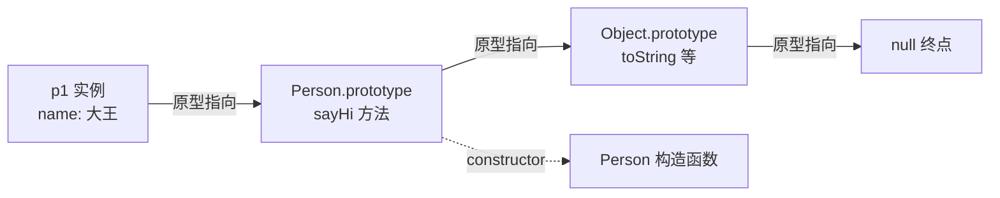

# 1.3 原型与继承

## 引言:JS 的"继承"靠链,不靠 class

`class` 是 ES6 的语法糖,JavaScript 骨子里是**基于原型(prototype)**。Java/C++ 开发者初看会困惑:没有静态类型,一切都发生在运行时,对象是"动态属性包",继承靠的是**一条指向原型的链**,而不是类的层级复制。

本章按"基础 → 操作 → 继承模式 → class → 坑 → 性能"的顺序,把原型链讲到能写、能调、能面试的程度。每个知识点都配**可直接在控制台粘贴运行**的代码。

---

## 一、原型链基础

### 1.1 对象与原型:`[[Prototype]]` 内部槽

JavaScript 的每个对象都有一条**指向另一个对象的引用**,这个被指向的对象叫**原型**。按 ECMAScript 规范,这个内部引用写作 `someObject.[[Prototype]]`。

- 读取/修改它,规范标准 API 是 `Object.getPrototypeOf()` / `Object.setPrototypeOf()`
- 浏览器历史遗留了一个**非标准访问器** `__proto__`(注意:`obj.__proto__` 与字面量里的 `{ __proto__: ... }` 是两回事,后者是标准且未弃用的)

```js
const obj = {};
Object.getPrototypeOf(obj) === Object.prototype;  // true
obj.__proto__ === Object.prototype;               // true(非标准,但引擎都实现了)
```

### 1.2 原型链的定义与查找规则

当访问对象的属性时,不仅在该对象自身找,还会沿着原型链一路向上找,**直到找到同名属性或到达链的末端 `null`**。

```js
const o = {
  a: 1,
  b: 2,
  __proto__: { b: 3, c: 4 },
};
// 完整原型链:{ a:1, b:2 } ---> { b:3, c:4 } ---> Object.prototype ---> null

console.log(o.a);  // 1    —— o 有自有属性 a
console.log(o.b);  // 2    —— o 有自有属性 b,原型上的 b 被"遮蔽"
console.log(o.c);  // 4    —— o 没有 c,沿链在原型上找到
console.log(o.d);  // undefined —— 沿链到底(null)都没找到
```

**属性遮蔽(Property Shadowing)**:对象自身和原型上**同名**时,自身属性"遮蔽"原型属性。查找时**先命中的是自身属性**。

### 1.3 构造函数、原型对象、实例的三者关系

```js
function Person(name) { this.name = name; }
const person = new Person("John");

Person.prototype.constructor === Person;                 // true
person.__proto__ === Person.prototype;                   // true
Object.getPrototypeOf(person) === Person.prototype;      // true
```

三者关系:

| 角色 | 关键属性 | 指向 |
|------|---------|------|
| 构造函数 `Person` | `prototype` | 原型对象 |
| 原型对象 `Person.prototype` | `constructor` | 指回构造函数 |
| 实例 `person` | `[[Prototype]]` | 原型对象 |

> **极易混淆的一对**:`func.prototype`(函数的属性)≠ `func.[[Prototype]]`(函数自身的原型)。前者只在**用 `new` 当构造函数**时有意义;后者指向 `Function.prototype`(见 1.5)。



### 1.4 Object.prototype 与原型链末端

- 大多数对象的原型链**顶端**是 `Object.prototype`
- `Object.prototype` 的原型是 `null`,即**链的终点**
- 它装着所有对象共享的方法:`toString` / `valueOf` / `hasOwnProperty` 等

```js
Object.prototype.__proto__ === null;  // true —— 链的终点
```

### 1.5 函数对象与 Function.prototype(函数也是对象)

**函数本身也是对象**,是 `Function` 构造函数的实例:

```js
function foo() {}
foo.__proto__ === Function.prototype;                 // true
Function.prototype.__proto__ === Object.prototype;    // true

// 但函数才有 prototype,普通对象没有;箭头函数连 prototype 都没有
const arrow = () => {};
arrow.prototype === undefined;                        // true
```

> 一句话区分:`foo.__proto__` 是"foo 从哪继承"(→ `Function.prototype`);`foo.prototype` 是"foo 当构造函数时,实例从哪继承"(→ 一个普通对象)。

### 1.6 字面量的隐式构造函数

一些字面量语法会**自动**给实例设好 `[[Prototype]]`:

```js
({}).__proto__ === Object.prototype;          // true
[1,2,3].__proto__ === Array.prototype;        // true
/abc/.__proto__ === RegExp.prototype;         // true
// 解糖等价于 new Array(1,2,3)、new RegExp("abc")
```

这就是为什么 `arr.map(...)` 能直接用——`map` 定义在 `Array.prototype` 上,所有数组实例自动继承。

**有趣的历史事实**:一些内置构造函数的 `prototype` 本身就是自身的实例:

```js
Number.prototype + 1;                    // 1 —— Number.prototype 是数字 0
Array.prototype.map(x => x + 1);         // [] —— Array.prototype 是空数组
String.prototype + "a";                  // "a"
RegExp.prototype.source;                 // "(?:)"
Function.prototype();                    // Function.prototype 本身是可调用的空函数
```

> **猴子修补(monkey patching)警告**:不要扩展内置原型(`Array.prototype.myMethod = ...`),这是坏实践——将来语言加同名方法但签名不同,你的代码就崩了(历史上有 SmooshGate 事件)。唯一正当理由是"向后移植"新引擎特性(如老环境补 `Array.prototype.forEach`)。

---

## 二、属性访问的底层:`[[Get]]` 与 `[[Set]]`

### `[[Get]]` 算法(读属性)

`obj.foo` 的完整查找流程:

1. 查 obj **自身**是否直接存在 `foo` → 有就返回(即使值为 `undefined`)
2. 没有 → 沿 `[[Prototype]]` 到原型,查原型的自身属性
3. 继续逐级向上 → `Object.prototype` → `null`
4. 到 `null` 还没找到 → 返回 `undefined`
5. 若链上某处 `foo` 是 **getter**,则调用它(返回 getter 结果)

```js
const proto = { get foo() { return "来自 getter"; } };
const obj = Object.create(proto);
obj.foo;   // "来自 getter" —— 触发了原型上的 getter
```

### `[[Set]]` 与遮蔽的边界(重要)

`obj.foo = x` 时:

- 若 obj **已有** `foo`(自有或原型上是普通数据属性)→ 直接设自有属性,`foo` 出现在 obj 上
- 若原型上是 **getter/setter** → 调用原型上的 setter,而**不在 obj 上创建自有属性**
- 若原型上是**只读** `writable: false` → 赋值**静默失败**(严格模式抛错)

```js
const proto = {};
Object.defineProperty(proto, "x", { value: 1, writable: false });
const obj = Object.create(proto);
obj.x = 99;      // 严格模式下抛 TypeError;非严格下静默失败
obj.x;           // 1 —— 没有遮蔽成功
```

---

## 三、原型链相关操作

### 3.1 检测原型关系

```js
function Person() {}
const p = new Person();

p instanceof Person;                     // true —— Person.prototype 在 p 的原型链上?
p instanceof Object;                     // true
Person.prototype.isPrototypeOf(p);       // true —— Person.prototype 是 p 的原型链一员?
Object.prototype.isPrototypeOf(p);       // true
Object.getPrototypeOf(p) === Person.prototype;  // true —— 直接拿原型
```

`instanceof` 本质:沿 `obj` 的原型链,看能否找到 `ctor.prototype`:

```js
function myInstanceof(obj, ctor) {
  let proto = Object.getPrototypeOf(obj);
  while (proto) {
    if (proto === ctor.prototype) return true;
    proto = Object.getPrototypeOf(proto);
  }
  return false;
}
```

### 3.2 修改原型(往 prototype 上添加属性)

```js
function Person() {}
const p1 = new Person();

Person.prototype.sayHello = function () { return "Hello!"; };
p1.sayHello();   // "Hello!" —— 已创建的实例立刻能用到(共享同一原型对象)
```

因为 `p1.[[Prototype]]` 和 `Person.prototype` 是**同一个对象**,改它就是改所有实例。

### 3.3 替换原型(整体重新赋值)

```js
function Person() {}
const p1 = new Person();

Person.prototype = {
  sayHello: function () { return "Hello!"; },
};

// 关键:必须补回 constructor,否则 instance.constructor 断链
Object.defineProperty(Person.prototype, "constructor", {
  value: Person,
  enumerable: false,
});

const p2 = new Person();
p2.sayHello();    // "Hello!"
// p1.sayHello();  // ❌ p1 仍指向旧原型,拿不到新方法
```

**为什么替换原型要补 `constructor`?** 新对象字面量自带 `constructor` 指向 `Object`,会让 `instance.constructor` 追不到原构造函数,破坏约定、也可能影响依赖 `constructor` 的内置操作。

> **为什么尽量别替换原型?** 替换后,替换前创建的实例指向旧原型、之后的指向新原型,两者**不再共享**,行为割裂。要改就"增量修改"(3.2),别"整体替换"。

### 3.4 Object.create() 与 Object.setPrototypeOf()

```js
const a = { a: 1 };
const b = Object.create(a);    // b ---> a ---> Object.prototype ---> null
b.a;                           // 1(继承)

const d = Object.create(null); // d ---> null(无原型链)
d.hasOwnProperty;              // undefined —— 没继承 Object.prototype
```

`Object.create(null)` 是**纯净字典**(无 `toString` 等),适合当 map,避免键名与原型方法冲突。

`Object.setPrototypeOf` 能**修改已存在对象**的原型,但代价是破坏引擎已做的原型链优化(可能反优化重新编译),所以**尽量在创建时就定好原型**:

```js
const obj = { a: 1 }, another = { b: 2 };
Object.setPrototypeOf(obj, another);   // obj ---> another ---> Object.prototype ---> null
```

### 3.5 `new` 的四步(规范等效)

```js
function myNew(constructor, ...args) {
  const obj = Object.create(constructor.prototype); // ① 建对象,绑 [[Prototype]]
  const res = constructor.apply(obj, args);         // ② 以 obj 为 this 执行
  return res instanceof Object ? res : obj;         // ③ 返回对象则用,否则用 obj
}
```

> 细节:构造函数若显式 `return` 一个**非原始值**,那个值会成为 `new` 的结果,此时 `[[Prototype]]` 可能没绑对(实践中极少见)。

---

## 四、继承的本质:方法与 `this` 指向

JavaScript 的"方法"就是"值为函数的属性",它和普通属性一样继承。**执行继承来的函数时,`this` 指向调用它的对象,而不是定义它的原型对象**:

```js
const parent = {
  value: 2,
  method() { return this.value + 1; },
};
console.log(parent.method());   // 3 —— this 是 parent

const child = { __proto__: parent };
console.log(child.method());    // 3 —— this 是 child,value 沿链找到 parent 的 2

child.value = 4;                // 遮蔽 parent.value
console.log(child.method());    // 5 —— this.value 现在是 child 自己的 4
```

这是原型继承里最容易踩的认知点:**方法写在原型上,但执行时 `this` 永远是"`.` 前面的那个对象"**。

---

## 五、JavaScript 的 10 种继承模式(全枚举)

### 5.1 原型链继承

```js
function Animal(name) { this.name = name; this.colors = ["black", "white"]; }
Animal.prototype.sayName = function () { console.log("My name is " + this.name); };

function Dog(breed) { this.breed = breed; }
Dog.prototype = new Animal("Generic Dog");   // 核心:父实例当子原型
Dog.prototype.constructor = Dog;
Dog.prototype.bark = function () { console.log("Woof!"); };

const dog = new Dog("Labrador");
dog.sayName();   // "My name is Generic Dog"
```

- ✅ 简单、方法可复用、`instanceof` 有效
- ❌ **引用类型属性被所有实例共享**(改一个影响全部);无法向父类构造传参

### 5.2 借用构造函数继承

```js
function Animal(name) { this.name = name; this.colors = ["black", "white"]; }
function Dog(name, breed) {
  Animal.call(this, name);   // 借父构造,this 指向子实例
  this.breed = breed;
}
const d1 = new Dog("Rex", "GSD"), d2 = new Dog("Buddy", "GR");
d1.colors.push("brown");
console.log(d2.colors);   // ["black","white"] —— 属性独立了 ✅
console.log(d1.sayName);  // undefined ❌ 拿不到原型上的方法
```

- ✅ 可向父构造传参、每个实例属性独立
- ❌ 方法不能复用(若写在构造里每次重建)、拿不到父原型方法、`instanceof Animal` 为 false

### 5.3 组合继承(原型链 + 借用)

```js
function Animal(name) { this.name = name; this.colors = ["black", "white"]; }
Animal.prototype.sayName = function () { console.log(this.name); };

function Dog(name, breed) {
  Animal.call(this, name);        // 第一次调父构造:属性独立
  this.breed = breed;
}
Dog.prototype = new Animal();     // 第二次调父构造:拿方法
Dog.prototype.constructor = Dog;
```

- ✅ 传参 + 属性独立 + 方法复用 + `instanceof` 有效
- ❌ **父构造被调了两次**,子原型上有冗余的父实例属性(被实例同名属性覆盖,浪费内存)

### 5.4 原型式继承

```js
// ES5 前的手写:Object.create 的雏形
function object(o) { function F() {} F.prototype = o; return new F(); }

const animal = {
  name: "Generic", colors: ["black", "white"],
  sayName() { console.log(this.name); },
};
const dog = object(animal);
dog.name = "Rex";
dog.sayName();   // "Rex"
```

- ✅ 无需构造函数、可复用原型方法
- ❌ 引用类型属性仍共享

### 5.5 寄生式继承

```js
function createAnother(original) {
  const clone = Object.create(original);   // 原型式继承
  clone.bark = function () { console.log("Woof!"); };  // 再"增强"
  return clone;
}
```

- ✅ 无需构造函数、可顺手加方法
- ❌ 引用类型共享、每次创建都新建方法(不复用)

### 5.6 寄生组合继承(ES5 最佳)

解决组合继承"调两次父构造"的问题:

```js
function inheritPrototype(Child, Parent) {
  const prototype = Object.create(Parent.prototype);  // 不 new,直接以父原型为原型
  prototype.constructor = Child;
  Child.prototype = prototype;
}

function Animal(name) { this.name = name; this.colors = ["black", "white"]; }
Animal.prototype.sayName = function () { console.log(this.name); };

function Dog(name, breed) {
  Animal.call(this, name);   // 只调一次父构造
  this.breed = breed;
}
inheritPrototype(Dog, Animal);
```

- ✅ 只调一次父构造、无冗余属性、`instanceof`/`isPrototypeOf` 正常
- ❌ 实现稍复杂(所以 ES6 直接给 `class` 封装了它)

### 5.7 ES6 class 继承

```js
class Animal {
  constructor(name) { this.name = name; this.colors = ["black", "white"]; }
  sayName() { console.log(this.name); }
  static isAnimal(o) { return o instanceof Animal; }
}
class Dog extends Animal {
  constructor(name, breed) {
    super(name);
    this.breed = breed;
  }
  sayName() { super.sayName(); console.log("I am a " + this.breed); }
  static isDog(o) { return o instanceof Dog; }
}
Dog.isAnimal(new Dog("Rex", "GSD"));   // true —— 静态方法也被继承
```

### 5.8 Mixin 多重继承

原型链是**单链**,JS 不支持真正多继承,但可用 Mixin 模拟:

```js
const swimMixin = { swim() { console.log(this.name + " swimming"); } };
const flyMixin  = { fly()  { console.log(this.name + " flying"); } };

function applyMixins(target, ...mixins) {
  for (const m of mixins)
    for (const name of Object.getOwnPropertyNames(m))
      target.prototype[name] = m[name];
}
class Duck { constructor(name) { this.name = name; } }
applyMixins(Duck, swimMixin, flyMixin);
new Duck("Donald").fly();   // "Donald flying"
```

### 5.9 对象委托模式(OLOO:Objects Linked to Other Objects)

不用构造函数/`new`,直接基于对象关系(更贴近原型本质,是 Kyle Simpson 推崇的写法):

```js
const animal = {
  init(name) { this.name = name; return this; },
  eat() { console.log(this.name + " is eating"); },
};
const dog = Object.create(animal);
dog.bark = function () { console.log("Woof!"); };

const rex = Object.create(dog).init("Rex");
rex.eat();   // "Rex is eating"
rex.bark();  // "Woof!"
```

### 5.10 工厂函数与闭包(私有状态)

```js
function createAnimal(name) {
  let energy = 100;   // 闭包私有变量,外部拿不到
  return {
    getName: () => name,
    eat() { energy += 10; return this; },
    getEnergy: () => energy,
  };
}
const a = createAnimal("Rex");
a.eat().getEnergy();   // 110
a.energy;              // undefined —— 真正私有
```

---

## 六、ES6 class 详解(语法糖,底层仍是原型)

### 6.1 class 底层等价

```js
class Child extends Parent {
  constructor(name) { super(name); }
}
// 等价手写:
function Child(...args) { return Parent.apply(this, args); }
Child.prototype = Object.create(Parent.prototype);
Child.prototype.constructor = Child;
Object.setPrototypeOf(Child, Parent);   // 静态继承:Child.__proto__ = Parent
```

> 关键:`class` 除了实例原型链,还额外建了**静态属性链**(`Child.__proto__ === Parent`),让子类继承父类**静态方法**——这是纯 ES5 寄生组合容易漏的一环。

### 6.2 super

- 构造函数里 `super()` = 调用父类构造,**必须先调**(否则 `this` 未初始化)
- 方法里 `super.method()` = 调用父类同名方法

```js
class A { constructor() { this.x = 1; } hi() { return "A"; } }
class B extends A {
  constructor() { super(); this.y = 2; }   // 不先 super 会报错
  hi() { return super.hi() + "B"; }
}
```

### 6.3 静态方法/属性

```js
class MathUtils {
  static PI = 3.14159;              // 静态属性(类上,非实例)
  static square(x) { return x * x; }
}
MathUtils.square(2);   // 4
class Sub extends MathUtils {}
Sub.square(3);         // 9 —— 静态方法被继承
```

### 6.4 私有字段与方法(ES2022,`#` 前缀)

```js
class Person {
  #secret = "private";
  #hide() { return "这是私有的"; }
  show() { return this.#secret + " " + this.#hide(); }
}
new Person().show();   // "private 这是私有的"
// new Person().#secret;   // SyntaxError —— 外部访问不到
```

### 6.5 类表达式

```js
const Person = class { constructor(name) { this.name = name; } };
const Employee = class EmployeeClass { /* 命名类表达式,内部可引用 EmployeeClass */ };
```

---

## 七、常见问题

### 7.1 原型污染(Prototype Pollution)

改 `Object.prototype` 会影响**所有对象**:

```js
Object.prototype.customMethod = function () { return "影响所有对象!"; };
({}).customMethod();   // "影响所有对象!" —— 极其危险
```

这也是为什么安全领域有"原型污染"攻击(污染 `__proto__` 达成 RCE/DoS)。永远别在生产代码里改内置原型。

### 7.2 instanceof 的局限(跨 iframe/窗口)

不同执行上下文(iframe、VM 上下文)各有独立的 `Array.prototype`,跨窗口对象会误判:

```js
const iframe = document.createElement("iframe");
document.body.appendChild(iframe);
const iframeArray = new iframe.contentWindow.Array();
iframeArray instanceof Array;   // false —— 其实是数组!
```

判断是否数组请用 **`Array.isArray()`**(内部检查 `[[Class]]`,不受上下文影响)。

### 7.3 原型链中的 this 指向

```js
function Person() {}
Person.prototype.getName = function () { return this.name; };

const p = new Person(); p.name = "John";
p.getName();   // "John" —— this 是 p

const obj = { name: "Object" };
Object.setPrototypeOf(obj, Person.prototype);
obj.getName(); // "Object" —— this 是 obj,不是 Person.prototype
```

### 7.4 循环引用(危险)

```js
const a = {}, b = Object.create(a);
Object.setPrototypeOf(a, b);   // a 的原型是 b,b 的原型是 a → 死循环
// a.toString();   // 栈溢出(Stack Overflow)
```

---

## 八、性能考虑

1. **原型链越长,查找越慢**:自身属性最快,链末端最慢;访问不存在的属性会**遍历整条链**
2. **`for...in` 会枚举原型链上所有可枚举属性**;只要自身属性用 `Object.keys()` 或 `hasOwnProperty`
3. **频繁访问的继承属性,缓存到局部变量**:

```js
// 低效:每次循环都查原型链
for (let i = 0; i < 1000; i++) console.log(this.inheritedProp);
// 高效:只查一次
const prop = this.inheritedProp;
for (let i = 0; i < 1000; i++) console.log(prop);
```

4. **判断"自身 vs 继承"**:`hasOwnProperty` / 更推荐 `Object.hasOwn`(不受原型被污染影响):

```js
const g = new (function () {} )();
Object.hasOwn(g, "x");            // false
Object.hasOwn(g, "toString");     // false —— toString 是继承的
// 注意:仅判断 undefined 不够(属性可能存在但值就是 undefined)
```

---

## 九、小结

```
[[Prototype]] 内部槽 → 原型链(实例 → 构造函数.prototype → Object.prototype → null)
[[Get]]:自身 → 逐级向上 → null → undefined;[[Set]] 遇只读/访问器有特殊规则
三关系:prototype(函数→原型对象)/ constructor(原型→函数)/ [[Prototype]](实例→原型)
函数也是对象:foo.__proto__ === Function.prototype
继承 10 式:原型链/借用/组合/原型式/寄生式/寄生组合(最佳)/class/Mixin/委托/工厂闭包
坑:原型污染/instanceof 跨窗口/this 指向/循环引用;性能:链长、hasOwn、缓存
```

---

## 十、面试题

**Q1:属性查找的全过程(`[[Get]]`)?**

读 `obj.foo`:先查自身属性 → 没有沿 `[[Prototype]]` 逐级向上到 `Object.prototype`、再到 `null` → 都没有返回 `undefined`;若链上有 getter 则触发。这就是原型链查找。

**Q2:`prototype` 和 `__proto__` 的区别?**

`prototype` 是**函数**的属性,指向"`new` 出的实例共享的原型对象";`__proto__` 是**每个对象**指向其原型的引用(历史访问器,规范标准是 `getPrototypeOf`)。一个"供实例用",一个"自己找爹"。

**Q3:继承的 10 种模式里,为什么"寄生组合继承"是最佳 ES5 写法?**

它只调**一次**父构造函数(组合继承要两次)、不在子原型留冗余父实例属性、`instanceof`/`isPrototypeOf` 都正常。ES6 `class extends` 本质上就是它 + 静态链的封装。

**Q4:`class` 相比 ES5 继承,底层多了什么?**

多了**静态属性链**:`Object.setPrototypeOf(Child, Parent)`(即 `Child.__proto__ = Parent`),让子类能继承父类的**静态方法**。这是纯 ES5 寄生组合容易漏的一环。

**Q5:为什么 `class` 的 `constructor` 里必须先调 `super`?**

`extends` 的实例由父类构造器创建,`super()` 内部 = `Parent.call(this)` + 绑定 `this` 的子类原型。不先 `super` 就没有 `this`(未初始化),访问会报错。这是 class 与普通函数"默认有 this"的关键区别。

**Q6:`Object.create(null)` 和 `{}` 有何不同?**

前者 `[[Prototype]]` 为 null,**无原型链**,不含 `toString`/`hasOwnProperty`,适合做纯净字典(键名不会与原型方法冲突);后者原型是 `Object.prototype`。

**Q7:属性遮蔽是什么?赋值一定会遮蔽吗?**

对象自身与原型同名时,自身属性"遮蔽"原型属性(查找先命中自身)。但**赋值不一定遮蔽**:若原型上是只读属性(`writable:false`)或访问器 setter,则赋值不会在对象上新建自有属性。

**Q8:`instanceof` 有什么局限?怎么判断数组?**

跨 iframe/窗口时,不同上下文有独立的 `Array.prototype`,`arr instanceof Array` 会误判 false。判断数组用 `Array.isArray()`(检查内部 `[[Class]]`,不受上下文影响)。

**Q9:原型方法里的 `this` 指向谁?**

指向**调用方法的对象**(`.` 前面的对象),不是定义方法的原型对象。即使方法是继承来的,`this` 也是当前实例。

**Q10:为什么别扩展内置原型(monkey patching)?**

会与未来语言内置的同名方法冲突(签名不同则你的代码崩),已导致 SmooshGate 等事件。唯一正当理由是"向后移植"新引擎特性(如补 `Array.prototype.forEach`)。

---

## 十一、练习题

1. 写出 `function Foo(){}` 与 `new Foo()` 之间,`Foo.prototype`、`instance.__proto__`、`Foo.prototype.constructor` 三者的指向关系。
2. 解释为什么下面输出是 5:

```js
const p = { v: 2, get() { return this.v + 1; } };
const c = Object.create(p);
c.v = 4;
c.get();   // ?
```

3. 用"借用构造函数 + 原型链"两种方式各实现一次 `Dog extends Animal`,并指出组合继承为什么调了两次父构造。
4. 手写 `Object.create` 与 `instanceof`。
5. 用 `class` 实现一个带静态方法、私有字段(`#`)的继承结构。
6. 判断:修改原型(加属性)与替换原型(整体赋值)对"已创建实例"的影响有何不同?

---

📎 参考:[MDN《继承与原型链》](https://developer.mozilla.org/zh-CN/docs/Web/JavaScript/Guide/Inheritance_and_the_prototype_chain)、[MDN《Object.create》](https://developer.mozilla.org/zh-CN/docs/Web/JavaScript/Reference/Global_Objects/Object/create)、[MDN《Classes》](https://developer.mozilla.org/zh-CN/docs/Web/JavaScript/Reference/Classes)、ECMA-262 OrdinaryObjectCreate / [[Get]] / [[Set]] / Prototype 章节
