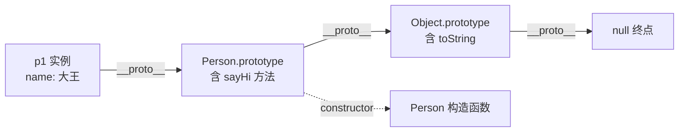

# 1.3 原型与继承

> 卷:卷一 · JavaScript 语言内核
> 难度:⭐⭐ 进阶 | 阅读时间:25min | 状态:已深化

---

## 引言:JS 的"继承"靠链,不靠 class

`class` 是 ES6 才加的糖,JS 骨子里是**基于原型**的语言。理解原型,才能解释:为什么数组能 `.map`、对象能 `.hasOwnProperty`、`instanceof Component` 怎么判。

---

## 一、为什么需要原型

我们希望 N 个对象共享同一份方法,而不是各存一份(浪费内存):

```js
function Person(name) { this.name = name; }
Person.prototype.sayHi = function () { console.log("hi " + this.name); };

const p1 = new Person("大王");
const p2 = new Person("阿北");
p1.sayHi();                    // hi 大王
p1.sayHi === p2.sayHi;         // true ← 方法是同一份,存在原型上
```

**为什么这样设计?** 每个实例都有独立的数据(`name`),但方法可以共享——把共享部分放"原型"、私有部分放实例,是"**用共享换内存**"的经典取舍(与 6.1 Vue 响应式的思路同源)。

---

## 二、`new` 的四步

```js
function myNew(constructor, ...args) {
  const obj = Object.create(constructor.prototype); // 1. 建对象,绑原型
  const res = constructor.apply(obj, args);        // 2. 以 obj 为 this 执行
  return res instanceof Object ? res : obj;        // 3. 有返回对象则用,否则用 obj
}
```

---

## 三、`prototype` vs `__proto__`



| 属性 | 属于谁 | 指向 | 作用 |
|------|--------|------|------|
| `prototype` | 函数 | 一个对象 | 供 `new` 出的实例共享 |
| `__proto__` | 每个对象 | 它的原型 | 实现原型链查找 |

**核心公式(背下来):**

```js
p1.__proto__ === Person.prototype;                  // true
Person.prototype.__proto__ === Object.prototype;    // true
Object.prototype.__proto__ === null;                // true
Person.prototype.constructor === Person;            // true
```

---

## 四、原型链:属性查找规则

访问 `obj.foo`:**先自身 → `__proto__` → `__proto__.__proto__` → … → `Object.prototype` → `null`**,找不到返回 `undefined`。

```js
const arr = [1, 2, 3];
arr.toString(); // 沿链找:arr → Array.prototype(覆盖版)→ Object.prototype
```

---

## 五、`instanceof` 的原理

`A instanceof B`:沿 A 的原型链,看能否找到 `B.prototype`。

```js
function myInstanceof(obj, ctor) {
  let proto = Object.getPrototypeOf(obj);
  while (proto) {
    if (proto === ctor.prototype) return true;
    proto = Object.getPrototypeOf(proto);
  }
  return false;
}
```

---

## 六、继承的五种演进

| 方案 | 核心 | 缺点 |
|------|------|------|
| 原型链继承 | `Child.prototype = new Parent()` | 引用类型共享 + 不能传参 |
| 借用构造 | `Parent.call(this)` | 方法不能复用 |
| 组合继承 | 上面两者结合 | 父构造调两次 |
| **寄生组合** | `Object.create(Parent.prototype)` | 无(ES5 最优) |
| **class extends** | 语法糖 = 寄生组合 | 无 |

```js
// 寄生组合继承(最优传统方案)
function Child(...args) { Parent.call(this, ...args); }
Child.prototype = Object.create(Parent.prototype); // 不 new,直接以父原型为原型
Child.prototype.constructor = Child;

// class extends(语法糖,内部就是寄生组合)
class Child extends Parent {
  constructor(...args) { super(...args); }
}
```

> `Object.create(Parent.prototype)` 创建"原型指向父原型"的空对象,**跳过一次多余的父类调用**——这是从"组合继承"到"寄生组合"的关键优化。

---

## 七、小结

```
new 四步:建对象/绑原型/执行/返回
prototype(函数)◀─constructor─▶ __proto__(实例)
原型链:实例 → 构造函数.prototype → Object.prototype → null
继承演进:原型链 → 借用 → 组合(调两次)→ 寄生组合(Object.create,最优)→ class
```

---

## 八、面试题

**Q1:`a.__proto__.foo = 2` 会影响所有实例吗?**

```js
function F() {} F.prototype.foo = 1;
const a = new F(), b = new F();
a.__proto__.foo = 2;   // 改的是 F.prototype
console.log(b.foo);    // 2 ← 影响所有实例(共享原型)
```

**Q2:手写 `Object.create`?**

```js
function create(proto) {
  function F() {}
  F.prototype = proto;
  return new F();
}
```

**Q3:`Object.create(null)` 和 `{}` 有何不同?**

前者**没有原型链**(`__proto__` 为 null),不含 `toString`/`hasOwnProperty`,常做纯净字典/map,避免键名与原型方法冲突。

---

📎 参考:MDN《继承与原型链》、ECMA-262 OrdinaryObjectCreate / Prototype 章节