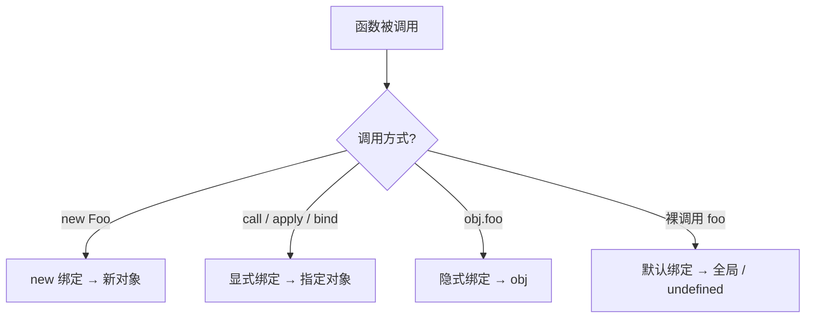

# 1.4 this 绑定与调用

## 引言:`this` 是运行时决定的——但为什么?

`this` 指向"谁在调用这个函数",由**调用方式**决定(箭头函数除外)。它和"函数定义在哪"无关,只和"函数怎么被调用"有关。要彻底理解,得往下挖到规范的 `this` 求值机制(Reference Record)和三种 `thisMode`。

---

## 一、this 的本质

`this` 不是函数"拥有"的,而是**每次函数被调用时,由调用方式动态计算出来的**一个绑定值。同一函数,不同调用方式,`this` 完全不同:

```js
function foo() { console.log(this); }

const obj = { foo };
foo();        // 裸调用 → window(或严格模式 undefined)
obj.foo();    // 方法调用 → obj
foo.call(1);  // 显式调用 → Number(1)
```

---

## 二、四大绑定规则



### 1. 默认绑定

```js
function foo() { console.log(this); }
foo();                     // 非严格:window / globalThis
function bar() { "use strict"; console.log(this); }
bar();                     // 严格:undefined
```

裸调用 `foo()` 时,`this` 走默认绑定:非严格模式下是 `globalThis`,严格模式下是 `undefined`。

### 2. 隐式绑定

```js
const obj = { name: "王", say() { console.log(this.name); } };
obj.say();                 // "王" —— 调用点是 obj,this = obj
```

`obj.say()` 这种"对象.方法()"调用,`this` 绑定到**调用点前的对象**。

### 3. 显式绑定(call / apply / bind)

```js
function greet(g) { console.log(g + this.name); }
greet.call({ name: "北" }, "hi ");   // "hi 北"
greet.apply({ name: "北" }, ["hi "]); // "hi 北"
const f = greet.bind({ name: "北" }); // 返回新函数,this 永久固定
f("hi ");                              // "hi 北"
```

### 4. new 绑定

```js
function P(n) { this.name = n; }
const p = new P("王");     // this = 新创建的对象
p.name;                    // "王"
```

`new` 会创建一个新对象,并把这个新对象绑定为 `this`(详见 1.3 的 new 四步)。

---

## 三、this 丢失的四种经典场景

方法一旦"脱离对象"被调用,就丢失 `this`:

```js
const obj = { name: "王", say() { console.log(this.name); } };

// ① 赋值给变量(最经典)
const fn = obj.say;
fn();                      // undefined —— this 丢了

// ② 作为回调传入(setTimeout / 事件监听器)
setTimeout(obj.say, 0);    // undefined —— this = window/undefined
button.addEventListener("click", obj.say);  // this = button 元素(注意:不是 obj!)

// ③ 数组方法回调
[1, 2, 3].forEach(obj.say);  // undefined
[1, 2, 3].forEach(obj.say, obj);  // forEach 第二参数 thisArg 可绑 this

// ④ 赋值后通过新对象调用(仍是"脱离")
const other = { say: obj.say };
other.say();               // undefined —— this = other,不是 obj
```

**三种修复方式:**

```js
// ① 箭头函数(推荐,最常见)
button.addEventListener("click", () => obj.say());

// ② bind 绑定
setTimeout(obj.say.bind(obj), 0);

// ③ 保存 this 引用(const self = this)
const self = obj;
setTimeout(() => self.say(), 0);
```

---

## 四、call / apply / bind 详解

### 对比表

| | 调用方式 | 参数 | 是否立即执行 | 返回 |
|---|---------|------|-------------|------|
| `call` | `fn.call(thisArg, a, b, c)` | 逐个传 | ✅ 立即 | 函数返回值 |
| `apply` | `fn.apply(thisArg, [a, b, c])` | 数组 | ✅ 立即 | 函数返回值 |
| `bind` | `fn.bind(thisArg, a, b)` | 逐个(可预置) | ❌ 返回新函数 | 新函数 |

> 记忆要点:`call` 是 `c`(comma,逗号分隔参数),`apply` 是 `a`(array,数组参数),`bind` 不执行、返回新函数。

### 手写 call / apply / bind

```js
// call
Function.prototype.myCall = function (ctx, ...args) {
  ctx = ctx ?? globalThis;              // 处理 null/undefined
  const key = Symbol("fn");             // 用 Symbol 避免属性名冲突
  ctx[key] = this;                      // 把函数临时挂到 ctx 上
  const res = ctx[key](...args);        // 以 ctx 为 this 调用
  delete ctx[key];
  return res;
};

// apply(与 call 唯一区别:参数是数组)
Function.prototype.myApply = function (ctx, args = []) {
  ctx = ctx ?? globalThis;
  const key = Symbol("fn");
  ctx[key] = this;
  const res = ctx[key](...args);
  delete ctx[key];
  return res;
};

// bind(固定 this + 柯里化预置参数)
Function.prototype.myBind = function (ctx, ...args) {
  const self = this;
  return function (...rest) {
    // 兼容 new:被 new 调用时 this 是新对象(new 优先级 > 显式绑定)
    return self.apply(this instanceof self ? this : ctx, args.concat(rest));
  };
};
```

### bind 的柯里化应用

`bind` 除了固定 `this`,还能**预置参数**(偏函数):

```js
function multiply(a, b) { return a * b; }
const double = multiply.bind(null, 2);  // 预置 a=2
double(5);   // 10
double(7);   // 14
```

---

## 五、绑定优先级

> **new > 显式绑定 > 隐式绑定 > 默认绑定**

```js
// 显式绑定 > 隐式绑定
function foo() { console.log(this.a); }
const o1 = { a: 1, foo }, o2 = { a: 2 };
o1.foo.call(o2);     // 2 —— call 盖过隐式

// new > 显式绑定
function Bar() { this.a = 99; }
const bound = Bar.bind({ a: 1 });
new bound().a;       // 99 —— new 盖过 bind
```

---

## 六、底层机制:this 是怎么"算"出来的(规范视角)

### 1. Reference Record(引用记录)

`obj.foo()` 调用时,先求值成员表达式 `obj.foo`,产出一个 **Reference**:

```
{ base: obj, referencedName: "foo" }
```

**函数调用的 `this` 就取这个 Reference 的 `base` 值**:

- `obj.foo()` → base 是 `obj` → this = obj(隐式绑定)
- `foo()` → 没有 base(环境引用)→ 默认绑定
- `const f = obj.foo; f();` → `f` 是标识符,base 是环境(不是 obj)→ this 丢失

> 这就是"为什么 `const fn = obj.say` 会丢 this"的规范级答案:**this 在"调用那一刻"由 base 决定,赋值过程不携带 base**。

### 2. 三种 thisMode

| thisMode | 含义 |
|----------|------|
| `sloppy`(非严格) | `undefined`/`null` 的 this 被改造成 `globalThis` |
| `strict` | this 原样传入(裸调用就是 undefined) |
| `lexical` | 箭头函数:this 从**外层作用域**捕获 |

```js
function sloppy() { return this; }
sloppy();  // window(undefined 被改造)
function strict() { "use strict"; return this; }
strict();  // undefined(原样)
```

---

## 七、箭头函数:lexical this

箭头函数**没有自己的 this**(thisMode = lexical),捕获**定义时外层作用域**的 this,且**无法被 call/apply/bind 改变**:

```js
const obj = {
  name: "王",
  say() {
    setTimeout(() => console.log(this.name), 0);   // "王" —— 词法捕获
  },
  sayWrong() {
    setTimeout(function () { console.log(this.name); }, 0); // undefined
  },
};
// 箭头函数的 this 不能被改:
const arrow = () => console.log(this);
arrow.call({ x: 1 });   // 仍是定义处的 this,{x:1} 被忽略
```

**为什么这样设计?** 回调/定时器/事件处理器里,普通函数的 this 会因"裸调用"丢失,开发者得天天 `const self = this` 或 `bind(this)`。箭头函数用**词法 this** 从定义处"锁死",正好解决这个高频痛点——这是它被 React/Vue 回调广泛采用的根因。

**箭头函数不能做的事:** 不能 `new`(没有自己的 this 和 prototype)、不能当构造函数、没有 `arguments` 对象。

---

## 八、常见场景

### 1. 类方法里的 this

```js
class Counter {
  count = 0;
  increment() { this.count++; }              // 方法:this = 实例
}
const c = new Counter();
const inc = c.increment;
inc();  // TypeError —— this 丢失,this 是 undefined(类体默认严格模式)
```

类的方法**默认严格模式**,丢失 this 后是 `undefined`(不是 window)。所以类方法当回调传,要么 `bind`,要么用**类字段箭头函数**:

```js
class Counter {
  count = 0;
  increment = () => { this.count++; };   // 类字段箭头函数,this 永远绑定实例
}
```

### 2. 事件处理里的 this

```js
button.addEventListener("click", function () {
  console.log(this);   // button 元素(事件绑定到谁,this 就是谁)
});
button.addEventListener("click", () => {
  console.log(this);   // 外层 this(箭头函数,不是 button)
});
```

### 3. 模块顶层的 this

ESM 模块顶层 `this` 是 `undefined`(不是 window):

```js
// module.js
console.log(this);   // undefined(ESM 模块)
```

---

## 九、小结

```
this 由"调用方式"动态决定:默认(全局/undefined)/ 隐式(obj.foo)/ 显式(call/apply/bind)/ new
优先级:new > 显式 > 隐式 > 默认
底层:Reference.base 决定 this;赋值剥离 base → this 丢失
thisMode:sloppy(undefined→global)/ strict(原样)/ lexical(箭头捕获外层)
call 逗号传参 / apply 数组传参 / bind 返回新函数(可柯里化预置参数)
```

---

## 十、面试题

**Q1:下面输出什么?**

```js
const length = 10;
function fn() { console.log(this.length); }
const obj = { length: 5, method(fn) { fn(); arguments[0](); } };
obj.method(fn, 1);
// 10, 2(fn() 默认 → window.length=10;arguments[0]() 隐式 → arguments.length=实参 2)
```

**Q2:手写 `call` / `apply` / `bind`?**

见第四节,核心:临时挂 `Symbol` 到 ctx 上调用;bind 需兼容 new(`this instanceof self ? this : ctx`)。

**Q3:为什么"箭头函数不能用 new"?**

箭头函数 thisMode = lexical,**没有自己的 `this` 和 `prototype`**,而 `new` 需要"能指向新对象"的 this 与 prototype 来绑实例。所以 `new` 箭头函数直接报错。

**Q4:为什么 `const fn = obj.say; fn()` 里 this 丢了?规范层面解释?**

赋值后 `fn` 是独立标识符,调用时它产出的 Reference **没有 base**(base 是环境而非 obj),this 取不到 obj → 默认绑定。**this 在"调用那一刻"由 base 决定,与赋值来源无关**。

**Q5:如何让"对象方法里嵌套的普通函数"拿到外层 this?三种方式**

```js
const obj = {
  name: "王",
  say()  { setTimeout(function () { console.log(this.name); }.bind(this), 0); }, // ① bind
  say2() { const self = this; setTimeout(function () { console.log(self.name); }, 0); }, // ② 保存引用
  say3() { setTimeout(() => console.log(this.name), 0); }, // ③ 箭头函数(推荐)
};
```

**Q6:`bind` 之后的函数还能被 `new` 吗?this 指向谁?**

能。`new` 优先级高于显式绑定,`new (fn.bind(obj))()` 时 this 是**新创建的对象**(bind 的 obj 被忽略)——正是 `myBind` 里 `this instanceof self ? this : ctx` 处理的情况。

**Q7:`call` 和 `apply` 除了参数形式,还有什么区别?**

本质没有区别,只是参数传递方式:`call` 逐个传、`apply` 用数组。功能完全等价,选哪个看参数是"散列"还是"数组"。

**Q8:严格模式下,裸调用的 this 是什么?为什么?**

`undefined`。因为严格模式关闭了 `thisMode = sloppy` 的"undefined→globalThis"改造,this 原样传入,裸调用没有 base 就是 undefined。这也避免误改全局变量。

**Q9:类字段用箭头函数定义方法,为什么不会丢 this?**

类字段的箭头函数在**实例初始化时**执行,其 `this` 词法捕获了"构造函数里的 this"= 实例,所以无论怎么传参/解构都不会丢。代价:每个实例都有一份方法(不在 prototype 上),内存略高。

**Q10:事件监听器 `addEventListener("click", obj.say)` 里的 this 是谁?怎么让它指向 obj?**

this 是**触发事件的元素**(button),不是 obj。要指向 obj 用箭头函数包一层:`addEventListener("click", () => obj.say())`。

---

📎 参考:[MDN《this》](https://developer.mozilla.org/zh-CN/docs/Web/JavaScript/Reference/Operators/this)、[MDN《Function.prototype.bind》](https://developer.mozilla.org/zh-CN/docs/Web/JavaScript/Reference/Global_Objects/Function/bind)、[MDN《箭头函数》](https://developer.mozilla.org/zh-CN/docs/Web/JavaScript/Reference/Functions/Arrow_functions)、ECMA-262 Reference Record / thisMode / MakeConstructor 章节
