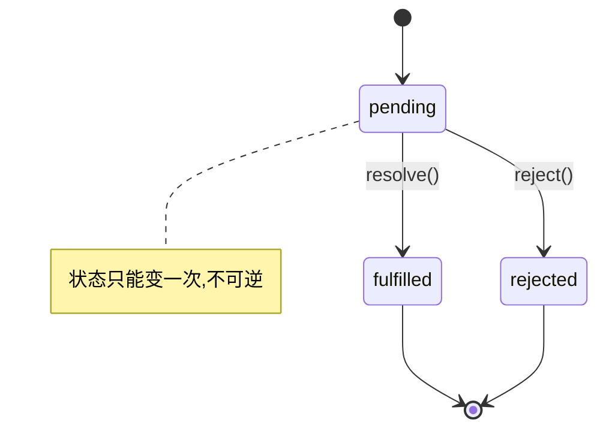

# 1.5 异步编程的前世今生

> 卷:卷一 · JavaScript 语言内核
> 难度:⭐⭐⭐ 专家 | 阅读时间:30min | 状态:已深化

---

## 引言:从回调地狱到 async/await

JS 单线程,阻塞会卡死页面,所以有了异步。异步写法一路演进:**回调 → Promise → async/await**,每次都为解决上一个的痛点。

---

## 一、回调与回调地狱

```js
fs.readFile("a.txt", (e, a) => {
  fs.readFile("b.txt", (e, b) => {
    fs.readFile("c.txt", (e, c) => { /* 层层嵌套 → 回调地狱 */ });
  });
});
```

痛点:深层嵌套、错误各回调单独处理、无法统一流程控制。

---

## 二、Promise:状态机 + 链式

### 2.1 三种状态(状态机)



```js
const p = new Promise((resolve, reject) => {
  resolve(1);
  reject(2);   // 无效,状态已定
});
```

**为什么状态只能变一次?** Promise 表达的是"一个异步操作的**最终结果**"。若结果能反复变,下游链式回调会在"成功/失败"之间反复横跳,语义就崩了。一次性状态让回调逻辑**确定、可预测**。

### 2.2 链式与错误穿透

`then` **总是返回新 Promise**;`catch` 能捕获链上前端任意异常:

```js
fetchApi()
  .then((r) => r.json())
  .then((data) => process(data))
  .catch((err) => handle(err)); // 一处兜底
```

### 2.3 手写最简 Promise

```js
class MyPromise {
  constructor(executor) {
    this.state = "pending"; this.value = undefined; this.callbacks = [];
    const resolve = (v) => { if (this.state !== "pending") return;
      this.state = "fulfilled"; this.value = v;
      this.callbacks.forEach((cb) => cb.onFulfilled(v)); };
    const reject = (e) => { if (this.state !== "pending") return;
      this.state = "rejected"; this.value = e;
      this.callbacks.forEach((cb) => cb.onRejected(e)); };
    try { executor(resolve, reject); } catch (e) { reject(e); }
  }
  then(onFulfilled, onRejected) {
    if (this.state === "fulfilled") onFulfilled?.(this.value);
    else if (this.state === "rejected") onRejected?.(this.value);
    else this.callbacks.push({ onFulfilled, onRejected });
  }
}
// 完整 A+ 规范(链式穿透/thenable)见「附录A · 手写系列」
```

---

## 三、async/await:生成器 + Promise 的语法糖

`async` 函数**总是返回 Promise**;`await` 暂停函数直到 Promise 完成,让异步写出**同步观感**:

```js
async function main() {
  try {
    const a = await readFile("a.txt");
    const b = await readFile("b.txt");   // 注意:串行!
    return a + b;
  } catch (e) { console.log("统一错误", e); }
}
```

**两个坑:**

```js
// 坑①:想并行用 Promise.all
const [a, b] = await Promise.all([readFile("a"), readFile("b")]);
// 坑②:循环里 await 是串行;并行用 map + Promise.all
const results = await Promise.all(urls.map((u) => fetch(u)));
```

---

## 四、核心认知(面试高频)

| 问题 | 答案 |
|------|------|
| `then` 返回什么? | **总是**新 Promise |
| `async` 返回什么? | **总是** Promise |
| 状态能变几次? | **一次** |
| `catch` vs `then` 第二参? | `catch` 捕获链上前端错 |

---

## 五、小结

```
异步演进:回调(嵌套/错误割裂)→ Promise(状态机,一次性,链式)→ async/await(生成器+Promise,同步观感)
关键:then 返回新 Promise;async 返回 Promise;并行用 Promise.all
```

---

## 六、面试题

**Q1:下面输出顺序?**

```js
console.log(1);
Promise.resolve().then(() => console.log(2));
setTimeout(() => console.log(3), 0);
console.log(4);
// 1 → 4 → 2 → 3(同步先;微任务 then 先于宏任务 setTimeout;详见 1.8)
```

**Q2:实现一个带并发限制的批量请求?**

思路:任务队列 + `active` 计数,每完成一个取下一个,直到清空——"**闭包存状态 + Promise 链**"的组合。(完整代码见「附录A · 手写系列」)

**Q3:为什么 `await` 会导致串行,如何并行?**

`await` 让当前 async 函数**停下等结果**,`await a; await b;` 就是"等完 a 再发 b",串行。并行要**先同时发起再一起等**:`const [a,b] = await Promise.all([pA(), pB()])`;

---

📎 参考:MDN《使用 Promise》《async function》、Promises/A+ 规范