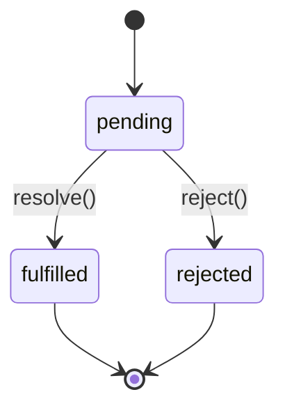

# 1.5 异步编程的前世今生

> 卷:卷一 · JavaScript 语言内核
> 难度:⭐⭐⭐ 专家 | 阅读时间:35min | 状态:深度增强

---

## 引言:从回调地狱到 async/await,底层是一张"状态机 + 回调队列"

JS 单线程,阻塞会卡死页面,所以有异步。写法演进:**回调 → Promise → async/await**。要深挖,得懂 Promise 的**状态机 + 回调队列**本质,和 async/await 的**生成器实现**。

---

## 一、回调与回调地狱

```js
fs.readFile("a.txt", (e, a) => {
  fs.readFile("b.txt", (e, b) => {
    fs.readFile("c.txt", (e, c) => { /* 回调地狱 */ });
  });
});
```

痛点:深层嵌套、错误割裂、无法统一流程控制。

---

## 二、Promise:状态机 + 回调队列

### 2.1 三种状态(状态机)



**为什么状态只能变一次?** Promise 表达"一个异步操作的**最终结果**",若结果反复变,下游链式会在成/败间反复横跳,语义崩溃。一次性状态让回调**确定、可预测**。

### 2.2 链式与错误穿透

`then` **总是返回新 Promise**;`catch` 捕获链上前端任意异常。

### 2.3 手写 Promise(更完整版)

```js
class MyPromise {
  constructor(executor) {
    this.state = "pending"; this.value = undefined; this.callbacks = [];
    const resolve = (v) => { if (this.state !== "pending") return;
      this.state = "fulfilled"; this.value = v;
      this.callbacks.forEach((cb) => cb.onFulfilled(v)); };
    const reject = (e) => { if (this.state !== "pending") return;
      this.state = "rejected"; this.value = e;
      this.callbacks.forEach((cb) => cb.onRejected(e)); };
    try { executor(resolve, reject); } catch (e) { reject(e); }
  }
  then(onFulfilled, onRejected) {
    // 链式:返回新 Promise;这里略去穿透/thenable,核心是"状态 + 回调队列"
    if (this.state === "fulfilled") onFulfilled?.(this.value);
    else if (this.state === "rejected") onRejected?.(this.value);
    else this.callbacks.push({ onFulfilled, onRejected });
  }
}
```

**底层本质:Promise = 状态机 + 回调队列。** `then` 时若还 pending,就把回调**存进队列**;状态一确定就**批量执行**队列。这解释了"为何 resolve 前的多次 then 都会执行"。

---

## 三、async/await:生成器 + Promise 的语法糖

### 3.1 本质

`async` 函数内部会被编译器改造成一个**状态机(生成器)**,每次 `await` 是一个"暂停点":

```js
async function f() {
  const a = await A();   // 暂停,等 A 的 Promise
  const b = await B(a);  // 恢复后继续
  return b;
}
// ≈ 生成器 + 自动执行器(每 yield 一个 Promise,完成后再 next)
```

### 3.2 两个坑

```js
// 串行(await 逐个等)
const a = await fa(); const b = await fb();
// 并行(先同时发起)
const [a, b] = await Promise.all([fa(), fb()]);
```

---

## 四、微任务地位(底层)

`Promise.then` 的回调是**微任务**,在事件循环里**优先于下一个宏任务**,且一次性清空(完整机制见 1.8)。这也是 `async/await` "await 之后的代码会进微任务"的根源。

---

## 五、小结

```
异步演进:回调(嵌套/错误割裂)→ Promise(状态机+回调队列,一次性)→ async/await(生成器+Promise)
底层:Promise=状态机+回调队列;async/await=生成器状态的语法糖,await=暂停点
关键:then 返回新 Promise;async 返回 Promise;并行 Promise.all;微任务(见1.8)
```

---

## 六、面试题

**Q1:详细解释 Promise 的"状态机 + 回调队列"机制?**

Promise 内部是 `pending → fulfilled/rejected` 的一次性状态机。`then` 时若 pending,回调被**存入队列**;`resolve/reject` 时才**批量执行**队列里的回调。这解释了为什么"resolve 前注册的多个 then 都会执行、且只执行一次"。

**Q2:下面输出顺序?**

```js
console.log(1);
Promise.resolve().then(() => console.log(2));
setTimeout(() => console.log(3), 0);
console.log(4);
// 1 → 4 → 2 → 3(同步;微任务 then 先于宏任务 setTimeout;见 1.8)
```

**Q3:实现一个带并发限制的批量请求?**

```js
async function pLimit(tasks, limit) {
  const queue = [...tasks];
  const workers = Array(limit).fill().map(async () => {
    while (queue.length) {
      const task = queue.shift();
      await task();
    }
  });
  await Promise.all(workers);
}
// 本质:多个 worker 并发消费队列,worker 数 = limit
```

**Q4:为什么 `await` 会串行?如何并行?**

`await` 让 async 函数**暂停等结果**,`await a; await b` 就是"等完 a 再发 b"(串行)。并行要**先同时发起再一起等**:`Promise.all([fa(), fb()])`。

**Q5:`async` 函数里 `return` 一个 Promise 会怎样?会被包两层吗?**

不会。`async` 的 return 值会被 `Promise.resolve` 处理,若返回值本身是 Promise,会**直接采用**它(即 Promise 的"thenable 解析"),不会包两层。

**Q6:手写 Promise 需要处理哪些 A+ 要点?**

① 状态一次性;② `then` 链式(返回新 Promise);③ 回调队列(pending 时存、确定时批执行);④ `then` 返回 thenable 需递归解析;⑤ 异常转 reject;⑥ `then` 的 onFulfilled/onRejected 微任务异步执行。

---

📎 参考:MDN《Promise》《async function》、Promises/A+ 规范、ECMA-262 Promise/AsyncFunction 章节