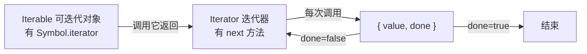

# 1.6 迭代器与生成器

> 卷:卷一 · JavaScript 语言内核
> 难度:⭐⭐ 进阶 | 阅读时间:20min | 状态:已深化

---

## 引言:`for...of` 为什么能遍历数组

因为数组是"可迭代对象"。这里藏着 JS 的**迭代协议**。理解它,才能搞懂 `for...of`、展开运算符、以及 `async/await` 的实现来源——**生成器**。

---

## 一、两个协议:Iterator 与 Iterable



### 1. Iterator(迭代器)

```js
function makeIterator(arr) {
  let i = 0;
  return {
    next() {
      return i < arr.length
        ? { value: arr[i++], done: false }
        : { value: undefined, done: true };
    },
  };
}
const it = makeIterator([1, 2, 3]);
it.next(); // { value: 1, done: false }
it.next(); // { value: 2, done: false }
it.next(); // { value: 3, done: false }
it.next(); // { value: undefined, done: true }
```

### 2. Iterable(可迭代对象)

有 `Symbol.iterator` 方法、返回迭代器的对象。数组、字符串、Map、Set、`arguments`、NodeList 都内置。

---

## 二、`for...of` 的原理

`for...of` 本质是反复调用迭代器 `next()`,直到 `done`:

```js
for (const v of arr) { /* ... */ }

// 等价于
const iter = arr[Symbol.iterator]();
let r = iter.next();
while (!r.done) { const v = r.value; /* ... */ r = iter.next(); }
```

**为什么用协议而非固定类型?** 迭代协议让"**任何**实现了 `Symbol.iterator` 的对象"都能被 `for...of`/展开运算符遍历——不局限于数组。这是"**面向协议,而非面向类型**"的设计,扩展性极强(自定义对象、链表、树都能接入)。

**`for...of` vs `for...in`:**

| | 遍历 | 适用 |
|---|------|------|
| `for...of` | **值**,依赖迭代协议 | 数组/字符串/Map/Set |
| `for...in` | **可枚举键**(含原型链) | 对象 |

**让普通对象可迭代:**

```js
const obj = {
  from: 1, to: 3,
  [Symbol.iterator]() {
    let cur = this.from; const { to } = this;
    return { next: () => (cur <= to ? { value: cur++, done: false } : { value: undefined, done: true }) };
  },
};
console.log([...obj]); // [1, 2, 3]
```

---

## 三、生成器 Generator

`function*` + `yield`,能**中途暂停**的函数:

```js
function* gen() {
  yield 1;
  yield 2;
  return 3;   // { value: 3, done: true }
}
const g = gen();
g.next(); // { value: 1, done: false }
g.next(); // { value: 2, done: false }
g.next(); // { value: 3, done: true }
```

**双向通信:`next` 能传值回 `yield`**

```js
function* talk() {
  const a = yield "第一次给我个值";
  const b = yield `收到:${a},再给我个值`;
  return `收到:${b},结束`;
}
const g = talk();
g.next();        // { value: "第一次给我个值" }
g.next("大王");  // { value: "收到:大王,再给我个值" }
g.next("阿北");  // { value: "收到:阿北,结束", done: true }
```

---

## 四、应用

| 场景 | 说明 |
|------|------|
| 惰性/无限序列 | 要多少算多少(斐波那契) |
| 异步流程控制 | `yield` 暂停等异步 → `async/await` 前身 |
| 自定义迭代器 | `function*` 代替手写 next |

```js
function* fibonacci() {
  let [a, b] = [0, 1];
  while (true) { yield a; [a, b] = [b, a + b]; }
}
const f = fibonacci();
f.next().value; // 0
f.next().value; // 1
f.next().value; // 1
f.next().value; // 2
```

---

## 五、小结

```
迭代协议:Iterator(next→{value,done})+ Iterable(Symbol.iterator)
for...of / 展开 / 解构 → 拿到迭代器 → 循环 next 到 done
生成器 function* + yield:暂停/恢复,next 双向传值
应用:惰性序列 / co 异步 / 自定义迭代器(是 async/await 的实现来源)
```

---

## 六、面试题

**Q1:`[...str]` 和 `Array.from(str)` 有何异同?**

都能把可迭代对象转数组。`Array.from` 额外支持**类数组对象**(有 `length` 无迭代协议)和第二个 map 函数:

```js
const like = { 0: "a", 1: "b", length: 2 };
console.log([...like]);       // TypeError(不可迭代)
console.log(Array.from(like)); // ["a", "b"] ✅
```

**Q2:如何让生成器感知被"提前 break"?**

`for...of` 遇 `break`/`return`/异常会调迭代器 `return()`;生成器里用 `try/finally` 捕获提前结束:

```js
function* g() {
  try { yield 1; yield 2; yield 3; }
  finally { console.log("被提前关闭"); }
}
for (const v of g()) { if (v === 2) break; } // "被提前关闭"
```

---

📎 参考:MDN《迭代协议》《迭代器和生成器》、ECMA-262 Iterator / Generator 章节