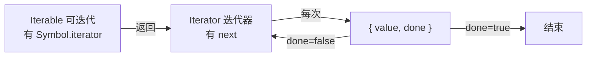

# 1.6 迭代器与生成器

## 引言:一个"协议",解锁了 for...of / 展开 / async/await

迭代协议是 JS 里最优雅的设计之一:统一了"遍历"这件事。理解它的**拉模型**本质与生成器的**状态机**,才能吃透 async/await 与生成器。

---

## 一、两个协议



### 1.1 Iterator(迭代器)

迭代器是**实现了 `next()` 方法的对象**,`next()` 返回 `{ value, done }` 两个属性:

- `value`:序列的下一个值
- `done`:是否迭代到最后一个值(true 时迭代结束;若 `value` 与 `done` 一起出现,`value` 就是返回值)

```js
function makeIterator(arr) {
  let i = 0;
  return {
    next: () => i < arr.length
      ? { value: arr[i++], done: false }
      : { value: undefined, done: true },
  };
}
const it = makeIterator([1, 2, 3]);
it.next(); // { value: 1, done: false }
```

### 1.2 完整例子:range 迭代器(含最终返回值)

```js
function makeRangeIterator(start = 0, end = Infinity, step = 1) {
  let nextIndex = start;
  let iterationCount = 0;
  return {
    next() {
      if (nextIndex < end) {
        const result = { value: nextIndex, done: false };
        nextIndex += step;
        iterationCount++;
        return result;
      }
      return { value: iterationCount, done: true };   // 最终 value = 序列长度
    },
  };
}

const it = makeRangeIterator(1, 10, 2);
let result = it.next();
while (!result.done) {
  console.log(result.value);   // 1 3 5 7 9
  result = it.next();
}
console.log("序列长度:", result.value);   // 5
```

> 注意:迭代器**只能被消耗一次**——产出终值后,再调 `next()` 应继续返回 `{ done: true }`。且迭代器能表示**无限序列**(如 0 到 Infinity),因为它是**按需分配**,不像数组必须一次性完整分配。

### 1.3 Iterable(可迭代对象)

拥有迭代行为的对象(能被 `for...of` 遍历),就是可迭代对象。它(或其原型链)必须有 `Symbol.iterator` 方法。

**只能迭代一次 vs 可多次迭代(重要):**

```js
function* makeIterator() {
  yield 1;
  yield 2;
}
const it = makeIterator();

console.log(it[Symbol.iterator]() === it);  // true —— 返回自己 → 只能迭代一次!

// 若改为每次返回新迭代器,则可多次迭代:
it[Symbol.iterator] = function* () {
  yield 2;
  yield 1;
};
```

- **生成器**从 `Symbol.iterator` 返回 `this`,所以**只能迭代一次**
- **数组**等每次调用 `Symbol.iterator` 都返回**新**迭代器,所以**可多次迭代**

### 1.4 为什么用"拉模型(pull)"?

迭代协议是**消费者主动拉取**(每次调 `next` 要下一个),而非"生产者推给你"。好处:**惰性**——要多少取多少(无穷序列、大文件流都可行),消费者掌控节奏。这正是"观察者模式(推)"和"迭代器(拉)"的分野。

---

## 二、`for...of` 的原理与可迭代语法

### 2.1 for...of 等价展开

```js
for (const v of arr) { /* ... */ }
// 等价于
const iter = arr[Symbol.iterator]();
let r = iter.next();
while (!r.done) { const v = r.value; /* ... */ r = iter.next(); }
```

`for...of` 遍历**值**(依赖协议);`for...in` 遍历**可枚举键**(含原型链)。

### 2.2 内置可迭代对象

`String`、`Array`、`TypedArray`、`Map`、`Set` 都是内置可迭代对象(原型上有 `Symbol.iterator`)。普通 `Object` 不是。

### 2.3 专用于可迭代对象的语法

```js
for (let value of ["a", "b", "c"]) { console.log(value); }   // for...of

[..."abc"];                          // ["a","b","c"] —— 展开语法

function* gen() {
  yield* ["a", "b", "c"];            // yield* 委托给另一个可迭代对象
}
gen().next();                        // { value: "a", done: false }

const [a, b, c] = new Set(["a", "b", "c"]);   // 解构
a;  // "a"
```

### 2.4 自定义可迭代对象

```js
const myIterable = {
  *[Symbol.iterator]() {   // 生成器方法,天然返回迭代器
    yield 1;
    yield 2;
    yield 3;
  },
};
for (const value of myIterable) console.log(value);   // 1 2 3
[...myIterable];   // [1, 2, 3]
```

```js
// 手写 next 版(范围对象)
const obj = {
  from: 1, to: 3,
  [Symbol.iterator]() {
    let cur = this.from; const { to } = this;
    return { next: () => cur <= to ? { value: cur++, done: false } : { value: undefined, done: true } };
  },
};
console.log([...obj]); // [1, 2, 3]
```

---

## 三、生成器 Generator:一个"可暂停的函数"

### 3.1 基础:`function*` + `yield`

生成器函数**调用时不执行任何代码**,而是返回一个生成器(特殊迭代器);每调 `next()` 才执行到下一个 `yield`:

```js
function* gen() {
  yield 1;
  yield 2;
  return 3;
}
const g = gen();
g.next(); // { value: 1, done: false }
g.next(); // { value: 2, done: false }
g.next(); // { value: 3, done: true }
```

生成器让"手写迭代器"变得简单——上面的 `makeRangeIterator` 用生成器重写:

```js
function* makeRangeIterator(start = 0, end = Infinity, step = 1) {
  let iterationCount = 0;
  for (let i = start; i < end; i += step) {
    iterationCount++;
    yield i;
  }
  return iterationCount;
}
```

### 3.2 双向通信:`next(x)` 传值回 `yield`

`next()` 接受一个参数,会被 `yield` 接收,用于**修改生成器内部状态**:

```js
function* talk() {
  const a = yield "给我个值";
  return `收到:${a}`;
}
const g = talk();
g.next();       // { value: "给我个值" }
g.next("大王"); // { value: "收到:大王", done: true }
```

> 细节:**传给第一个 `next()` 的值会被忽略**(那时还没执行到任何 `yield`)。

### 3.3 高级:斐波那契 + `next(x)` 重启序列

```js
function* fibonacci() {
  let current = 0;
  let next = 1;
  while (true) {
    const reset = yield current;   // 收到 reset 则重启
    [current, next] = [next, next + current];
    if (reset) { current = 0; next = 1; }
  }
}
const seq = fibonacci();
seq.next().value;        // 0
seq.next().value;        // 1
seq.next().value;        // 1
seq.next().value;        // 2
seq.next(true).value;    // 0 —— 传 true 重启序列
seq.next().value;        // 1
```

### 3.4 三个方法:next / return / throw

```js
// return():从外部提前终止生成器,返回给定值并终结
function* gen() {
  yield 1; yield 2; yield 3;
}
const g = gen();
g.next();              // { value: 1, done: false }
g.return("提前结束");   // { value: "提前结束", done: true }
g.next();              // { value: undefined, done: true }

// throw():在生成器内部当前位置抛错(可被 try/catch 捕获)
function* gen2() {
  try { yield 1; } catch (e) { console.log("捕获:", e); }
  yield 2;
}
const g2 = gen2();
g2.next();            // { value: 1, done: false }
g2.throw("出错了");   // 捕获: 出错了 → 继续到 yield 2
g2.next();            // { value: 2, done: false }
```

> `throw()` 的异常若**在生成器内部没被捕获**,会向上传播给 `throw()` 的调用方,且后续 `next()` 返回 `{ done: true }`。

> `for...of` 遇到 `break`/`return`/异常时,会自动调用迭代器的 `return()`——这就是 Q2 里 `try/finally` 能捕获"提前结束"的底层机制。

---

## 四、生成器的应用(含 async 迭代)

| 场景 | 说明 |
|------|------|
| 惰性/无限序列 | 要多少算多少 |
| 异步流程控制(co) | yield 暂停等异步 → async/await 前身 |
| 自定义迭代器 | 代替手写 next |
| **async 迭代** | `Symbol.asyncIterator` + `for await...of` |

```js
// async 迭代器:处理异步数据流(如分页拉取)
const asyncIterable = {
  async *[Symbol.asyncIterator]() {
    yield 1; yield 2; yield 3;
  },
};
for await (const v of asyncIterable) console.log(v); // 1 2 3
```

---

## 五、小结

```
迭代协议:Iterable(Symbol.iterator)→ Iterator(next→{value,done})
本质:拉模型(惰性,消费者掌控)→ 无穷序列/流式都可行;迭代器只能消耗一次
for...of:走协议遍历值;for...in:遍历键;内置可迭代:String/Array/TypedArray/Map/Set
生成器:状态机/协程,yield 暂停、next 恢复、双向传值(next传值回yield)
yield* 委托;next/return/throw 三方法;async 迭代 for await...of
```

---

## 六、面试题

**Q1:`[...str]` 和 `Array.from(str)` 有何异同?**

都能把可迭代对象转数组。`Array.from` 额外支持**类数组对象**(有 `length` 无迭代协议)和第二个 map 函数:

```js
const like = { 0: "a", 1: "b", length: 2 };
console.log([...like]);        // TypeError(不可迭代)
console.log(Array.from(like)); // ["a", "b"]
```

**`Array.from` 的底层原理:** 按顺序判断:① 若有 `Symbol.iterator` → 走迭代协议逐一收集;② 否则若有 `length` → 按下标 0..length-1 取值(类数组路径);③ 第二参数 `mapFn` 收集时同步映射(省一次中间数组)。这就是它比展开运算符"宽容"的原因。

📎 官方:[MDN《Array.from()》](https://developer.mozilla.org/zh-CN/docs/Web/JavaScript/Reference/Global_Objects/Array/from)

**Q2:如何让生成器感知被"提前 break"?**

`for...of` 遇 break/return/异常会调迭代器的 `return()`;生成器用 `try/finally` 捕获:

```js
function* g() {
  try { yield 1; yield 2; yield 3; }
  finally { console.log("被提前关闭"); }
}
for (const v of g()) { if (v === 2) break; } // "被提前关闭"
```

**Q3:解释"迭代器是拉模型",并对比观察者(推模型)**

迭代器由**消费者主动调用 `next` 拉取**,什么时候要、要多少由消费者定 → 惰性、可中断;观察者模式由**生产者主动 push 事件**给订阅者 → 实时、无惰性。流式/无穷数据适合拉模型,事件广播适合推模型。

**Q4:生成器为什么可以用来实现 async/await?简述原理**

生成器可**暂停/恢复**(`yield`/`next`),每个 `yield` 后挂一个 Promise,配一个**自动执行器**:每 `next` 得到一个 Promise,完成后再 `next` 继续——就把"异步"写成了"同步观感"。早期 Babel 正是这样把 async/await 编译成生成器 + 自动执行器。

**Q5:`for await...of` 和 `for...of` 的区别?**

`for await...of` 遍历的是**异步可迭代对象**(`Symbol.asyncIterator`,每次 next 返回 Promise),能 `await` 异步数据流;`for...of` 走同步 `Symbol.iterator`。

**Q6:如何手写一个"无限斐波那契"迭代器,并说明其优点?**

```js
function* fib() {
  let [a, b] = [0, 1];
  while (true) { yield a; [a, b] = [b, a + b]; }
}
```
优点:**惰性**——只在实际 `next` 时才算下一个,不预生成、不占内存,可随时取任意多个。

**Q7:为什么说"生成器只能迭代一次"?数组为什么能多次?**

生成器的 `Symbol.iterator` 返回**自己(`this`)**,消费一次后内部游标已到末尾,不能再从头开始;数组每次调 `Symbol.iterator` 都返回**新的**迭代器,所以能反复 `for...of`。

**Q8:`yield*` 有什么用?**

`yield*` 把迭代**委托**给另一个可迭代对象,逐个产出它的值:

```js
function* gen() { yield* [1, 2, 3]; yield* "ab"; }
[...gen()];   // [1, 2, 3, "a", "b"]
```

**Q9:`next(x)` 传参的意义?为什么第一个 next 传值会被忽略?**

`next(x)` 把 x 作为**上一个 `yield` 表达式的返回值**,从而把外部数据"注入"生成器、修改其内部状态(如斐波那契重启)。第一个 `next()` 传值被忽略,因为那时还没执行到任何 `yield`,没有"上一个 yield"可接收。

**Q10:哪些内置类型是可迭代的?普通对象怎么变成可迭代?**

`String`/`Array`/`TypedArray`/`Map`/`Set` 可迭代(原型有 `Symbol.iterator`);普通 `Object` 不可。让对象可迭代:实现 `[Symbol.iterator]` 方法(返回 `{ next }` 或写成 `*[Symbol.iterator]` 生成器)。

---

📎 参考:[MDN《迭代器和生成器》](https://developer.mozilla.org/zh-CN/docs/Web/JavaScript/Guide/Iterators_and_generators)、[MDN《迭代协议》](https://developer.mozilla.org/zh-CN/docs/Web/JavaScript/Reference/Iteration_protocols)、[MDN《Generator》](https://developer.mozilla.org/zh-CN/docs/Web/JavaScript/Reference/Global_Objects/Generator)、ECMA-262 Iterator / Generator 章节
