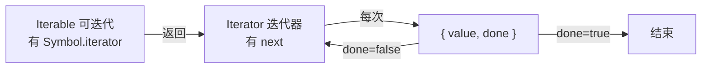

# 1.6 迭代器与生成器

## 引言:一个"协议",解锁了 for...of / 展开 / async/await

迭代协议是 JS 里最优雅的设计之一:统一了"遍历"这件事。理解它的**拉模型**本质与生成器的**状态机**,才能吃透 async/await 与生成器。

---

## 一、两个协议



### 1. Iterator | 2. Iterable

```js
function makeIterator(arr) {
  let i = 0;
  return { next: () => i < arr.length ? { value: arr[i++], done: false } : { value: undefined, done: true } };
}
const it = makeIterator([1, 2, 3]);
it.next(); // { value: 1, done: false }
```

**为什么用"拉模型(pull)"?** 迭代协议是**消费者主动拉取**(每次调 `next` 要下一个),而非"生产者推给你"。好处:**惰性**——要多少取多少(无穷序列、大文件流都可行),消费者掌控节奏。这正是"观察者模式(推)"和"迭代器(拉)"的分野。

---

## 二、`for...of` 的原理

```js
for (const v of arr) { /* ... */ }
// 等价于
const iter = arr[Symbol.iterator]();
let r = iter.next();
while (!r.done) { const v = r.value; /* ... */ r = iter.next(); }
```

`for...of` 遍历**值**(依赖协议);`for...in` 遍历**可枚举键**(含原型链)。

```js
const obj = {
  from: 1, to: 3,
  [Symbol.iterator]() {
    let cur = this.from; const { to } = this;
    return { next: () => cur <= to ? { value: cur++, done: false } : { value: undefined, done: true } };
  },
};
console.log([...obj]); // [1, 2, 3]
```

---

## 三、生成器 Generator:一个"可暂停的函数"

`function*` + `yield`,本质是**状态机(协程)**:每次 `yield` 暂停,`next` 恢复。

```js
function* gen() {
  yield 1;
  yield 2;
  return 3;
}
const g = gen();
g.next(); // { value: 1, done: false }
g.next(); // { value: 2, done: false }
g.next(); // { value: 3, done: true }
```

**双向通信:`next` 传值回 `yield`**

```js
function* talk() {
  const a = yield "给我个值";
  return `收到:${a}`;
}
const g = talk();
g.next();       // { value: "给我个值" }
g.next("大王"); // { value: "收到:大王", done: true }
```

**生成器的三个方法:next / return / throw**

生成器对象除了 `next()`,还有两个控制方法:

```js
// return():从外部提前终止生成器
function* gen() {
  yield 1;
  yield 2;
  yield 3;
}
const g = gen();
g.next();              // { value: 1, done: false }
g.return("提前结束");   // { value: "提前结束", done: true }
g.next();              // { value: undefined, done: true } ← 已终止

// throw():在生成器内部当前位置抛错(可被 try/catch 捕获)
function* gen2() {
  try { yield 1; } catch (e) { console.log("捕获:", e); }
  yield 2;
}
const g2 = gen2();
g2.next();            // { value: 1, done: false }
g2.throw("出错了");   // 捕获: 出错了 → 继续到 yield 2
g2.next();            // { value: 2, done: false }
```

> `for...of` 遇到 `break`/`return`/异常时,会自动调用生成器的 `return()`——这就是 Q2 里 `try/finally` 能捕获"提前结束"的底层机制。

---

## 四、生成器的应用(含 async 迭代)

| 场景 | 说明 |
|------|------|
| 惰性/无限序列 | 要多少算多少 |
| 异步流程控制(co) | yield 暂停等异步 → async/await 前身 |
| 自定义迭代器 | 代替手写 next |
| **async 迭代** | `Symbol.asyncIterator` + `for await...of` |

```js
// async 迭代器:处理异步数据流(如分页拉取)
const asyncIterable = {
  async *[Symbol.asyncIterator]() {
    yield 1; yield 2; yield 3;
  },
};
for await (const v of asyncIterable) console.log(v); // 1 2 3
```

---

## 五、小结

```
迭代协议:Iterable(Symbol.iterator)→ Iterator(next→{value,done})
本质:拉模型(惰性,消费者掌控)→ 无穷序列/流式都可行
for...of:走协议遍历值;for...in:遍历键(含原型)
生成器:状态机/协程,yield 暂停、next 恢复、双向传值;async 迭代 for await...of
```

---

## 六、面试题

**Q1:`[...str]` 和 `Array.from(str)` 有何异同?**

都能把可迭代对象转数组。`Array.from` 额外支持**类数组对象**(有 `length` 无迭代协议)和第二个 map 函数:

```js
const like = { 0: "a", 1: "b", length: 2 };
console.log([...like]);        // TypeError(不可迭代)
console.log(Array.from(like)); // ["a", "b"]
```

**`Array.from` 的底层原理:**

它按顺序判断:① 若对象有 `Symbol.iterator` → 走**迭代协议**逐一收集;② 否则若有 `length` → 按**下标 0..length-1 逐一取值**(类数组路径);③ 第二个参数 `mapFn` 在**收集每个元素时同步映射**(等价 `from(iter).map(fn)` 但省一次中间数组)。这就是它比展开运算符"宽容"的原因。

📎 官方:[MDN《Array.from()》](https://developer.mozilla.org/zh-CN/docs/Web/JavaScript/Reference/Global_Objects/Array/from)

**Q2:如何让生成器感知被"提前 break"?**

`for...of` 遇 break/return/异常会调迭代器的 `return()`;生成器用 `try/finally` 捕获:

```js
function* g() {
  try { yield 1; yield 2; yield 3; }
  finally { console.log("被提前关闭"); }
}
for (const v of g()) { if (v === 2) break; } // "被提前关闭"
```

**Q3:解释"迭代器是拉模型",并对比观察者(推模型)**

迭代器由**消费者主动调用 `next` 拉取**,什么时候要、要多少由消费者定 → 惰性、可中断;观察者模式由**生产者主动 push 事件**给订阅者 → 实时、无惰性。流式/无穷数据适合拉模型,事件广播适合推模型。

**Q4:生成器为什么可以用来实现 async/await?简述原理**

生成器可**暂停/恢复**(`yield`/`next`),每个 `yield` 后挂一个 Promise,配一个**自动执行器**:每 `next` 得到一个 Promise,完成后再 `next` 继续——就把"异步"写成了"同步观感"。早期 Babel 正是这样把 async/await 编译成生成器 + 自动执行器。

**Q5:`for await...of` 和 `for...of` 的区别?**

`for await...of` 遍历的是**异步可迭代对象**(`Symbol.asyncIterator`,每次 next 返回 Promise),能 `await` 异步数据流;`for...of` 走同步 `Symbol.iterator`。

**Q6:如何手写一个"无限斐波那契"迭代器,并说明其优点?**

```js
function* fib() {
  let [a, b] = [0, 1];
  while (true) { yield a; [a, b] = [b, a + b]; }
}
```
优点:**惰性**——只在实际 `next` 时才算下一个,不预生成、不占内存,可随时取任意多个。

---

📎 参考:[MDN《迭代协议》](https://developer.mozilla.org/zh-CN/docs/Web/JavaScript/Reference/Iteration_protocols)《迭代器和生成器》《Symbol.asyncIterator》、ECMA-262 Iterator / Generator 章节