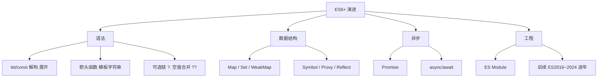

# 1.7 ES6+ 演进与 API

> 卷:卷一 · JavaScript 语言内核
> 难度:⭐ 基础(覆盖面广) | 阅读时间:25min | 状态:已深化

---

## 引言:按"场景"速览 ES6 到 ES2024 的常用

ES6 大爆发,之后每年小步新特性。本章按**使用场景**归类高频考点,不罗列。

---

## 一、ES6+ 全景一张图



---

## 二、解构与展开

```js
const { name, age = 18 } = user;     // 对象解构 + 默认值
const [first, , third] = arr;        // 数组解构跳位
const { a: aa, ...rest } = obj;      // 重命名 + 剩余
const merged = { ...a, ...b };       // 浅合并
const copy = [...arr];               // 浅拷贝(嵌套引用仍是浅的)
```

> `...` 在函数形参里是 **rest(收集)**,在字面量/调用里是 **spread(展开)**。

---

## 三、可选链 `?.` 与空值合并 `??`(ES2020 高频)

```js
const city = user?.address?.city;   // 链上任一环 null/undefined 就返回 undefined
const v = obj?.name ?? "默认值";     // ?? 只在 null/undefined 兜底(区别于 ||)
```

```js
0 || "兜底"  // "兜底"(|| 把 0/""/false 都当假)
0 ?? "兜底"  // 0(?? 只认 null/undefined)
```

---

## 四、数组新方法

```js
arr.map / filter / reduce      // 老三样
arr.find(fn) / findIndex       // 找元素/下标
arr.some / every               // 任一/全部满足
arr.includes(v)                // 代替 indexOf !== -1
arr.flat(Infinity)             // 全拍平
arr.flatMap(fn)                // map + flat(1)
arr.at(-1)                     // 负索引取末位
Array.from(iterable)           // 可迭代/类数组 → 真数组
```

---

## 五、Map / Set / WeakMap

```js
const m = new Map([["k", "v"]]);      // 键任意类型,有 .size/.get/.set
const s = new Set([1, 2, 2, 3]);      // 去重,.has/.add
const wm = new WeakMap();             // 键必须对象,弱引用(不阻止 GC)
wm.set(obj, meta);
```

> `WeakMap` 键是**弱引用**:键对象无其他引用时会被回收,适合给对象挂私有元数据、或做"可自动清理"的缓存(见 10.4)。

---

## 六、Symbol / Proxy / Reflect

```js
const s = Symbol("desc");             // 唯一标识,常作非字符串 key
Symbol.iterator                       // 迭代协议(1.6)

// Proxy:拦截对象操作(Vue3 响应式底层,见 6.1)
const proxy = new Proxy({ n: 0 }, {
  get(o, k) { console.log("读", k); return o[k]; },
  set(o, k, v) { console.log("写", k, v); o[k] = v; return true; },
});
proxy.n = 1;   // 写 n 1
// Reflect 是配套的"默认行为"反射 API:Reflect.get/set/has
```

---

## 七、速查表

| 需求 | 语法 |
|------|------|
| 块级变量 | `let/const` |
| 安全取深层属性 | `a?.b?.c` |
| 空值兜底(不含 falsy) | `a ?? 默认` |
| 浅拷贝对象/数组 | `{...o}` / `[...a]` |
| 去重 | `new Set(arr)` |
| 拍平 | `arr.flat(Infinity)` |
| 对象私有元数据 | `WeakMap` |
| 拦截对象读写(Vue3 原理) | `Proxy` + `Reflect` |

---

## 八、小结

```
ES6+:解构/展开、可选链/空值合并、数组新方法、Map/Set/WeakMap、Symbol、Proxy/Reflect
关键:?? 只认 null/undefined;WeakMap 弱引用;Proxy 是 Vue3 响应式基石
```

---

## 九、面试题

**Q1:`??` 和 `||` 的区别?**

`||` 把 `0/""/false/NaN` 都当假;`??` 只在 `null/undefined` 时兜底。要"区分 0 是合法值"时用 `??`。

**Q2:Proxy 为什么能实现响应式,而 Vue2 的 defineProperty 有局限?**

`defineProperty` 只能**逐属性**拦截,新增属性、删除属性、数组下标变化监听不到,需 `Vue.set` 补丁;`Proxy` 能拦截**任意属性**的增删改查 + 数组方法,Vue3 因此整体转向 Proxy。(详见 6.1)

**Q3:`WeakMap` 和 `Map` 的差异?**

`Map` 键是**强引用**(只要 map 活着,键对象永不被回收);`WeakMap` 键是**弱引用**(键对象无其他引用即被 GC,entry 自动消失),且**不可枚举、不可遍览**。缓存/私有元数据用 WeakMap 防泄漏。

---

📎 参考:MDN《JavaScript 指南》、ES2015~ES2024 各版规范、caniuse