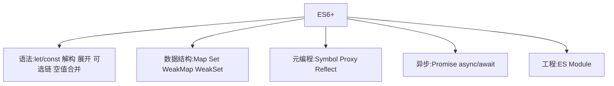

# 1.7 ES6+ 演进与 API

> 卷:卷一 · JavaScript 语言内核
> 阅读时间:30min

---

## 引言:ES6+ 不只是新语法,更是思维升级

ES6 起 JS 从"玩具语法"进化成"现代工程语言"。本章在常用 API 基础上,补几处**底层为什么**(Proxy、Symbol、Map、WeakMap 的设计动机)。

---

## 一、全景一张图



---

## 二、解构与展开

```js
const { name, age = 18 } = user;
const [first, , third] = arr;
const { a: aa, ...rest } = obj;   // rest 收集
const merged = { ...a, ...b };    // spread 展开(浅拷贝)
```

---

## 三、可选链 `?.` 与空值合并 `??`

```js
const city = user?.address?.city;  // 任一环 null/undefined → undefined
const v = obj?.name ?? "默认";     // ?? 只在 null/undefined 兜底
```

```js
0 || "兜底"  // "兜底"(|| 把 0/""/false 当假)
0 ?? "兜底"  // 0(?? 只认 null/undefined)
```

---

## 四、数组新方法

```js
arr.map/filter/reduce                 // 老三样
arr.find(fn) / findIndex              // 找元素/下标
arr.some / every                      // 任一/全部
arr.includes(v)                       // 替代 indexOf
arr.flat(Infinity) / flatMap(fn)      // 拍平
arr.at(-1)                            // 负索引
Array.from(iterable)                  // 可迭代/类数组 → 真数组
```

---

## 五、Map / Set / WeakMap(底层设计)

```js
const m = new Map([["k", "v"]]);   // 键任意类型
const s = new Set([1, 2, 2, 3]);   // 去重
const wm = new WeakMap();          // 键必须对象,弱引用
```

**为什么 Map 优于普通对象做映射?** 对象键只能是字符串/Symbol,且 `__proto__`、`constructor` 等键名会与原型冲突(map 污染);Map 键**任意类型**、无原型污染、有迭代顺序、`size` 直接可得。

**WeakMap 的弱引用(核心):**

```js
let obj = { id: 1 };
const wm = new WeakMap();
wm.set(obj, "meta");
obj = null;   // obj 不再被引用 → 键被 GC,entry 自动消失
```

> WeakMap 键是**弱引用**(不阻止 GC)、**不可枚举**(隐私保护),适合"对象 → 元数据"映射与"可自动清理"的缓存。Map 键是强引用,会撑爆内存(见 10.4)。

---

## 六、Symbol / Proxy / Reflect(元编程)

```js
const s = Symbol("desc");             // 唯一标识
Symbol.iterator                       // 内置著名 Symbol(迭代协议)
Symbol.for("k") / Symbol.keyFor()     // 全局 symbol 注册表(可跨模块共享)
```

**Proxy:拦截对象操作(Vue3 响应式底层,6.1)**

```js
const proxy = new Proxy({ n: 0 }, {
  get(o, k) { console.log("读", k); return o[k]; },
  set(o, k, v) { console.log("写", k, v); o[k] = v; return true; },
  deleteProperty(o, k) { console.log("删", k); return delete o[k]; },
  has(o, k) { return k in o; },
});
proxy.n = 1;   // 写 n 1
```

> Proxy 相比 Vue2 的 `Object.defineProperty`:能拦截**新增/删除/数组/`in`/`has`** 等全部操作,`Reflect` 提供"默认行为"的统一反射 API(`Reflect.get/set/deleteProperty`)。

**对象"不可变"三剑客(与 Proxy 互补):**

| 方法 | 禁止 |
|------|------|
| `Object.preventExtensions` | 新增属性 |
| `Object.seal` | 新增 + 删除(已有可改) |
| `Object.freeze` | 新增 + 删除 + 修改(最严) |

```js
const o = Object.freeze({ a: 1 });
o.a = 2;   // 静默失败(严格模式报错)
o.b = 3;   // 无效
```

> 注意:三者都是**浅**的(嵌套对象仍可变);`freeze` 后 `Proxy` 的 `set` 陷阱也写不进。

📎 官方:MDN《Proxy》《Reflect》《Object.freeze》《Object.seal》《Object.preventExtensions》

---

## 七、速查表

| 需求 | 语法 |
|------|------|
| 块级变量 | `let/const` |
| 安全取深层属性 | `a?.b?.c` |
| 空值兜底(不含 falsy) | `a ?? 默认` |
| 浅拷贝 | `{...o}` / `[...a]` |
| 去重 | `new Set(arr)` |
| 拍平 | `arr.flat(Infinity)` |
| 可自动清理缓存 | `WeakMap` |
| 拦截对象读写(Vue3) | `Proxy` + `Reflect` |

---

## 八、小结

```
ES6+:解构/展开、?.和??、数组新方法、Map/Set/WeakMap、Symbol、Proxy/Reflect、Promise、ESM
底层:Map 无原型污染/任意键;WeakMap 弱引用(GC)+不可枚举;Proxy 全量拦截;Reflect 默认行为
关键:?? 只认 null/undefined;WeakMap 防泄漏;Proxy 是 Vue3 响应式基石
```

---

## 九、面试题

**Q1:`??` 和 `||` 的区别?**

`||` 把 `0/""/false/NaN` 都当假;`??` 只在 `null/undefined` 兜底。要"0 是合法值"用 `??`。

**Q2:`WeakMap` 和 `Map` 的差异?各自适用场景?**

`Map` 键强引用(键对象永不被回收)、可枚举、可遍览;`WeakMap` 键**弱引用**(键无引用即被 GC)、**不可枚举**。Map 用于需要遍览的普通映射;WeakMap 用于"对象→私有元数据"和"可自动清理的缓存"(防内存泄漏)。

**Q3:Proxy 为什么能实现响应式,而 Vue2 的 defineProperty 有局限?**

`defineProperty` 只能**逐属性**拦截 get/set,新增、删除、数组下标、`in` 都监听不到,需 `Vue.set` 补丁;`Proxy` 在**对象层面**拦截所有操作(增删改查 + 数组 + has),Vue3 因此整体转向 Proxy + Reflect。

**Q4:`Object.freeze` 和 Proxy 能共存吗?**

`Object.freeze` 让对象不可变;Proxy 的 `set` 陷阱在这种对象上**写不进去**(静默失败或按严格模式报错)。要"冻结 + 可观测"需自定义:在 set 陷阱里拒绝写入并记录。

**Q5:`Map` 和普通对象做"键值存储"的三种差异?**

① 键类型:Map 任意类型,对象只能字符串/Symbol;② **原型污染**:对象有 `__proto__` 等冲突键,Map 无;③ **可扩展性/顺序**:Map 有迭代顺序、`size`、原生 forEach,对象无。

**Q6:`Symbol` 的典型用途有哪些?举三个**

① 唯一标识:避免对象属性命名冲突;② **内置著名 Symbol**:如 `Symbol.iterator`(迭代协议)、`Symbol.toStringTag`;③ 半私有属性:用 Symbol 做"约定私有"的 key(非真私有,但 `Object.keys` 拿不到)。

---

📎 参考:MDN《JavaScript 指南》《Symbol》《Proxy》、ES2015~ES2024 规范、caniuse