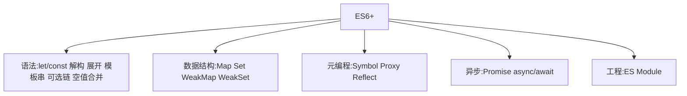

# 1.7 ES6+ 演进与 API

## 引言:ES6+ 不只是新语法,更是思维升级

ES6 起 JS 从"玩具语法"进化成"现代工程语言"。本章把 ES6 到 ES2026 的关键演进按"语法 / 数据结构 / 元编程 / 异步 / 工程"梳理,并补几处**底层为什么**(Proxy、Symbol、Map、WeakMap 的设计动机)。

---

## 一、全景图



---

## 二、解构、展开、默认参数、剩余参数

```js
// 解构(带默认值、重命名、嵌套)
const { name, age = 18 } = user;
const [first, , third] = arr;
const { a: aa, ...rest } = obj;        // rest 收集剩余
const { info: { city } } = user;       // 嵌套解构

// 展开(浅拷贝 / 合并)
const merged = { ...a, ...b };
const arr2 = [...arr, 4, 5];

// 默认参数
function f(x = 1, y = x + 1) { return x + y; }   // 默认值可引用前面的参数

// 剩余参数 rest(真数组,替代 arguments)
function sum(...nums) { return nums.reduce((s, n) => s + n, 0); }
sum(1, 2, 3);   // 6
```

> `...rest` 是**真数组**(能直接用数组方法),而 `arguments` 是类数组对象(需 `Array.from` 转)。剩余参数必须放最后一位。

---

## 三、模板字符串与标签模板

### 3.1 模板字符串

```js
const name = "大王";
const s = `你好,${name}`;            // 插值
const multi = `第一行
第二行`;                              // 支持多行

// 表达式(不只变量)
const v = `结果是 ${1 + 2}`;
```

### 3.2 标签模板(tagged templates)

模板字符串前加一个"标签函数",能**自定义插值处理**:

```js
function tag(strings, ...values) {
  console.log(strings);  // ["Hello, ", " and ", ""]
  console.log(values);   // ["Alice", "Bob"]
  return strings.reduce((acc, s, i) => acc + s + (values[i] ?? ""), "");
}
const a = "Alice", b = "Bob";
tag`Hello, ${a} and ${b}`;   // "Hello, Alice and Bob"
```

> 标签模板的典型应用:**Styled Components**(CSS-in-JS)、**SQL 安全拼接**(转义参数防注入)、i18n 翻译函数。

---

## 四、可选链 `?.` 与空值合并 `??`

```js
const city = user?.address?.city;   // 任一环 null/undefined → undefined(不抛错)
const v = obj?.name ?? "默认";      // ?? 只在 null/undefined 兜底
const fn = obj.method?.();          // 可选调用
const el = arr?.[0];                // 可选索引
```

```js
0 || "兜底"  // "兜底"(|| 把 0/""/false 当假)
0 ?? "兜底"  // 0(?? 只认 null/undefined)
```

---

## 五、数组新方法

```js
arr.map / filter / reduce            // 老三样
arr.find(fn) / findIndex             // 找元素/下标
arr.some / every                     // 任一/全部
arr.includes(v)                      // 替代 indexOf(NaN 也能判断)
arr.flat(Infinity) / flatMap(fn)     // 拍平
arr.at(-1)                           // 负索引(取最后一项)
Array.from(iterable)                 // 可迭代/类数组 → 真数组
arr.toSorted() / toReversed()        // 非破坏性排序/反转(返回新数组,ES2023)
```

```js
const arr = [1, [2, [3]]];
arr.flat(Infinity);          // [1, 2, 3]
[1, 2, 3].at(-1);            // 3
[NaN].includes(NaN);         // true(=== 判断不了 NaN)
[3, 1, 2].toSorted();        // [1, 2, 3](原数组不变)
```

---

## 六、Object 新方法

```js
Object.assign(target, src)            // 浅拷贝/合并(返回 target)
Object.entries(obj)                   // [[k,v], ...]
Object.values(obj)                    // [v, ...]
Object.keys(obj)                      // [k, ...]
Object.fromEntries(entries)           // entries 的逆运算
Object.hasOwn(obj, "k")               // 判断自身属性(替代 obj.hasOwnProperty)
```

```js
const obj = { a: 1, b: 2 };
Object.entries(obj);        // [["a",1],["b",2]]
Object.fromEntries([["a",1],["b",2]]);   // { a: 1, b: 2 }

// 经典用法:Object.entries + fromEntries 过滤对象
const filtered = Object.fromEntries(
  Object.entries(obj).filter(([k, v]) => v > 1)
);   // { b: 2 }
```

> `Object.hasOwn`(ES2022)比 `obj.hasOwnProperty` 更稳:它不依赖原型链(防 `hasOwnProperty` 被覆盖,尤其 `Object.create(null)` 的对象)。

---

## 七、字符串与数字新方法

```js
// 字符串
str.includes(sub) / startsWith(sub) / endsWith(sub)
str.repeat(n)
str.padStart(len, "0") / padEnd
str.trimStart() / trimEnd()
str.replaceAll("a", "b")              // 全部替换(ES2021)

// 数字
Number.isNaN(v)                       // 只判断 NaN(替代全局 isNaN)
Number.isFinite(v) / Number.isInteger(v)
Number.isSafeInteger(v)               // 是否在 2^53-1 安全整数内
```

```js
"7".padStart(3, "0");    // "007"
"abc".repeat(2);         // "abcabc"
"a b a".replaceAll("a", "x");   // "x b x"
Number.isNaN(NaN);       // true
Number.isInteger(3);     // true
```

---

## 八、Map / Set / WeakMap / WeakSet(底层设计)

```js
const m = new Map([["k", "v"]]);      // 键任意类型
const s = new Set([1, 2, 2, 3]);      // 去重 → {1,2,3}
const wm = new WeakMap();             // 键必须对象,弱引用
const ws = new WeakSet();             // 值必须对象,弱引用
```

**为什么 Map 优于普通对象做映射?** 对象键只能是字符串/Symbol,且 `__proto__`、`constructor` 等键名会与原型冲突(原型污染);Map 键**任意类型**、无原型污染、有迭代顺序、`size` 直接可得。

**WeakMap 的弱引用(核心):**

```js
let obj = { id: 1 };
const wm = new WeakMap();
wm.set(obj, "meta");
obj = null;   // obj 不再被引用 → 键被 GC,entry 自动消失
```

| | Map | WeakMap |
|---|-----|---------|
| 键类型 | 任意 | 必须对象 |
| 引用 | 强(不回收) | 弱(可被 GC) |
| 枚举/遍历 | 可 | 不可 |
| `size` | 有 | 无 |

> WeakMap 键**弱引用**(不阻止 GC)、**不可枚举**(隐私保护),适合"对象 → 元数据"映射与"可自动清理"的缓存;WeakSet 适合"标记对象集合"。Map/Set 是强引用,会撑爆内存(见 [10.4](/卷十-性能优化与工程质量/10.4-运行时与内存))。

---

## 九、Symbol / Proxy / Reflect(元编程)

```js
const s = Symbol("desc");             // 唯一标识
Symbol.iterator                       // 内置著名 Symbol(迭代协议)
Symbol.for("k") / Symbol.keyFor()     // 全局 symbol 注册表
```

**Proxy:拦截对象操作(Vue3 响应式底层,6.1)**

```js
const proxy = new Proxy({ n: 0 }, {
  get(o, k) { console.log("读", k); return Reflect.get(o, k); },
  set(o, k, v) { console.log("写", k, v); return Reflect.set(o, k, v); },
  deleteProperty(o, k) { console.log("删", k); return Reflect.deleteProperty(o, k); },
  has(o, k) { return k in o; },
});
proxy.n = 1;   // 写 n 1
```

> Proxy 相比 Vue2 的 `Object.defineProperty`:能拦截**新增/删除/数组/`in`/`has`** 等全部操作;`Reflect` 提供"默认行为"的统一反射 API,让 trap 里能规范地调用默认操作。

**Proxy 常用 trap 速查(共 13 个,列高频):**

| trap | 拦截 | 触发 |
|------|------|------|
| `get` | 读属性 | `obj.k` |
| `set` | 写属性 | `obj.k = v` |
| `has` | `in` 判断 | `k in obj` |
| `deleteProperty` | 删除 | `delete obj.k` |
| `ownKeys` | 遍历键 | `Object.keys` / `for...in` |
| `apply` | 函数调用 | `fn()` |
| `construct` | 构造函数 | `new Fn()` |

---

## 十、Set 集合运算(ES2025 新)

```js
const a = new Set([1, 2, 3]);
const b = new Set([2, 3, 4]);

a.union(b);            // {1,2,3,4} —— 并集
a.intersection(b);     // {2,3} —— 交集
a.difference(b);       // {1} —— 差集(a 有 b 无)
a.symmetricDifference(b);   // {1,4} —— 对称差
a.isSubsetOf(b);       // false —— 是否子集
a.isSupersetOf(b);     // false
a.isDisjointFrom(b);   // false —— 是否不相交
```

---

## 十一、对象"不可变"三剑客

| 方法 | 禁止 |
|------|------|
| `Object.preventExtensions` | 新增属性 |
| `Object.seal` | 新增 + 删除(已有可改) |
| `Object.freeze` | 新增 + 删除 + 修改(最严) |

```js
const o = Object.freeze({ a: 1 });
o.a = 2;   // 静默失败(严格模式报错)
o.b = 3;   // 无效
```

> 注意:三者都是**浅**的(嵌套对象仍可变);`freeze` 后 `Proxy` 的 `set` 陷阱也写不进。

📎 官方:[MDN《Proxy》](https://developer.mozilla.org/zh-CN/docs/Web/JavaScript/Reference/Global_Objects/Proxy) · [Reflect](https://developer.mozilla.org/zh-CN/docs/Web/JavaScript/Reference/Global_Objects/Reflect) · [Object.freeze](https://developer.mozilla.org/zh-CN/docs/Web/JavaScript/Reference/Global_Objects/Object/freeze)

---

## 十二、速查表

| 需求 | 语法 |
|------|------|
| 块级变量 | `let/const` |
| 字符串插值 | `` `${x}` `` |
| 安全取深层属性 | `a?.b?.c` |
| 空值兜底(不含 falsy) | `a ?? 默认` |
| 浅拷贝 | `{...o}` / `[...a]` |
| 去重 | `new Set(arr)` |
| 拍平 | `arr.flat(Infinity)` |
| 可自动清理缓存 | `WeakMap` |
| 拦截对象读写(Vue3) | `Proxy` + `Reflect` |
| 冻结对象 | `Object.freeze` |

---

## 十三、最新进展(ES2026)

**ES2026(ECMA-262 第 17 版,2026-06 批准):**

- `Array.fromAsync()`:异步可迭代对象 → 数组(`Array.from` 处理不了异步迭代器)
- `Temporal`(日期时间 API):取代难用的 `Date`,`Temporal.PlainDate`/`ZonedDateTime` 等
- Map/Set 新方法、JSON 精度修补等

---

## 十四、小结

```
ES6+:解构/展开/模板串/?.和??/数组新方法/Object新方法/Map/Set/WeakMap/Symbol/Proxy/Reflect
底层:Map 无原型污染/任意键;WeakMap 弱引用(GC)+不可枚举;Proxy 全量拦截;Reflect 默认行为
关键:?? 只认 null/undefined;rest 是真数组;标签模板可自定义插值;Set 有集合运算(ES2025)
```

---

## 十五、面试题

**Q1:`??` 和 `||` 的区别?**

`||` 把 `0/""/false/NaN` 都当假;`??` 只在 `null/undefined` 兜底。要"0 是合法值"用 `??`。

**Q2:`WeakMap` 和 `Map` 的差异?各自适用场景?**

`Map` 键强引用(键对象永不被回收)、可枚举、可遍览;`WeakMap` 键**弱引用**(键无引用即被 GC)、**不可枚举**。Map 用于需要遍览的普通映射;WeakMap 用于"对象→私有元数据"和"可自动清理的缓存"(防内存泄漏)。

**Q3:Proxy 为什么能实现响应式,而 Vue2 的 defineProperty 有局限?**

`defineProperty` 只能**逐属性**拦截 get/set,新增、删除、数组下标、`in` 都监听不到,需 `Vue.set` 补丁;`Proxy` 在**对象层面**拦截所有操作(增删改查 + 数组 + has),Vue3 因此整体转向 Proxy + Reflect。

**Q4:`Object.freeze` 和 Proxy 能共存吗?**

`Object.freeze` 让对象不可变;Proxy 的 `set` 陷阱在这种对象上**写不进去**(静默失败或严格模式报错)。要"冻结 + 可观测"需自定义:在 set 陷阱里拒绝写入并记录。

**Q5:`Map` 和普通对象做"键值存储"的三种差异?**

① 键类型:Map 任意类型,对象只能字符串/Symbol;② **原型污染**:对象有 `__proto__` 等冲突键,Map 无;③ 可扩展性/顺序:Map 有迭代顺序、`size`、原生 forEach,对象无。

**Q6:`Symbol` 的典型用途有哪些?举三个**

① 唯一标识:避免对象属性命名冲突;② 内置著名 Symbol:如 `Symbol.iterator`(迭代协议)、`Symbol.toStringTag`;③ 半私有属性:用 Symbol 做"约定私有"的 key(`Object.keys` 拿不到)。

**Q7:`...rest` 剩余参数和 `arguments` 的区别?**

`...rest` 是**真数组**(能直接用 map/filter 等),且只收集"未命名的剩余参数";`arguments` 是类数组对象(需 `Array.from` 转),且箭头函数里没有 `arguments`。现代写法优先用 `...rest`。

**Q8:标签模板(tagged templates)是什么?有哪些应用?**

在模板字符串前加标签函数,自定义插值处理:标签函数收到 `strings` 数组和 `values` 数组,可任意重组。应用:Styled Components(CSS-in-JS)、SQL 参数转义防注入、i18n 翻译函数。

**Q9:`Object.hasOwn` 和 `obj.hasOwnProperty` 的区别?为什么推荐前者?**

`Object.hasOwn(obj, k)` 是静态方法,直接判断自身属性;`obj.hasOwnProperty(k)` 依赖原型链,若对象用 `Object.create(null)` 创建(无原型)或 `hasOwnProperty` 被覆盖,就会出错。前者更安全、语义更清晰。

**Q10:`Array.from` 和展开运算符 `[...]` 的区别?**

展开运算符要求对象**可迭代**(有 `Symbol.iterator`);`Array.from` 额外支持**类数组对象**(有 `length` 无迭代协议),还能传第二个 map 函数。所以 `Array.from({0:"a",length:1})` 可行,`[...{0:"a",length:1}]` 报错。

---

📎 参考:[MDN《JavaScript 指南》](https://developer.mozilla.org/zh-CN/docs/Web/JavaScript/Guide)、[MDN《模板字符串》](https://developer.mozilla.org/zh-CN/docs/Web/JavaScript/Reference/Template_literals)、[MDN《Symbol》](https://developer.mozilla.org/zh-CN/docs/Web/JavaScript/Reference/Global_Objects/Symbol)、ES2015~ES2024 规范、caniuse
