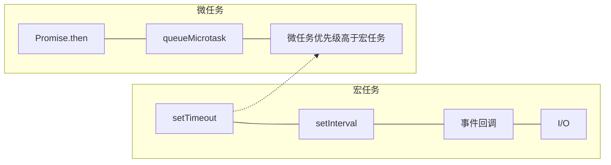
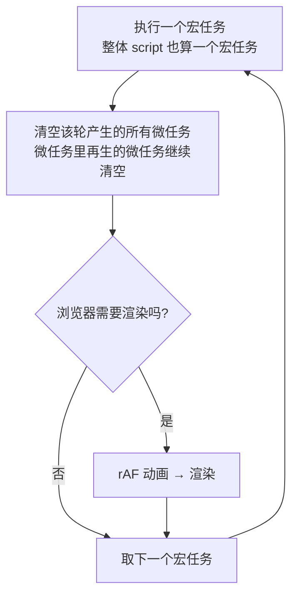

# 1.8 深入事件循环

> 卷:卷一 · JavaScript 语言内核(联动卷二浏览器渲染)
> 难度:⭐⭐⭐ 专家 | 阅读时间:30min | 状态:进行中

---

## 引言:单线程凭什么"永不阻塞"

JS 是单线程,却能用一套**事件循环(Event Loop)**把异步任务安排得明明白白。本章把事件循环的核心讲透,并重点补强最常考、最易错的:**宏任务与微任务的执行时机**。(浏览器渲染主线程与渲染时机,在卷二 2.2/2.5 展开。)

---

## 一、为什么需要事件循环

- JS 引擎本身**单线程**,一次只能干一件事
- 但浏览器/Node 是多线程的:定时、网络、IO 交给**其他线程**
- 其他线程完成后,把回调**包装成任务**塞进队列,主线程循环取任务执行

**事件循环 = 渲染主线程的工作方式**:无限循环,每次从任务队列取第一个任务执行,周而复始。

---

## 二、两类任务:宏任务 vs 微任务

| | 宏任务(MacroTask) | 微任务(MicroTask) |
|---|-------------------|-------------------|
| 谁产生 | 浏览器/环境 | JS 引擎(通常由 Promise 等触发) |
| 典型来源 | `setTimeout`、`setInterval`、I/O、事件、`MessageChannel`、`setImmediate`(Node) | `Promise.then/catch/finally`、`queueMicrotask`、`MutationObserver`、`process.nextTick`(Node) |
| 优先级 | 低 | **高**(微任务永远先于下一个宏任务) |



---

## 三、执行模型(核心,背下来)



**两条铁律:**

1. **微任务队列在下一个宏任务开始前一定被清空**
2. **微任务里再产生微任务,会插队继续清空,直到空为止**(不会让位给宏任务)

---

## 四、为什么这样设计(不是死记,是逻辑)

**为什么微任务要"抢先"于下一个宏任务?**

> 微任务通常代表"**当前宏任务派生的后续工作**":`Promise.then` 是上一个操作的"下一步",`MutationObserver` 是刚发生 DOM 变更的"批处理通知"。它们必须在**同一个上下文回合内尽快跑完**,否则一个 Promise 链会被 `setTimeout` 插断,数据一致性无从谈起。

**为什么渲染插在"宏任务边界 + 微任务清空后"?**

> 只有在这个时间点,**DOM 变更已经稳定**(一轮宏任务 + 微任务都结束了),浏览器渲染一次就能反映"这轮所有变动的最终态",而不是渲染到一半的中间态——既省渲染次数,又不会看到"半成品"。

---

## 五、经典执行顺序题(逐步拆解)

```js
console.log("1");
setTimeout(() => console.log("2"), 0);
Promise.resolve().then(() => {
  console.log("3");
  Promise.resolve().then(() => console.log("4"));
});
console.log("5");
```

<details>
<summary>答案与推导</summary>

```js
// 1 → 5 → 3 → 4 → 2

// ① 整体 script 是第一个宏任务:同步打印 1、5
// ② 产出微任务 [3],宏任务 [2]
// ③ 清空微任务:执行 3,又入队 4 → 立即执行 4(微任务插队特性)
// ④ 微任务清空完,才执行下个宏任务 → 2
```
</details>

**更难一题:**

```js
setTimeout(() => console.log("timeout"), 0);
new Promise((resolve) => {
  console.log("promise");
  resolve();
}).then(() => console.log("then"));
console.log("main");
```

<details>
<summary>答案</summary>

```js
// promise → main → then → timeout
// new Promise 的执行器是【同步】执行的(先打印 promise),
// 只有 .then 的回调才是异步微任务。
```
</details>

---

## 六、三个最易错点

### 1. `new Promise(executor)` 的 executor 是同步的

```js
new Promise((resolve) => { console.log("同步!"); resolve(); });
// "同步!" 立即打印,不是异步
```

### 2. `await` 之后的代码是「微任务」

```js
async function f() {
  console.log("a");
  await 1;               // 后面的代码进微任务
  console.log("b");
}
f();
console.log("c");
// a → c → b
```

### 3. 定时器做不到精准

`setTimeout(fn, 0)` 不是"立即",只是"尽快放入宏任务队列";还要等当前同步代码 + 所有微任务跑完,加上系统定时线程通信的误差与嵌套超 5 层的 4ms 最小延迟,所以**计时永远不准**。

---

## 七、微任务与渲染时机(前端关键)

浏览器每处理完一个宏任务 + 清空微任务,才**有机会**渲染一次。这意味着:

- 在一个宏任务里做**大量同步 DOM 修改**,浏览器只会渲染**最终结果**,中途看不到(体验卡顿)
- 用 `requestAnimationFrame` 把动画放到**每帧渲染前**执行,才能跟屏幕刷新对齐

```
宏任务 → 微任务清空 → [rAF 动画] → 渲染 → 下一帧
```

> 这与卷二「重排/重绘/合成」直接相关:想不卡,就要把长任务切碎,别阻塞渲染。

---

## 八、Node 与浏览器的差异(预告)

Node 的事件循环基于 libuv,是**六阶段轮询**(timers → pending → poll → check → close),且 `process.nextTick` 的优先级**高于** Promise 微任务。详细在卷九 Node 展开。

---

## 九、小结

```
事件循环(渲染主线程无限循环)
├─ 取一个宏任务执行
├─ 清空该轮产出的所有微任务(微任务生微任务 → 继续清空)
├─ 有机会则渲染(rAF 在渲染前)
└─ 取下一个宏任务

宏任务:setTimeout/事件/IO  微任务:Promise.then/MutationObserver/queueMicrotask
铁律:微任务 ＞ 下一个宏任务,且一次性清空
为什么:微任务是"当前任务的后续",须同回合尽快完成
```

---

## 十、面试题

**Q1:`MutationObserver` 为什么被归为微任务,它有什么用?**

它在 DOM 变更后**以微任务形式**异步回调,能捕获"一批变动"(而非每次),常用于监听 DOM 变化、替代已淘汰的 `MutationEvent`,以及框架里做子节点更新的批处理钩子。因为微任务在渲染前清空,所以能拿到"本轮所有变更的最终态"。

**Q2:用事件循环解释"为什么长列表渲染会卡、如何不卡"**

大量 DOM 节点在同一宏任务里同步插入,浏览器要等这轮宏任务 + 微任务全部结束才能渲染,主线程被占满 → 掉帧卡顿。解法:**时间切片**(把任务切成小段,穿插让出主线程,React 的 Fiber 调度正是这个思想)或**虚拟滚动**(只渲染可视区)。

**Q3:请排出下面代码的执行顺序**

```js
async function async1() {
  console.log("async1");
  await async2();
  console.log("after await");
}
async function async2() { console.log("async2"); }
console.log("start");
setTimeout(() => console.log("timeout"), 0);
async1();
new Promise((resolve) => { console.log("promise"); resolve(); })
  .then(() => console.log("then"));
console.log("end");
```

<details>
<summary>答案</summary>

```js
// start → async1 → async2 → promise → end → after await → then → timeout

// 同步(第一个宏任务):start、async1(进函数)、async2、promise、end
// await async2() 之后的 "after await" 进微任务队列(先入)
// Promise.then 的 "then" 也进微任务队列(后入)
// 清空微任务(先进先出):after await → then
// 最后宏任务:timeout
```
</details>

---

📎 参考:HTML 规范《event loop processing model》、MDN《事件循环》