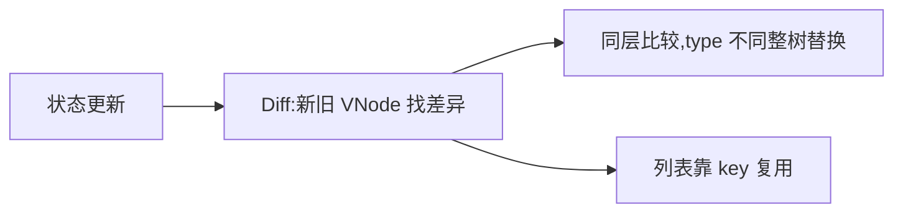
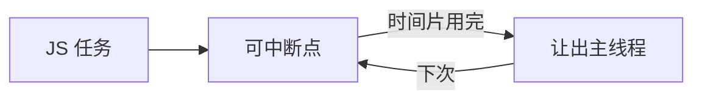

# 7.3 协调与 Fiber(虚拟 DOM / 时间切片 / Lane)

> 卷:卷七 · 框架核心 · React
> 阅读时间:30min

---

## 引言:为什么 React 从"栈"改成 Fiber

协调(Reconciliation)是"状态更新后算差异更新 DOM"。深挖要懂 **双缓冲(双 Fiber 树)** 与 **Lane 优先级** 这两个关键机制。

---

## 一、协调与 Diff



```jsx
{list.map((x) => <Item key={x.id} {...x} />)}
```

---

## 二、为什么从"栈"改成 Fiber(底层)

早期协调是**递归、一次性同步完成**,任务大时**长时间霸占主线程 → 卡顿**。Fiber 把渲染拆成**可中断、可恢复**的小任务:



- **Fiber** = 一个任务的"工作单元"链表
- **时间切片**:每片只处理一部分,时间到就让出,不阻塞输入

---

## 三、双缓冲:两个 Fiber 树(底层)

> React 维护**两棵 Fiber 树**:屏幕上的 `current` 树 + 内存里正在构建的 `workInProgress` 树。更新在 `workInProgress` 上做,**完成、可中断重启**,最后**一次性切换**为新 `current`。

```
current(屏上) ⇄ workInProgress(内存构建)
```

**为什么双缓冲?** ① 构建过程可**随时中断/丢弃/重启**,不污染屏上树;② 用户永远看不到"构建到一半"的树,切换是原子的。这是"并发渲染"的根基。

---

## 四、Lane 优先级(底层)

- Lane 用**位运算**给更新标优先级(交互 > 数据)
- 高优先级更新(输入/点击)能**插队**,低优先级(大数据)延后
- 配合 `useTransition`(7.4)实现"先响应交互,再慢慢渲染"

---

## 五、为什么需要"可中断渲染"

> 用户点击/输入是**高优先、需即时**,大数据渲染是**低优先、可慢慢来**。若一律同步串行,一次大更新就卡住交互。Fiber 的"可中断 + 优先级"让 React 能"**先响应交互,再渲染大数据**"——并发模式(7.4)的底座。

---

## 六、小结

```
Diff:同层比较 + key 复用
Fiber:可中断的工作单元链表,时间切片不阻塞主线程
双缓冲:current/workInProgress 两棵树,原子切换
Lane:位运算优先级,高优先插队
```

---

## 七、面试题

**Q1:Fiber 架构解决了什么问题?**

解决"一次性同步递归渲染导致**主线程长时间被占、卡顿**":拆成可中断小任务 + 时间切片,让主线程给交互,支持优先级调度。

**Q2:key 在 React Diff 中的作用?为什么不能用 index?**

key 判断"新旧是否同一节点",能复用则复用、移动则移动,最小化 DOM 操作。index 在列表增删时导致错误复用(状态/输入串位),须稳定 id。

**Q3:什么是"双缓冲"?为什么需要两棵 Fiber 树?**

`current`(屏上)+ `workInProgress`(内存构建)两棵树:更新在 workInProgress 上做、可中断丢弃重启,完成一次性切换。让用户看不到"半成品",也是并发渲染的根基。

**Q4:什么是 Lane?它怎么实现优先级?**

Lane 是**位运算**表示的优先级车道:每个更新的 lane 位不同,数字小的优先级高。调度器按 lane 决定先处理谁,高优先(交互)能插队低优先(大数据)。

**Q5:"时间切片"是怎么让出主线程的?**

Fiber 在每个工作单元处检查**是否超时**(`shouldYield`),超时就把控制权还给浏览器(处理输入/渲染),下次继续。借助 `MessageChannel`/`Scheduler` 实现,而非 `setTimeout`(精度太差)。

**Q6:为什么 React 渲染要"可中断",而 Vue 的 Diff 通常是不可中断的?**

设计取舍:React 推崇**并发调度**(大数据场景先响应交互),故把渲染做成可中断;Vue 更重**编译期静态优化**(把 Diff 工作前移,运行时更轻,通常无需频繁中断)。两者殊途同归,都为了"渲染不卡交互"。

---

📎 参考:react.dev《Render and Commit》、React《Fiber 深度解析》