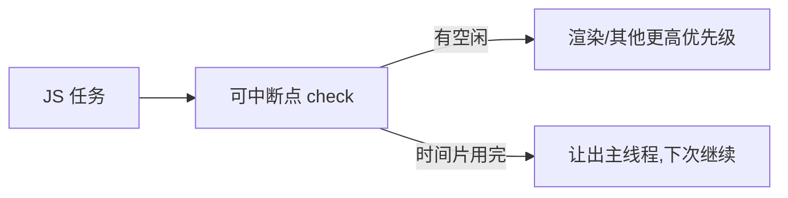

# 7.3 协调与 Fiber(虚拟 DOM / 时间切片 / Lane)

> 卷:卷七 · 框架核心 · React
> 难度:⭐⭐⭐ 专家 | 阅读时间:25min

---

## 一、协调(Reconciliation)是什么

状态更新后,React 要算出"新旧 UI 的差异并更新 DOM",这个过程叫**协调(Reconciliation)**,核心是 **Diff**:

- 同层比较,`type` 不同 → 整棵子树替换
- 列表用 `key` 复用节点

```jsx
// key 决定能否复用
{list.map(x => <Item key={x.id} {...x} />)}
```

---

## 二、为什么从"栈"改成 Fiber

早期 React 的协调是**递归、一次性同步完成**,任务大时**长时间霸占主线程 → 卡顿**。Fiber 把渲染拆成**可中断、可恢复**的小任务单元:



- **Fiber** = 一个任务的"工作单元"链表
- **时间切片**:每个时间片只处理一部分,时间到就让出,不阻塞输入

---

## 三、双缓冲与优先级(Lane)

- **双缓冲**:屏幕上当前树(current)+ 内存里正在构建的新树(workInProgress),构建完一次性切换,用户不会看到"半成品"
- **Lane(车道)**:用位运算给更新标优先级(如交互 > 数据),高优先级更新能**插队**先处理(配合 `useTransition`)

---

## 四、为什么需要"可中断渲染"

> 用户点击/输入是**高优先级、需即时响应**的,大量数据渲染是**低优先级、可慢慢来**的。如果一切同步串行,一次大更新就会卡住交互。Fiber 的"可中断 + 优先级"让 React 能"**先响应交互,再慢慢渲染大数据**"——这正是并发模式(7.4)的底座。

---

## 小结

```
Diff:同层比较 + key 复用
Fiber:可中断的工作单元链表,时间切片不阻塞主线程
双缓冲:current/新树切换,不闪屏
Lane:优先级调度(高优先插队)
```

## 面试题

**Q1:Fiber 架构解决了什么问题?**

解决了"一次性同步递归渲染导致**主线程长时间被占用、页面卡顿**"的问题。它把渲染拆成**可中断、可恢复**的小任务 + 时间切片,让出主线程给用户交互,支持**优先级调度**(高优先任务插队)。

**Q2:`key` 在 React Diff 中的作用?为什么不能用 index?**

`key` 用于判断新旧节点是否"同一节点",能复用则复用、能移动则移动,最小化 DOM 操作。用 `index` 在列表增删时会导致后续节点被错误复用(状态/输入框串位),必须用稳定唯一 id。

---

📎 参考:react.dev《Render and Commit》、React 官方《Fiber 深度解析》