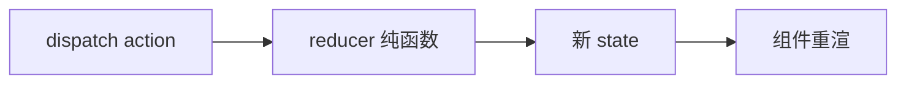

# 7.5 状态管理(Redux / Zustand / React Query)

> 卷:卷七 · 框架核心 · React
> 难度:⭐⭐ 进阶 | 阅读时间:20min | 状态:深度增强

---

## 引言:状态分三类,别都用 Redux 一把抓

状态管理最常犯的错:把"服务端数据"也塞进全局状态。深挖要懂**三类状态的分野**与 Redux 的单向数据流。

---

## 一、状态分三类(先想清再用)

| 类型 | 例子 | 工具 |
|------|------|------|
| 组件局部 | 表单、开关 | `useState` |
| 全局共享 | 用户、主题、购物车 | Redux / Zustand |
| **服务端数据** | 接口列表、详情 | **React Query / SWR** |

> **关键认知:服务端数据 ≠ 全局状态。** 它是"带缓存的请求结果",用 React Query 管理(缓存/去重/重试开箱),塞 Redux 会手写一堆 loading/error/缓存样板。

---

## 二、Redux:经典但重(单向数据流)

```js
const counter = createSlice({
  name: "counter",
  initialState: { value: 0 },
  reducers: { inc: (s) => { s.value += 1; } },
});
const value = useSelector((s) => s.counter.value);
dispatch(inc());
```



- 单向数据流:dispatch → reducer → 新 state → 重渲
- 优:可预测、DevTools 强;缺:样板多、心智重

---

## 三、Zustand:极简现代替代

```js
import { create } from "zustand";
const useStore = create((set) => ({
  count: 0,
  inc: () => set((s) => ({ count: s.count + 1 })),
}));
const count = useStore((s) => s.count);
```

> 无 Provider、无 action 样板,API 极小,全局状态的轻量首选。

---

## 四、React Query:服务端数据专精

```js
const { data, isLoading, error } = useQuery({
  queryKey: ["todos"],
  queryFn: () => fetch("/todos").then((r) => r.json()),
});
```

内置:**缓存、去重、后台刷新、重试、分页/无限滚动、乐观更新**。用 `queryKey` 区分数据。

---

## 五、小结

```
局部→useState;全局→Zustand/Redux;服务端数据→React Query
Redux:单向数据流可预测但重;Zustand:极简;React Query:缓存/去重/重试
```

---

## 六、面试题

**Q1:为什么服务端数据别放 Redux?**

它是"**带缓存的请求结果**",不是"全局状态";放 Redux 要手写 loading/error/缓存/去重/失效;React Query 开箱提供这些,职责更清晰。

**Q2:Zustand 相比 Redux 的差异?**

Zustand **无 Provider/action 样板**、`create` 一把搞定、API 极小;Redux 单向数据流严格、可预测性强、DevTools 最强但样板重。中小项目偏 Zustand,大型严格治理偏 Redux。

**Q3:Redux 的"单向数据流"是什么?**

`dispatch(action) → reducer(纯函数)→ 新 state → 组件重渲`。状态变更只能走这条链,来源单一、可预测、可回放。

**Q4:什么状态该用 useState 而非全局 store?**

**组件局部**状态(表单输入、开关、临时 UI)用 useState;只有"多个不相关组件共享"才上全局。能局部就别全局,滥用难维护。

**Q5:React Query 的 `queryKey` 作用?**

作为**缓存键**区分不同数据:相同 key 复用缓存、去重请求、失效管理;不同 key 各自独立。它是"数据身份标识"。

**Q6:什么是"乐观更新"?React Query 怎么做?**

先**立即**用预期值更新 UI(乐观)、再等服务器确认,失败回滚。React Query 用 `onMutate`(先改缓存)+ `onError`(回滚)+ `onSettled`(失效重取)实现。

---

📎 参考:Redux Toolkit 文档、Zustand 文档、TanStack Query 文档