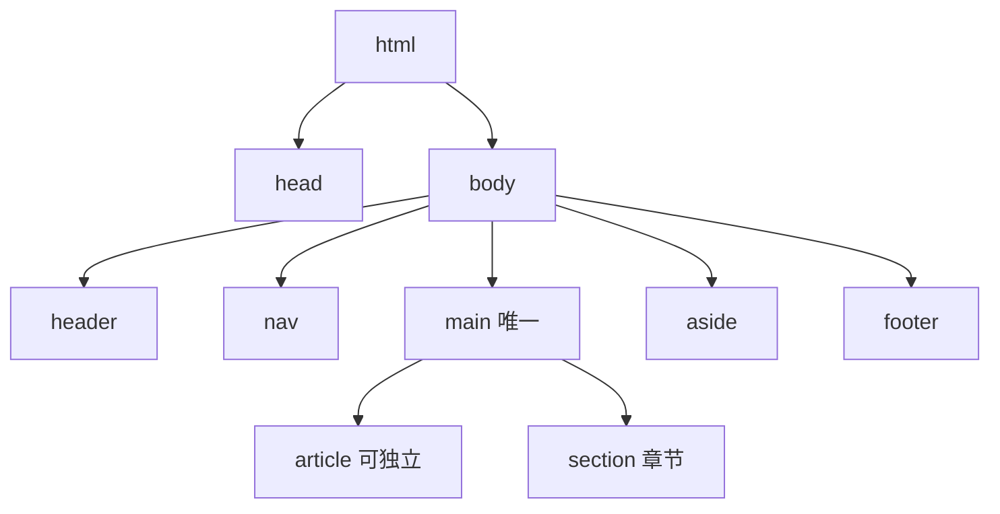
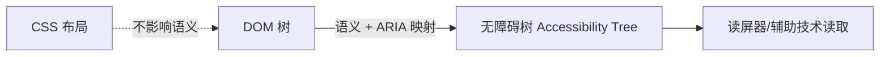

# 3.1 HTML 语义化与标准

## 引言:HTML 不只是一堆 div

语义化 = "用对的标签表达对的意思",直接决定 **SEO、可访问性、可维护性**。深挖要懂一层:语义标签最终被浏览器转换成**无障碍树**,供读屏器等辅助技术消费。

---

## 一、什么是语义化

用有明确含义的标签承载内容,而非满屏 `<div>`:

```html
<header>…</header> <main>…</main> <footer>…</footer>
```

---

## 二、页面结构



**section vs article**:内容**脱离页面能否独立存在/被引用**?能 → `article`;否则 `section`。

---

## 三、底层:无障碍树(Accessibility Tree)

浏览器渲染时,除了 DOM 树,还会基于**语义标签 + ARIA**生成一棵**无障碍树(a11y tree)**,读屏器读的就是它:



- `<h1>`/`<nav>`/`<button>` 这些语义标签会被映射成无障碍树的"角色(role)+ 名称(name)"
- `<div>` 无语义 → 无障碍树里多是"通用容器",读屏器无法辨识结构

> **这就是"语义化影响 a11y"的底层**:语义标签被映射进无障碍树,机器(读屏器)才"看得懂";`<div>` 对机器就是空白。

**DevTools 里怎么看无障碍树:**

1. **Elements → Accessibility 面板**:选中任意元素,面板里直接展示它在无障碍树里的 role/name/属性——能直观看到"`<div>` 是 generic、`<button>` 是 button"
2. **Lighthouse → Accessibility 审计**:一键扫出 a11y 问题(对比度、alt 缺失、label 缺失等)
3. **Full accessibility tree**:在 Accessibility 面板里可展开完整无障碍树,看整页的语义结构

> 实操:选中一个 `<div>` 和一个 `<button>`,对比 Accessibility 面板里两者的 role——语义化的差距一目了然。

---

## 四、可访问性要点

```html
   <!-- alt(装饰图留空 alt="") -->
<label for="email">邮箱</label>
<input id="email" type="email">

<button aria-expanded="true" aria-controls="menu">展开</button>
<div role="dialog" aria-modal="true">…</div>
```

**ARIA 五规则(核心):**

1. **能用原生语义就别用 ARIA**(`<button>` 优于 `<div role="button">`)
2. ARIA 只改"无障碍树信息",**不改变行为**(加了 `role="button"` 还得自己处理键盘)
3. 交互控件必须**可键盘操作**、有焦点
4. 有焦点元素**不应遮挡**/移除焦点(别 `display:none` 掉焦点元素)
5. 交互元素要有**可访问名称**(`aria-label`/文本内容)

---

## 五、SEO 相关细节

- `<h1>` 唯一概括主题,`h2→h6` 层层嵌套不跳级
- `<title>` + `<meta name="description">` 完善
- 结构化数据(JSON-LD)帮搜索引擎识别类型

---

## 六、小结

```
语义化 = 用对标签表达结构(header/nav/main/article/…)
底层:语义+ARIA → 无障碍树 → 读屏器读取;div 对机器无语义
a11y:alt / label-for / ARIA(五规则,原生优先)/ 键盘可操作
SEO:h1 唯一、title/description、结构化数据
```

---

## 七、面试题

**Q1:`<section>` 和 `<div>` 的本质区别?**

`section` 有**语义**(有主题的章节,映射进无障碍树、被搜引当结构);`div` 无语义通用容器。能表达结构就用语义标签。

**Q2:如何提升页面可访问性?至少四点**

① 图片 `alt`;② 表单 `label for`;③ 原生按钮/链接保证键盘可操作;④ 语义标签 + 合理标题层级;⑤ 需要时补 `role`/`aria-*`;⑥ 关注对比度与焦点可见。

**Q3:什么是无障碍树?它和 DOM 树什么关系?**

无障碍树是浏览器基于**语义标签 + ARIA**生成的、面向辅助技术的树(角色/名称/状态)。DOM 树是文档结构,无障碍树是"机器可读的语义视图",读屏器读它。CSS 视觉布局不影响语义映射。

**Q4:为什么说"尽量用 `<button>` 而不是 `<div role='button'>`"?**

原生 `<button>` 自带键盘可操作、焦点管理、回车/空格触发、无障碍树正确映射;`div role="button"` 只是"骗过读屏器",却要自己补键盘/焦点/行为,容易漏。ARIA 是补丁,原生是首选(ARIA 第一规则)。

**Q5:`alt` 什么时候该留空(`alt=""`)?**

图片是**纯装饰**(分割线、背景图、图标旁边已有文字说明)时,`alt=""` 让读屏器**跳过它**,避免噪音;有信息价值的图片必须写有意义的 alt。

**Q6:ARIA 会改变元素的实际行为吗?**

不会。ARIA 只影响**无障碍树的语义信息**(角色/状态),不改变键盘交互、不补事件。例:加 `role="button"` 后仍需自己监听键盘事件——这是 ARIA 最易被误解的点。

---

📎 参考:[MDN《HTML 元素参考》](https://developer.mozilla.org/zh-CN/docs/Web/HTML/Element)《无障碍》、[W3C WAI-ARIA](https://www.w3.org/TR/wai-aria/)《Using ARIA》、[Web.dev](https://web.dev/)《可访问性》