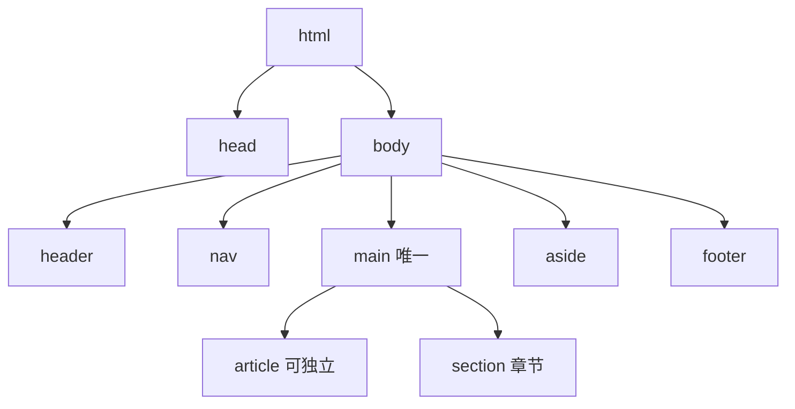
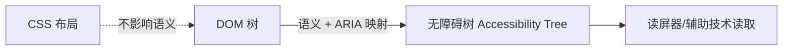

# 3.1 HTML 语义化与标准

## 引言:HTML 不只是一堆 div

语义化 = "用对的标签表达对的意思",直接决定 **SEO、可访问性、可维护性**。深挖要懂一层:语义标签最终被浏览器转换成**无障碍树**,供读屏器等辅助技术消费。

---

## 一、什么是语义化 + 完整标签清单

用有明确含义的标签承载内容,而非满屏 `<div>`:

```html
<header>…</header> <main>…</main> <footer>…</footer>
```

**语义标签清单:**

| 标签 | 语义 |
|------|------|
| `header` | 页眉 / 区块头部 |
| `nav` | 导航 |
| `main` | 主内容(每页**唯一**) |
| `article` | 可独立分发的内容(博客文、评论) |
| `section` | 有主题的章节 |
| `aside` | 侧边栏 / 补充信息 |
| `footer` | 页脚 |
| `figure` + `figcaption` | 图 + 图注 |
| `time` | 时间(带 datetime) |
| `mark` | 高亮文本 |
| `details` + `summary` | 折叠/展开 |
| `address` | 联系信息 |

> 对比:`<div>` 是无语义的通用容器,`<span>` 是无语义的行内容器。能用语义标签表达结构时,就别用 div。

---

## 二、页面结构



**section vs article**:内容**脱离页面能否独立存在/被引用**?能 → `article`;否则 `section`。

---

## 三、底层:无障碍树(Accessibility Tree)

浏览器渲染时,除了 DOM 树,还会基于**语义标签 + ARIA**生成一棵**无障碍树(a11y tree)**,读屏器读的就是它:



- `<h1>`/`<nav>`/`<button>` 这些语义标签会被映射成无障碍树的"角色(role)+ 名称(name)"
- `<div>` 无语义 → 无障碍树里多是"通用容器",读屏器无法辨识结构

> **这就是"语义化影响 a11y"的底层**:语义标签被映射进无障碍树,机器(读屏器)才"看得懂";`<div>` 对机器就是空白。

**DevTools 里怎么看无障碍树:**

1. **Elements → Accessibility 面板**:选中元素,看它在无障碍树里的 role/name
2. **Lighthouse → Accessibility 审计**:一键扫出 a11y 问题
3. **Full accessibility tree**:展开完整无障碍树

---

## 四、图片语义:figure / picture / srcset

```html
<!-- 图 + 图注 -->
<figure>
  
  <figcaption>图 1:2024 年营收</figcaption>
</figure>

<!-- 响应式图片(按屏幕宽度/分辨率选源)-->
<picture>
  <source media="(min-width: 800px)" srcset="large.jpg">
  <source media="(min-width: 400px)" srcset="medium.jpg">
          <!-- 兜底 -->
</picture>

<!-- srcset + sizes(按 DPR/宽度选图)-->

```

> `picture`/`srcset` 让浏览器**按屏幕选最合适的图片**,避免大屏加载小图糊、小屏加载大图浪费带宽(呼应 [10.2](/卷十-性能优化与工程质量/10.2-加载性能))。

---

## 五、表单语义

```html
<form>
  <fieldset>
    <legend>个人信息</legend>
    <label for="email">邮箱</label>
    <input id="email" type="email" name="email">
    <label for="age">年龄</label>
    <input id="age" type="number" min="1" max="120">
  </fieldset>
</form>
```

> `label for` 关联输入框(点 label 聚焦输入框)、`fieldset`/`legend` 分组、`type="email/number/tel"` 提供语义 + 移动端键盘 + 浏览器校验。

---

## 六、可访问性要点 + ARIA

```html
   <!-- alt(装饰图留空 alt="") -->
<label for="email">邮箱</label>
<input id="email" type="email">

<button aria-expanded="true" aria-controls="menu">展开</button>
<div role="dialog" aria-modal="true">…</div>
```

**ARIA 五规则(核心):**

1. **能用原生语义就别用 ARIA**(`<button>` 优于 `<div role="button">`)
2. ARIA 只改"无障碍树信息",**不改变行为**(加了 `role="button"` 还得自己处理键盘)
3. 交互控件必须**可键盘操作**、有焦点
4. 有焦点元素**不应遮挡**/移除焦点
5. 交互元素要有**可访问名称**(`aria-label`/文本内容)

---

## 七、meta 与 viewport

```html
<head>
  <meta charset="utf-8">                          <!-- 字符编码 -->
  <meta name="viewport" content="width=device-width, initial-scale=1">  <!-- 移动端视口 -->
  <meta name="description" content="页面描述">     <!-- SEO 摘要 -->
  <title>页面标题</title>
</head>
```

> `viewport` 的 `width=device-width` 让页面宽度跟随设备宽度,是响应式布局的前提;漏了它,手机端会按桌面宽度渲染、字小得看不见。

---

## 八、SEO 相关细节

- `<h1>` 唯一概括主题,`h2→h6` 层层嵌套不跳级
- `<title>` + `<meta name="description">` 完善
- 结构化数据(JSON-LD)帮搜索引擎识别类型

---

## 九、小结

```
语义化 = 用对标签表达结构(header/nav/main/article/section/…)
底层:语义+ARIA → 无障碍树 → 读屏器读取;div 对机器无语义
图片:figure/figcaption、picture/srcset(按屏选图);表单:label/fieldset/type
a11y:alt / label-for / ARIA(五规则,原生优先)/ 键盘可操作
meta:charset/viewport(width=device-width)/description;SEO:h1/title/JSON-LD
```

---

## 十、面试题

**Q1:`<section>` 和 `<div>` 的本质区别?**

`section` 有**语义**(有主题的章节,映射进无障碍树、被搜引当结构);`div` 无语义通用容器。能表达结构就用语义标签。

**Q2:如何提升页面可访问性?至少四点**

① 图片 `alt`;② 表单 `label for`;③ 原生按钮/链接保证键盘可操作;④ 语义标签 + 合理标题层级;⑤ 需要时补 `role`/`aria-*`;⑥ 关注对比度与焦点可见。

**Q3:什么是无障碍树?它和 DOM 树什么关系?**

无障碍树是浏览器基于**语义标签 + ARIA**生成的、面向辅助技术的树(角色/名称/状态)。DOM 树是文档结构,无障碍树是"机器可读的语义视图",读屏器读它。CSS 视觉布局不影响语义映射。

**Q4:为什么说"尽量用 `<button>` 而不是 `<div role='button'>`"?**

原生 `<button>` 自带键盘可操作、焦点管理、回车/空格触发、无障碍树正确映射;`div role="button"` 只是"骗过读屏器",却要自己补键盘/焦点/行为,容易漏。ARIA 是补丁,原生是首选(ARIA 第一规则)。

**Q5:`alt` 什么时候该留空(`alt=""`)?**

图片是**纯装饰**(分割线、背景图、图标旁已有文字)时,`alt=""` 让读屏器**跳过它**,避免噪音;有信息价值的图片必须写有意义的 alt。

**Q6:ARIA 会改变元素的实际行为吗?**

不会。ARIA 只影响**无障碍树的语义信息**(角色/状态),不改变键盘交互、不补事件。例:加 `role="button"` 后仍需自己监听键盘事件。

**Q7:`picture` 和 `srcset` 有什么区别?各自适用场景?**

`picture` 按**媒体条件(media query)**选源(如"大屏用横图、小屏用竖图",艺术方向);`srcset` 按**宽度/DPR**让浏览器选最合适的图(同一图不同分辨率)。前者换"不同构图",后者换"不同尺寸"。

**Q8:`viewport` 的 `width=device-width` 为什么重要?**

它让页面视口宽度**跟随设备宽度**,是移动端响应式的前提。漏了它,手机按桌面宽度(如 980px)渲染,页面缩得很小、文字看不清。

---

📎 参考:[MDN《HTML 元素参考》](https://developer.mozilla.org/zh-CN/docs/Web/HTML/Element)、[MDN《无障碍》](https://developer.mozilla.org/zh-CN/docs/Web/Accessibility)、[W3C WAI-ARIA](https://www.w3.org/TR/wai-aria/)、[MDN《响应式图片》](https://developer.mozilla.org/zh-CN/docs/Web/HTML/Responsive_images)