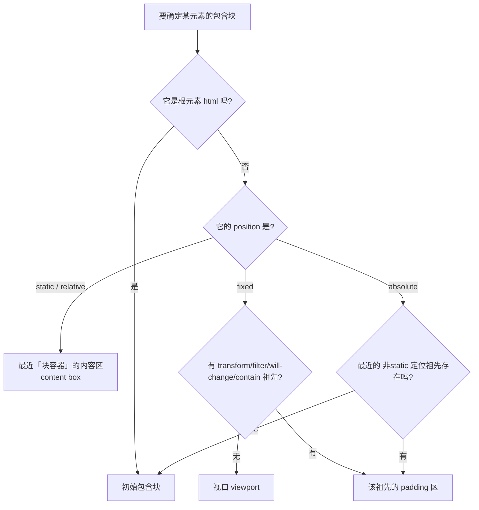

# 3.2 盒模型与包含块

> 卷:卷三 · HTML 与 CSS
> 阅读时间:30min

---

## 引言:百分比到底"相对于谁"

你写 `width: 50%` 时,这 50% 是**谁的** 50%?大多数人会答"父元素"。**不准确。** 正确答案是:**包含块(containing block)**。

这正是「包含块」这个主题的核心。本章把它讲透,并补上最容易忽略的**「transform 为何能改变包含块」**以及一套可一键自查的判定流程图。

---

## 一、先厘清:盒模型的两套算法

```css
.box {
  width: 100px;
  padding: 10px;
  border: 5px solid;
  box-sizing: content-box; /* 默认 */
}
```

| `box-sizing` | `width` 指谁 | 实际占宽 = |
|-------------|-------------|-----------|
| `content-box`(默认 / 标准盒) | 内容区 | `width + padding + border` |
| `border-box`(IE 盒) | 边框盒整体 | `width`(已含 padding+border) |

```css
/* 工程惯例:全局统一,布局最好算 */
* { box-sizing: border-box; }
```

> 别小看这个:设置 `width: 100%` 时,`content-box` 下再加 padding 会溢出父容器,`border-box` 不会——这是新手最常踩的布局 bug 之一。

---

## 二、什么是包含块

> **元素的尺寸、位置、以及 `%` 值的参考,全部由它的"包含块"决定。**

所以 `width: 50%` 是"包含块宽度"的 50%。**大多数时候包含块恰好等于父元素的内容区**,才让人误以为"就是父元素"。

**哪些属性会拿包含块做参照?**

```css
.item {
  width: 50%;          /* % 相对包含块宽度 */
  height: 50%;         /* % 相对包含块高度(父高需确定,否则塌) */
  padding: 5%;         /* 上下左右 % 都相对包含块【宽度】! */
  margin: 10%;         /* 同理,相对包含块宽度 */
}
.pos {
  position: absolute;
  left: 10px;          /* 偏移相对包含块 */
  top: 10px;
}
```

> ⚠️ 高频坑:`padding/margin` 的百分比(上下左右)一律相对包含块**宽度**,不是高度。

---

## 三、包含块的判定规则(一图流)



### 三句话记死:

1. **根元素**(`<html>`)→ 初始包含块 = 视口大小,基点在画布左上角
2. **static/relative** → 最近**块容器**的**内容区**
3. **absolute** → 最近**非 static 定位祖先**(absolute/relative/fixed/sticky)的 **padding 区**;找不到则用初始包含块
4. **fixed** → 默认视口;但若祖先有 `transform/filter/will-change/contain` 等,则改用**那个祖先的 padding 区**

---

## 四、完整示例(藏着全部易错点)

```html
<html>
  <body id="body">
    <div id="div1">
      <p id="p1">first paragraph...</p>
      <p id="p2">This is text <em id="em1">in the <strong id="strong1">second</strong> paragraph.</em></p>
    </div>
  </body>
</html>
```

**没有任何 CSS 时,各元素的包含块:**

| 元素 | 包含块 | 为什么 |
|------|--------|--------|
| `html` | initial C.B. | 根元素 |
| `body` | `html` | static → 最近块容器 |
| `div1` | `body` | static → 最近块容器 |
| `p1` / `p2` | `div1` | 同上 |
| `em1` | `p2` | static → 最近**块容器**(em 是行内,不是块容器!) |
| `strong1` | `p2` | **不是 em1**!因为 em1 不是块容器,最近的块容器是 p2 |

**关键点①:是"离得最近的块容器",不是"离得最近的祖先"。** 行内元素(`em`/`strong`/`span`)不是块容器,会被跳过。

---

## 五、加了定位后,包含块怎么"漂移"

```css
#div1 { position: absolute; left: 50px; top: 50px; }
```

| 元素 | 包含块(变化后) |
|------|----------------|
| `div1` | **initial C.B.**(从 body 变成视口)|

**为什么?** `div1` 变成 absolute,走第三条规则:找最近的**非 static 定位祖先**;`body` 是 static,没有 → 退回初始包含块。

再叠加:

```css
#em1 { position: absolute; left: 100px; top: 100px; }
```

| 元素 | 包含块 |
|------|--------|
| `em1` | `div1`(em1 自己定位了,找最近非 static 祖先 = div1)|
| `strong1` | **`em1`**(因为 em1 已定位,成为 strong1 最近的非 static 祖先)|

> 看到"连锁反应"了吗:**给一个元素定位,会改变它内部所有 absolute/fixed 后代的包含块**。这是定位布局里最容易被忽略的全局影响。

---

## 六、特例:transform 为什么能"偷走"fixed 的包含块

这是一个进阶点,也是真实业务里最迷惑人的 bug:

```css
/* 一个 fixed 悬浮球,本该钉在视口右下角 */
.ball { position: fixed; right: 0; bottom: 0; }

/* 某天给它的某个祖先加了个 transform 动画 */
.wrapper { transform: translateX(0); }
```

结果:`.ball` **不再相对视口,而是相对 `.wrapper`** 定位,视觉上"飘"了。

**根因**:CSS 规范规定,当祖先存在以下任一,它会成为 fixed/absolute 后代的包含块:

```css
transform: …;             /* 非 none */
perspective: …;
will-change: transform/perspective;
filter: …;                /* 非 none */
contain: paint;
backdrop-filter: …;       /* 部分 */
```

> **为什么这样设计?** `transform`/`filter` 会建立一个**新的坐标系统 / 层叠上下文**,它需要"劫持"后代定位作为锚点,否则变换后的坐标系就自相矛盾了。所以从实现上,这类属性会强制成为包含块。

**一句话避险:**

> 谁要做 transform/filter 动画,就让它**只包自己那层**,别把一个包住 fixed/absolute 弹层的祖先进去做 transform。

---

## 七、如何用 DevTools 自己验证

1. F12 → Elements → 选中元素 → 右侧 **Layout** 面板
2. 会直接显示该元素的 **Containing Block** 是谁、尺寸多少
3. 配合改 `transform` 观察包含块是否变化——比背规则更直观

---

## 八、小结

```
盒模型:content-box(默认,易溢出)/ border-box(推荐全局)

包含块 = 百分比 + 定位偏移的参照物
├─ 根元素 → 初始包含块 = 视口
├─ static/relative → 最近【块容器】的内容区(跳过行内)
├─ absolute → 最近【非 static 祖先】的 padding 区;无则视口
├─ fixed → 视口;但 transform/filter/will-change/contain 祖先可劫持
└─ 陷阱:padding/margin 的 % 恒相对【宽度】;定位有"连锁改变后代"效应
```

---

## 九、面试题

**Q1:`position: absolute` + `left: 50%` 如何实现"真正居中"?**

`left: 50%` 是相对包含块宽的 50%(元素左边缘到居中点),再 `transform: translateX(-50%)` 把元素自身向左回移一半宽:

```css
.center {
  position: absolute;
  left: 50%;
  top: 50%;
  transform: translate(-50%, -50%);
}
```

**Q2:`position: fixed` 的元素,什么情况下会"不固定"?**

当它的某个祖先设置了 `transform`/`filter`/`perspective`/`will-change: transform`/`contain: paint`/`backdrop-filter` 时,该祖先成为它的包含块,`fixed` 退化为"相对这个祖先固定",视觉上就不再是相对视口了。

**Q3:为什么 `padding: 50%` 在正方形里是对称的,在长方形里上下比左右小?**

因为 padding 百分比**恒相对包含块的宽度**(不区分方向)。长方形里宽 > 高,所以 `50%`(相对宽)的上下 padding 会比左右 padding 大——上下 padding 也按"宽的 50%"算。

---

📎 参考:MDN《Containing block》、CSS2.1 规范 §10.1、CSS Transforms 规范(containing block 章节)