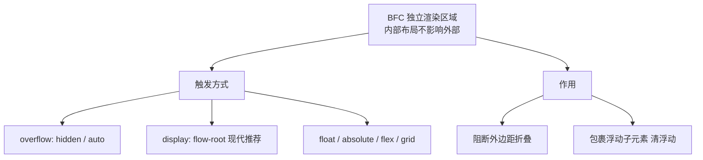
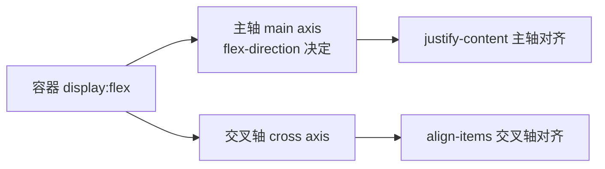

# 3.3 布局体系(上):常规流 / Flex / BFC

> 卷:卷三 · HTML 与 CSS
> 难度:⭐⭐ 进阶 | 阅读时间:25min | 状态:已深化

---

## 引言:从"块和行"到"上帝给的 Flex"

CSS 布局心法三层:**常规流 → BFC → Flex**。本章把"外边距折叠""清除浮动"这些老痛点一次说清。

---

## 一、常规流:块级 vs 行内

| | 块级 | 行内 |
|---|------|------|
| 典型 | `div`/`p`/`h1` | `span`/`a`/`em` |
| 排列 | 纵向独占 | 横向流式 |
| 盒模型 | 宽高/上下 margin 生效 | 宽高难生效 |

> `inline-block` = 行内排布 + 块级盒模型(可设宽高)。

---

## 二、BFC(块级格式化上下文,一图)



**触发 BFC:**

```css
overflow: hidden / auto / scroll;   /* 最常见 */
display: flow-root;                 /* 现代推荐,无副作用 */
float: left / right;
position: absolute / fixed;
display: inline-block / flex / grid;
```

**为什么 BFC 能"清除浮动"?** 浮动元素脱离常规流,父容器高度塌陷为 0;但 BFC 要求"**独立隔离、包裹内部内容**",所以会计算浮动子元素的高度,父容器就不再塌陷。这就是 BFC 清浮动的本质——不是"清除",而是"**隔离并包裹**"。

**阻断外边距折叠:**

```css
p { margin: 20px 0; }            /* 上下相邻取较大值,不是相加 */
.container { display: flow-root; } /* 阻断父子 margin 折叠 */
```

---

## 三、Flexbox:一维布局



```css
.container {
  display: flex;
  flex-direction: row;
  justify-content: space-between;  /* 主轴 */
  align-items: center;             /* 交叉轴 */
  flex-wrap: wrap;
  gap: 12px;
}
```

**项目属性:**

| 属性 | 作用 |
|------|------|
| `flex-grow` | 放大比例(默认 0) |
| `flex-shrink` | 缩小比例(默认 1) |
| `flex-basis` | 基准尺寸 |
| `flex: 1` | `1 1 0%`(真等分) |

**`flex:1` vs `flex:auto`(高频):**

- `flex: 1` → `1 1 0%`:忽略内容宽度,**纯按比例均分** → 真等宽
- `flex: auto` → `1 1 auto`:先按内容占位再分剩余 → 长短不均

---

## 四、小结

```
常规流:块(纵向)/行内(横向)/inline-block
BFC:独立渲染区域;触发(overflow/flow-root/float/absolute/flex)
    作用:阻断 margin 折叠 + 包裹浮动(清浮动)核心
Flex:一维;容器(justify/align/gap)+ 项目(flex:1 = 1 1 0%)
```

---

## 五、面试题

**Q1:什么是 BFC?触发条件?三个应用?**

BFC 是独立布局区域,内外互不影响。触发:`overflow:hidden`、`flow-root`、`float`、`absolute`、`flex/grid`。应用:① 清浮动;② 阻断外边距折叠;③ 两栏隔离防浮动重叠。

**Q2:`flex: 1` 和 `flex: auto` 的区别?**

`flex:1`=`1 1 0%`(忽略内容宽度,均分 → 等宽);`flex:auto`=`1 1 auto`(先内容再分剩余 → 不等)。要真等分用 `flex:1`。

---

📎 参考:MDN《BFC》《flexbox》、CSS2.1 规范 margin-collapsing