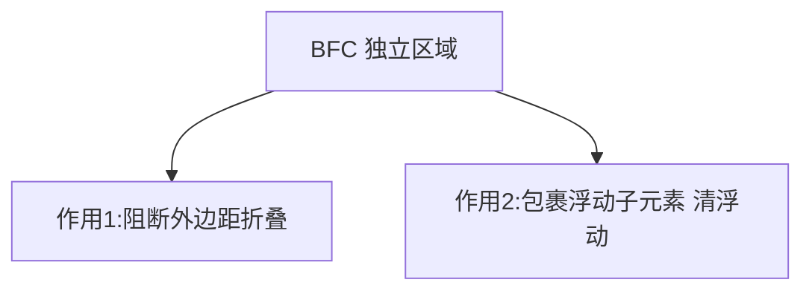
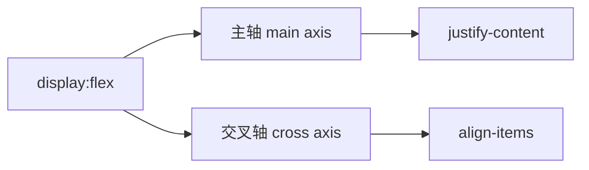

# 3.3 布局体系(上):常规流 / Flex / BFC

> 卷:卷三 · HTML 与 CSS
> 难度:⭐⭐ 进阶 | 阅读时间:30min | 状态:深度增强

---

## 引言:从"块和行"到"格式化上下文"与 Flex 算法

CSS 布局心法三层:**常规流 → 格式化上下文(BFC)→ Flex**。深挖要懂"格式化上下文"是什么、外边距折叠的完整规则、以及 flex 的收缩算法。

---

## 一、常规流:块级 vs 行内

| | 块级 | 行内 |
|---|------|------|
| 典型 | `div`/`p`/`h1` | `span`/`a`/`em` |
| 排列 | 纵向独占 | 横向流式 |
| 盒模型 | 宽高/上下 margin 生效 | 宽高难生效 |

> `inline-block` = 行内排布 + 块级盒模型。

---

## 二、BFC(块级格式化上下文)

### 2.1 什么是"格式化上下文"(底层)

> **格式化上下文(FC)**是"一块**独立布局的区域**",它规定了内部元素如何排布、以及**内外互不影响**。BFC(Block FC)就是其中"块级"的那一种,IFC 是"行内"那种。

```css
overflow: hidden / auto;   /* 触发 */
display: flow-root;        /* 现代推荐,无副作用 */
float / absolute / flex / grid;
```

### 2.2 两个作用(一图)



**为什么 BFC 能"清浮动"?** 浮动元素脱离常规流,父容器高度塌陷为 0;但 BFC 要求"独立隔离、包裹内部内容",所以会**计算浮动子元素的高度**,父容器不再塌陷。本质不是"清除",而是"**隔离并包裹**"。

### 2.3 外边距折叠(Margin Collapse)的三种情况

```css
/* ① 相邻兄弟:上下 margin 取较大值,不叠加 */
p + p { margin-top: 20px; }   /* 相邻 p 之间 = 20px 而非 40px */

/* ② 父子:子 margin 会"漏"到父外面(父无 border/padding/BFC) */
.parent { }                    /* 没有 BFC → 子 margin 折叠穿透 */

/* ③ 空元素:自身 margin-top/bottom 折叠 */
```

> 阻止折叠的办法:设 border/padding、或把父设成 BFC(`display: flow-root`)。

---

## 三、Flexbox:一维布局 + 收缩算法



```css
.container { display: flex; flex-direction: row; justify-content: space-between; align-items: center; gap: 12px; }
```

### flex 的三要素与算法(底层)

| 属性 | 作用 |
|------|------|
| `flex-grow` | 放大比例(默认 0) |
| `flex-shrink` | 缩小比例(默认 1) |
| `flex-basis` | 分配前的基准尺寸 |

- **空间足够 → grow 分配**:按 `flex-grow` 比例分"剩余空间"
- **空间不足 → shrink 收缩**:按 `flex-shrink × 基准尺寸` 加权收缩(**大元素缩得多**)

```css
/* flex:1 = 1 1 0%:忽略内容宽,纯按比例均分 → 真等宽 */
/* flex:auto = 1 1 auto:先按内容占位再分剩余 → 长短不均 */
```

> 收缩公式(理解用):项目实际收掉的空间 ∝ `flex-shrink × flex-basis`,所以"基准大的元素收缩比例更大"——这是"为什么内容长的那项会缩得更多"的算法根源。

---

## 四、小结

```
常规流:块/行内/inline-block
BFC:独立布局区域(格式化上下文);触发 flow-root/overflow/float/absolute/flex
   作用:阻断 margin 折叠 + 包裹浮动;折叠三情况(兄弟/父子/空元素)
Flex:容器(justify/align/gap)+ 项目(grow/shrink/basis);收缩 ∝ shrink×basis
```

---

## 五、面试题

**Q1:什么是 BFC?触发条件?三个应用?**

BFC 是独立布局区域,内外互不影响。触发:`overflow:hidden`、`flow-root`、`float`、`absolute`、`flex/grid`。应用:① 清浮动;② 阻断外边距折叠;③ 两栏隔离防浮动重叠。

**Q2:`flex: 1` 和 `flex: auto` 的区别?**

`flex:1`=`1 1 0%`(忽略内容宽,均分 → 等宽);`flex:auto`=`1 1 auto`(先内容后分剩余 → 不等)。

**Q3:什么是"外边距折叠"?哪些情况会折叠?如何阻止?**

相邻块级元素的上下 margin **取较大值合并**,不叠加。三种:① 相邻兄弟;② 父子(子 margin 穿透到父外);③ 空元素自身上下。阻止:设 `border/padding`,或父触发 BFC(`display: flow-root`)。

**Q4:为什么 flex 缩小时,内容长的项会缩得更多?**

收缩量 ∝ `flex-shrink × flex-basis`。基准尺寸大(内容长)的项目,在空间不足时按比例**缩得更多**。这就是 flex 收缩算法的直接结果(默认 `flex-shrink:1` 时所有项整体按 basis 加权收缩)。

**Q5:为什么说"清浮动"的本质是 BFC 而非 clear 属性?**

`clear: both` 是"强制元素避开浮动"(往下排),但不解决父容器高度塌陷;BFC 通过"独立隔离 + 包裹内部浮动"直接**算入浮动高度**,治本。二者常配合:父设 BFC 包裹,兄弟用 clear 避让。

**Q6:inline 元素为什么对 height/margin-top 不敏感,而 inline-block 可以?**

`inline` 属于**行内格式化上下文(IFC)**,盒模型语义弱(高度由行高决定、垂直 margin 不生效);`inline-block` 内部是"块级盒模型"、外部"行内排布",所以能设宽高和垂直 margin——这是它常被用来"行内但要能设宽高"的原因。

---

📎 参考:MDN《BFC》《flexbox》、CSS2.1 规范 margin-collapsing、CSS Flexbox 规范(flex-shrink 算法)