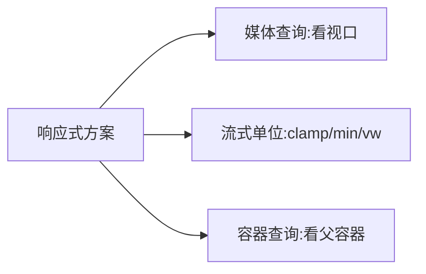

# 3.4 布局体系(下):Grid / 定位 / 响应式与容器查询

## 引言:二维交给 Grid,定位交给 position,适配交给查询

Flex 是"一维",Grid 是"二维"。深挖要懂 Grid 的**显式/隐式网格**、sticky 的**滚动祖先机制**、以及 afr 单位与"媒体 vs 容器查询"的底层区别。

---

## 一、Grid:显式网格 vs 隐式网格

```css
.grid {
  display: grid;
  grid-template-columns: 200px 1fr 1fr;  /* 显式:明确声明 */
  grid-template-rows: auto 100px;
  grid-auto-rows: 80px;                  /* 隐式:内容多出来的行 */
  gap: 16px;
}
.item { grid-column: 1 / 3; }
```

**底层:显式 vs 隐式**

- **显式网格**:`grid-template-*` 声明的行/列
- **隐式网格**:内容超出显式定义时,浏览器**自动生成**的行/列(`grid-auto-rows/columns` 决定其尺寸)

> `grid-template` 定"你画好的格",`grid-auto` 定"多出来的格用多大"。

**`fr` vs 百分比(高频):**

| 单位 | 语义 |
|------|------|
| `1fr` | **剩余空间**的 1 等份(先减去固定项、gap) |
| `50%` | 容器宽度的 50% |

> `1fr 1fr` 是"均分剩余空间";`50% 50%` 是"各占一半"——两者在**有 gap/固定列时结果不同**,因为 fr 从"剩余"里分,百分比从"整体"里算。

---

## 二、定位(position 五值)

| 值 | 参照物 | 脱离文档流 | 场景 |
|----|--------|-----------|------|
| `static` | 常规流 | 否 | 默认 |
| `relative` | 自身原位置 | 否(占位) | 微调,给 absolute 做参照 |
| `absolute` | 最近非 static 祖先 | **是** | 弹层 |
| `fixed` | 视口 | **是** | 悬浮 |
| `sticky` | 最近**滚动容器** | 否(占位) | 吸顶 |

**sticky 底层:相对"最近的滚动祖先"**

> sticky 粘附的参照不是视口,而是**最近的、会滚动的祖先**;它"粘"在滚动容器可视区内,且**不会超出父容器边界**(父容器滚走了,sticky 也跟着走)。

**sticky 失效四因:** ① 没设阈值(`top` 等);② 祖先 `overflow:hidden/scroll` 破坏滚动上下文;③ 父容器无足够滚动空间;④ 多个滚动容器层级不清。

**层叠上下文(Stacking Context)与 z-index(高频):**

`z-index` 只在**定位元素**(或 flex/grid 子项)上生效,且受**层叠上下文**约束——不同层叠上下文里的 z-index **互不比较**,只在本上下文内比。

**会创建层叠上下文的条件:**

- 定位元素 + `z-index` 非 auto
- `transform`/`filter`/`opacity < 1`/`will-change` 等
- `position: fixed`/`sticky`(部分)

**同一上下文内层叠顺序(从低到高):**

```
背景/边框 → 负 z-index → 块级盒子 → 浮动 → 行内 → z-index:0/auto → 正 z-index
```

```css
.parent { position: relative; z-index: 1; }   /* 创建上下文 */
.child { z-index: 999; }   /* 只在本上下文内比较,再高也出不了 parent 的层 */
```

> 为什么会有"z-index 999 还是被盖住"的坑?因为它被父级层叠上下文"锁"住了——不同上下文的 z-index 无法跨上下文比较。

---

---

**现代 CSS 新特性(2026 已基线可用):**

| 特性 | 作用 | 说明 |
|------|------|--------|
| 子网格 `subgrid` | 嵌套 grid 继承父网格轨道 | 跨卡片对齐 |
| `:has()` | 父元素选择器(根据子元素选父) | "含某个子元素的父" |
| `@property` | 可动画的自定义属性 | 自定义属性可过渡/动画 |
| 容器查询单位 `cqw` | 相对容器宽度 | 组件内尺寸自适应 |

```css
/* subgrid:子项继承父 grid 轨道,跨卡片对齐 */
.child { grid-template-rows: subgrid; }

/* :has():选中"含 .img 的 .card" */
.card:has(.img) { padding: 0; }

/* @property:让 --angle 可动画 */
@property --angle { syntax: "<angle>"; initial-value: 0deg; inherits: false; }
```

> 意义:容器查询 + 子网格 + `:has()` 解决了多年"需 JS 变通"的布局/选择难题,CSS 从"样式表"进化成"设计系统引擎"。

---

## 三、响应式:三条路线(底层区别)



```css
/* ① 媒体查询(整页适配) */
@media (min-width: 768px) { .card { width: 50%; } }

/* ② 流式单位(省掉一半查询) */
font-size: clamp(1rem, 2vw + 0.5rem, 1.5rem);

/* ③ 容器查询(组件级,现代) */
.card-wrap { container-type: inline-size; }
@container (min-width: 400px) { .card { grid-template-columns: 1fr 1fr; } }
```

**媒体查询 vs 容器查询(底层):**

- 媒体查询基于**视口(viewport)**——整页级别
- 容器查询基于**某个父容器的尺寸**——组件级别

> 意义:同一组件丢进侧边栏(窄)和主区(宽),容器查询让它**随容器自适应**,不必关心"整屏多宽"。这是"组件化时代"的响应式范式升级。

---

## 四、小结

```
Grid:显式(grid-template)vs 隐式(grid-auto);fr=剩余空间(区别于百分比);grid-column/row 定位
定位:sticky 相对最近滚动容器,不超出父边界;失效四因
响应式:媒体查询(视口)/ clamp+min(流式)/ 容器查询(父容器,组件级)
```

---

## 五、面试题

**Q1:`position: sticky` 为什么不生效?**

① 未设阈值;② 祖先 `overflow:hidden/scroll`;③ 父容器无滚动空间;④ sticky 不脱离文档流,父高即内容高时无从粘附。

**Q2:媒体查询和容器查询的本质区别?**

媒体查询基于**视口**做整页适配;容器查询基于**父容器**做组件级适配,让组件"随容器伸缩",更适合可复用组件库。

**Q3:`1fr` 和 `50%` 有什么区别?举例何时结果不同?**

`1fr` 分的是**剩余空间**(先减固定项和 gap);`50%` 是容器宽的 50%。当列里有固定宽度或 gap 时,`1fr 1fr`(均分剩余)与 `50% 50%`(各占一半)结果不同——fr 更符合"等分剩余"的直觉。

**Q4:什么是 Grid 的"显式网格"和"隐式网格"?**

显式网格 = `grid-template-*` 声明的行列;隐式网格 = 内容超出显式定义时浏览器**自动生成**的行列,尺寸由 `grid-auto-*` 控制。两者缺一不可地描述"Grid 怎么摆下所有内容"。

**Q5:实现"三行等高"除了 Grid 还有什么?**

Grid(推荐)`grid-auto-rows: 1fr`;Flex 默认 `align-items: stretch` 让同行等高;旧方案"负 margin + padding 补偿"/table(过时)。

**Q6:`position: fixed` 的元素在"有 transform 的祖先"里会发生什么?**

`transform` 会让祖先成为**新的包含块**(见 [3.2](/卷三-HTML与CSS/3.2-盒模型与包含块)),于是 `fixed` 不再相对视口,而相对这个祖先定位,视觉上"固定失效/跑偏"。这是面试高频组合陷阱。

---

📎 参考:[MDN《CSS Grid》](https://developer.mozilla.org/zh-CN/docs/Web/CSS/CSS_grid_layout)《position》《容器查询》、[Web.dev](https://web.dev/)《响应式设计》、CSS Grid 规范