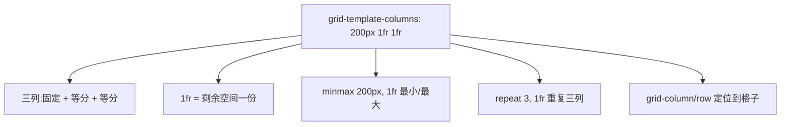

# 3.4 布局体系(下):Grid / 定位 / 响应式与容器查询

> 卷:卷三 · HTML 与 CSS
> 难度:⭐⭐ 进阶 | 阅读时间:25min | 状态:已深化

---

## 引言:二维交给 Grid,定位交给 position,适配交给查询

Flex 是"一维神器",Grid 是"二维之神"。这一章补齐 Grid、定位、响应式三块拼图。

---

## 一、Grid:二维网格(一图)



```css
.grid {
  display: grid;
  grid-template-columns: 200px 1fr 1fr;
  grid-template-rows: auto 100px;
  gap: 16px;
}
.item { grid-column: 1 / 3; }   /* 跨两列 */
```

> 经典圣杯布局一行:`grid-template-columns: 200px 1fr 240px;`

**Flex vs Grid 选型**

| | Flex | Grid |
|---|------|------|
| 维度 | 一维 | 二维 |
| 适合 | 导航、行内对齐 | 页面骨架、卡片网格 |
| 口诀 | 内容推尺寸 | 先定框架再填内容 |

---

## 二、定位(position 五值)

| 值 | 参照物 | 脱离文档流 | 场景 |
|----|--------|-----------|------|
| `static` | 常规流 | 否 | 默认 |
| `relative` | 自身原位置 | 否(占位) | 微调,给 absolute 做参照 |
| `absolute` | 最近非 static 祖先 | **是** | 弹层、角标 |
| `fixed` | 视口 | **是** | 悬浮、吸顶 |
| `sticky` | 滚动容器 | 否(占位) | 吸顶导航、表头 |

**`sticky` 原理(高频):** relative + fixed 的混合——常规流占位,滚到阈值(`top:0`)时"粘"住,但不脱离文档流、不超出父容器边界。

**sticky 不生效的常见原因:** ① 没设阈值(`top` 等);② 祖先 `overflow:hidden/scroll` 破坏;③ 父容器高度不足无滚动空间。

---

## 三、响应式

### 1. 媒体查询(看视口)

```css
.card { width: 100%; }
@media (min-width: 768px) { .card { width: 50%; } }
```

### 2. 流式单位 + clamp

```css
font-size: clamp(1rem, 2vw + 0.5rem, 1.5rem);  /* 最小/弹性/最大 */
.wrap { width: min(90%, 1200px); margin: 0 auto; }
```

### 3. 容器查询(看父容器,现代)

```css
.card-wrap { container-type: inline-size; }
@container (min-width: 400px) {
  .card { grid-template-columns: 1fr 1fr; }
}
```

> 媒体查询看**视口**,容器查询看**父容器**——组件级响应式,丢进侧边栏(窄)和主区(宽)能自动适配。

---

## 四、小结

```
Grid(二维):grid-template-* + fr + minmax + grid-column/row
定位:relative(占位参照)/absolute(脱离,最近非 static)/fixed(视口)/sticky(粘附)
响应式:媒体查询(视口)/clamp+min(流式)/容器查询(父容器,组件自适)
```

---

## 五、面试题

**Q1:`position: sticky` 为什么不生效?**

① 未设 `top/bottom/left/right` 阈值;② 祖先 `overflow:hidden/scroll` 破坏(它相对滚动容器);③ 父容器无滚动空间;④ sticky 不脱离文档流,父高即内容高时无从粘附。

**Q2:媒体查询和容器查询的本质区别?**

媒体查询基于**视口**做整页适配;容器查询基于**父容器**做组件级适配,让组件"随容器伸缩",更适合可复用组件库。

**Q3:实现"三行等高"除了 Grid 还有什么?**

Grid(推荐):`grid-auto-rows: 1fr`;Flex:默认 `align-items: stretch` 让同行等高;旧方案"负 margin + padding 补偿"/table(已过时)。

---

📎 参考:MDN《CSS Grid》《position》《容器查询》、Web.dev《响应式设计》