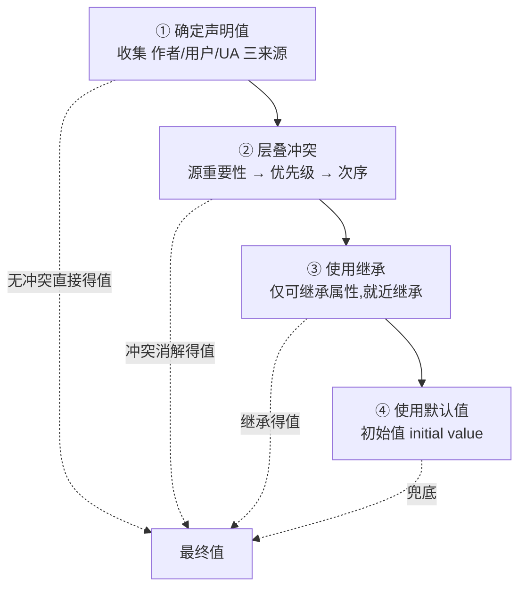

# 3.5 CSS 级联与属性计算

> 卷:卷三 · HTML 与 CSS
> 难度:⭐⭐⭐ 专家 | 阅读时间:25min | 状态:已深化

---

## 引言:一个元素的最终样式到底怎么定

「CSS 属性计算」要回答的就是:为什么 h1 不写样式也有样式?为什么 a 标签不继承颜色?本章把"声明值 → 层叠 → 继承 → 默认值"的计算链讲成体系,并补 `@layer`。

---

## 一、总纲:属性计算四步(一图)



- 每个元素最终都有**一整套完整属性值**(不写的也有)
- 计算就是**按顺序**解决每个属性"值从哪来"

---

## 二、第一步:确定声明值(三种来源)

| 来源 | 谁写 | 说明 |
|------|------|------|
| 页面作者样式 | 开发者 | 最常见 |
| 用户样式 | 浏览器用户 | 较少见 |
| 用户代理样式(UA) | 浏览器 | 内置默认 |

> 例:`h1` 不写也有字号/加粗,正是 UA 表给了默认值。

---

## 三、第二步:层叠冲突(三比较)

### 1. 比较源的重要性

`作者 > 用户 > UA`(默认);**`!important` 反转这一层**。

### 2. 比较优先级(Specificity)

`(id 数, class/伪类/属性 数, 元素/伪元素 数)`,从左往右逐位比:

```css
#nav a          /* (1,0,1) */
.nav a:hover    /* (0,2,1) */
a               /* (0,0,1) */
```

### 3. 比较次序

同源、同权重 → **后写的赢**。

---

## 四、第三步:使用继承

**可继承**:`color`、`font-*`、`line-height`、`text-align`、`visibility`;不可继承:宽高、margin、padding、border、position。

**两个细节:**

1. **就近继承**:只从最近祖先取值,不比权重(因为没选中该元素)
2. **继承值弱于任何直接声明** → 所以:

```css
div { color: red; }
a { }  /* a 在 UA 表声明了 color → 用 UA 声明,不继承 div 的 red */
```

> 这就是"a 不继承父色"的底层原因;可用 `a { color: inherit; }` 强制继承。

---

## 五、第四步:使用默认值 + 三个关键字

```css
inherit;  /* 强制继承父值 */
initial;  /* 初始值 */
unset;    /* 可继承=inherit,不可继承=initial */
revert;   /* 回退到上一层来源(如 UA 默认) */
```

---

## 六、`@layer`:层叠层(现代工具)

```css
@layer base, components, utilities;

@layer base { h1 { font-size: 2rem; } }
@layer components { .title { font-size: 1.5rem; } }
@layer utilities { .text-lg { font-size: 1.25rem; } }
/* 后声明的层优先级高:utilities > components > base */
```

**为什么要有 `@layer`?** 多方样式(第三方库 + 自己 + 工具类)冲突时,靠 specificity 硬碰会失控。`@layer` 人为**分层定优先级**,让"工具类可预期覆盖组件类",不必堆 `!important`(Tailwind 正是靠它管优先级)。

---

## 七、小结

```
四步:声明值 → 层叠(源重要性!important 反转 → 优先级 id/class/元素 → 次序)→ 继承(可选,弱于声明)→ 默认值
工具:@layer 分组控优先级;inherit/initial/unset/revert 显式指定
```

---

## 八、面试题

**Q1:计算 `#nav .item a:hover` 的优先级?**

```js
// #nav(1 id)+ .item + :hover(2 class)+ a(1 element)= (1, 2, 1)
```

**Q2:下面 `p` 文字什么颜色?为什么?**

```html
<div style="color: red"><p>text</p></div>
<!-- 红色:p 未声明 color,color 可继承 → 就近继承 div 的 red；
     若 p 是 a,则 UA 表已声明 → 用链接默认蓝,不退化为继承 -->
```

**Q3:`!important` 和 `@layer` 谁更能"压住"对方?**

`!important` 是最高优先级的"王炸",连 `@layer` 都压不住;但 `@layer` 的价值是让你**不必再用** `!important` 就能预测覆盖次序(重要声明在层内还各自倒序,属进阶细节)。

---

📎 参考:MDN《CSS Cascade》《specificity》《@layer》、CSS-Cascade-5 规范