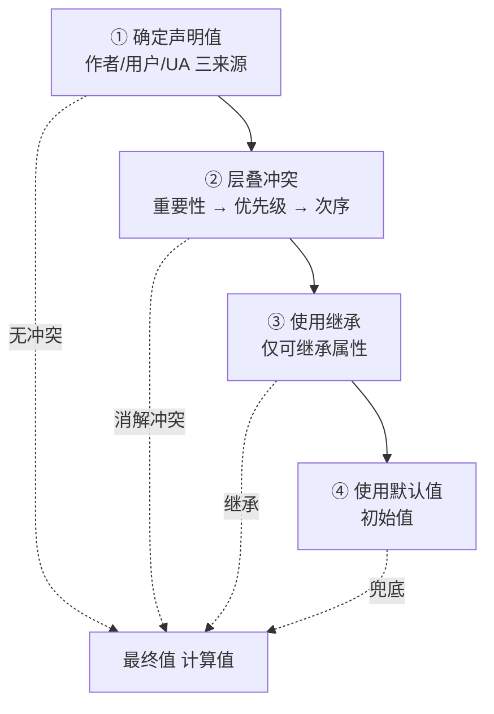

# 3.5 CSS 级联与属性计算

## 引言:一个元素的最终样式到底怎么定

「CSS 属性计算」要回答的就是:为什么 h1 不写样式也有样式?为什么 a 标签不继承颜色?深挖要懂**层叠的完整顺序**(含 `!important` 反转与 `@layer` 倒序),以及**属性值从声明到最终值的完整流水线**。

---

## 一、总纲:属性计算四步



---

## 二、第一步:确定声明值(三种来源)

| 来源 | 谁写 | 说明 |
|------|------|------|
| 页面作者 | 开发者 | 最常见 |
| 用户 | 浏览器用户 | 较少见 |
| 用户代理(UA) | 浏览器 | 内置默认 |

---

## 三、第二步:层叠冲突(完整顺序)

**完整优先级从高到低:**

```
1. 浏览器 UA 的 !important
2. 用户的 !important
3. 作者的 !important
4. 作者普通声明:动画/transition > @layer(按顺序) > 行内 style > 各特殊性
5. 用户普通声明
6. UA 普通声明
```

拆成三把尺子(最常见的"作者普通声明"内部再比):

1. **源重要性**:作者 > 用户 > UA;`!important` **整条反转**
2. **优先级(Specificity)**:`(id 数, class/伪类/属性 数, 元素/伪元素 数)`,从左往右逐位比
3. **次序**:同源同权 → 后写赢

### Specificity 计算示例

```css
a                /* (0,0,1) → 1 个元素 */
.nav a           /* (0,1,1) → 1 class + 1 元素 */
#nav .item a:hover  /* (1,2,1) → 1 id + 2 class/伪类 + 1 元素 */
```

| 选择器 | 优先级 |
|--------|--------|
| `a` | (0,0,1) |
| `.nav a` | (0,1,1) |
| `#nav .item a:hover` | (1,2,1) |
| 行内 style | 高于一切普通选择器 |

> 记忆:`id`(百位)> `class/属性/伪类`(十位)> `元素/伪元素`(个位)。`*`、`:where()` 不占权重;`:is()` 取参数里最高者。

**行内 style 的位置:** 行内 style 优先级**高于**任何普通选择器,但**低于 `!important`**。相当于"作者声明里的最高普通级"。

---

## 四、属性值的完整流水线(四阶段)

一个属性从声明到真正渲染,要经过四个阶段:

```
声明值(specified value)→ 计算值(computed value)→ 使用值(used value)→ 实际值(actual value)
```

| 阶段 | 说明 | 例子 |
|------|------|------|
| 声明值 | 层叠后确定的声明 | `width: 50%` |
| 计算值 | 解析相对单位/继承 | `50%`(仍未落定,取决于父宽) |
| 使用值 | 结合布局环境算出绝对值 | `width: 400px`(父 800px 的 50%) |
| 实际值 | 渲染时的最终取值(受设备精度约束) | 亚像素取整 |

---

## 五、继承:传递的是"计算值"

```css
div { font-size: 20px; }
p { font-size: 1.5em; }   /* 1.5em 会先算成 30px 再传给子元素 */
```

**底层细节:继承传递的是「计算值(computed value)」,不是声明本身。**

> 子元素继承到的是父元素**已经算好的值**(如 `1.5em` 已算成 `30px`),而不是"1.5em 这个表达式再相对子元素算一遍"。这就是为什么 `em` 不会"层层翻倍"。

**为什么 a 不继承父色?**

```css
div { color: red; }
a { }  /* UA 表给 a 声明了 color → 声明值优先于继承值 → 用链接默认蓝 */
```

> 继承值**弱于任何直接声明**(哪怕是 UA 声明)。要强制继承:`a { color: inherit; }`。

---

## 六、CSS 自定义属性(var)的继承特性

```css
:root { --brand: #3366ff; }
.button { color: var(--brand); }
```

**自定义属性的特殊点:**

1. **总是继承**(不像普通属性分可继承/不可继承)
2. **不参与层叠的 specificity**(它就是值,var() 在哪用就继承到哪)
3. **在 computed value 阶段才解析**(`var()` 的替换发生在计算值阶段)

```css
.parent { --gap: 16px; }
.child { padding: var(--gap); }   /* 子元素能继承到 --gap */
```

---

## 七、`@layer` 的底层:important 在层内"倒序"

```css
@layer base, components, utilities;
/* 后声明的层优先级高:utilities > components > base */
```

**关键反直觉点:** 普通声明里"后面的层赢";但 `!important` 在层内**反转**——`base` 的 `!important` 会赢过 `utilities` 的 `!important`。

> 为什么这样设计?为了"**基础层的强制约束(品牌色、安全规则)能用 !important 压住工具类**",而工具类的普通声明又能压基础层——双向可控,正是 `@layer` 的精髓。

---

## 八、小结

```
四步:声明值 → 层叠 → 继承 → 默认值
属性值流水线:声明值 → 计算值 → 使用值 → 实际值
层叠完整序:UA!important > 用户!important > 作者!important > 作者普通(动画/@layer/行内/特殊性)> 用户 > UA
继承:传"计算值"(em 不翻倍);继承弱于声明(故 a 不继承父色);自定义属性总是继承
@layer:普通声明后层赢;!important 层内倒序(基础层可强制约束)
```

---

## 九、面试题

**Q1:计算 `#nav .item a:hover` 的优先级?**

`(1, 2, 1)`:1 个 id(#nav)+ 2 个 class/伪类(.item + :hover)+ 1 个元素(a)。

**Q2:行内 style、`!important`、id 选择器、`@layer` 的优先级如何排?**

`!important`(作者)> 行内 style > 高特殊性(id)>…> 低特殊性;`@layer` 内部再按"层声明顺序"分优先级。行内 style 高于一切普通选择器,但低于 `!important`。

**Q3:继承传递的是"声明"还是"计算值"?举例说明后果?**

是**计算值**。如父 `font-size: 20px`、子 `font-size: 1.5em`,子先算出 30px 再传给孙,孙继承到的是 30px(而非"1.5em 再相对孙翻倍")——所以 `em` 沿继承链不会指数级翻倍。

**Q4:`@layer` 里 `!important` 为什么"倒序"生效?**

为了让**基础层能用 `!important` 施加强制约束**(品牌色、安全规则),压得住工具类;而工具类的**普通声明**又能压基础层。二者方向可控,正是 `@layer` "双向分层"的设计目的。

**Q5:为什么 a 标签不继承父元素的 color?**

因为 UA 样式表**已经给 a 声明了 color**,而"声明值"优先于"继承值"(继承只发生在无声明时)。要覆盖需显式 `a { color: inherit; }` 或自己声明。

**Q6:`!important` 的完整优先级顺序是什么?**

从高到低:浏览器 UA 的 `!important` > 用户的 `!important` > 作者的 `!important` > 作者普通声明 > 用户普通 > UA 普通。注意作者 `!important` 其实低于用户 `!important`(用户偏好优先于作者强制)。

**Q7:属性值从声明到渲染要经过哪几个阶段?**

四阶段:**声明值(specified)→ 计算值(computed)→ 使用值(used)→ 实际值(actual)**。如 `width:50%` 声明后,先保留百分比(计算值),结合父宽算出 400px(使用值),最后按设备精度取整(实际值)。

**Q8:CSS 自定义属性(var)和普通属性的继承有何不同?**

自定义属性**总是继承**(普通属性分可继承/不可继承),且**不参与 specificity 计算**,`var()` 在计算值阶段才替换。所以 `--brand` 这类变量天然沿 DOM 树向下传递。

---

📎 参考:[MDN《CSS Cascade》](https://developer.mozilla.org/zh-CN/docs/Web/CSS/CSS_cascade/Cascade)、[MDN《Specificity》](https://developer.mozilla.org/zh-CN/docs/Web/CSS/Specificity)、[MDN《@layer》](https://developer.mozilla.org/zh-CN/docs/Web/CSS/@layer)、[MDN《CSS 自定义属性》](https://developer.mozilla.org/zh-CN/docs/Web/CSS/Using_CSS_custom_properties)