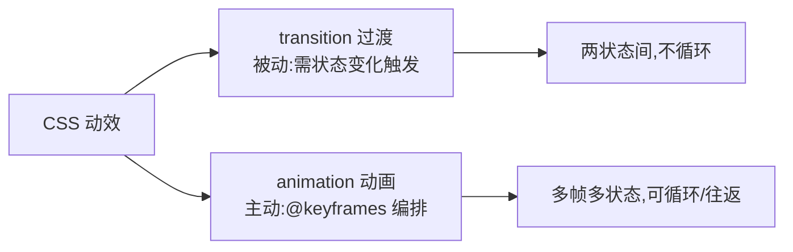

# 3.6 CSS 动画与过渡

> 卷:卷三 · HTML 与 CSS
> 难度:⭐⭐ 进阶 | 阅读时间:20min | 状态:已深化

---

## 引言:过渡是"两状态之间",动画是"多状态编排"

两大支柱:`transition`(靠状态变化触发)与 `animation`(靠 `@keyframes` 主动编排)。配合合成层知识,才能既好看又不卡。

---

## 一、Transition vs Animation(一图)



| | Transition | Animation |
|---|-----------|-----------|
| 触发 | 需状态变化(被动) | 自动/keyframes(主动) |
| 复杂度 | 两状态间 | 多帧 |
| 循环 | 不支持 | 支持 infinite/alternate |

---

## 二、Transition:过渡

```css
.box { transition: transform .3s ease .1s; }
/*                属性      时长  缓动 延迟 */
.box:hover { transform: scale(1.2); }
```

- 四要素:属性 / 时长 / 缓动(`ease`/`linear`/`cubic-bezier`)/ 延迟
- 必须状态变化才触发;`display`、`height:auto` 无法顺滑过渡

```css
/* 用 opacity + visibility 替代 display 做显隐过渡 */
.item { opacity: 0; visibility: hidden; transition: opacity .3s; }
.item.show { opacity: 1; visibility: visible; }
```

---

## 三、Animation:动画

```css
.box { animation: bounce 1s ease-in-out 2s infinite alternate; }
@keyframes bounce {
  0%   { transform: translateY(0); }
  50%  { transform: translateY(-20px); }
  100% { transform: translateY(0); }
}
```

| 属性 | 说明 |
|------|------|
| `animation-fill-mode: forwards` | 结束后停在末帧 |
| `animation-direction: alternate` | 往返 |
| `animation-iteration-count: infinite` | 无限循环 |

---

## 四、性能:只动 transform / opacity(呼应 2.5)

```css
/* ❌ 帧帧重排 */
@keyframes bad { from { left: 0; } to { left: 100px; } }
/* ✅ 合成层动画 */
@keyframes good { from { transform: translateX(0); } to { transform: translateX(100px); } }
```

**为什么只用 transform/opacity?** 回 2.5:它们只在**合成线程**完成,不触发布局/绘制;`left/top` 却要**重排**。配套 `will-change: transform` 预提升(用完移除,防层爆炸)。

---

## 五、FLIP 技巧(进阶)

**First-Last-Invert-Play**:对"布局属性变化"也能做出 60fps 动画:

```
F 记录起始 → L 布局变到位,记录结束 → I 用 transform 反向拉回 → P 播放 transform 到 0
```

> 精髓:**用 transform 去"演"布局变化**,既保留布局语义,又享合成层性能。适合列表增删、拖拽排序。

---

## 六、小结

```
Transition:四要素,靠状态变化触发,两状态间
Animation:@keyframes 多帧,可循环/往返/停末帧(forwards)
性能:只动 transform/opacity(合成层),避免 left/top/width(重排)
FLIP:把布局变化转成 transform 动画
```

---

## 七、面试题

**Q1:如何让点击后元素淡入并停在最终态?**

```css
.el { opacity: 0; }
.el.show { animation: fadeIn .5s forwards; }
@keyframes fadeIn { from { opacity: 0; } to { opacity: 1; } }
```

**Q2:为什么 CSS 动画比 JS 动画更流畅?**

① 可用 `transform/opacity` 走合成线程/GPU,**不触发布局**(JS 改 left 会重排);② 浏览器能对 CSS 动画做**独立于主线程**的调度优化;③ JS 动画依赖主线程 tick。

**Q3:`display:none` 能过渡吗?替代方案?**

不能——`display` 是离散属性无中间态,`none` 时不渲染。替代:用 `opacity + visibility`(保留过渡),或现代 `@starting-style` 支持 `display:none` 过渡。

---

📎 参考:MDN《transition》《animation》《FLIP》、Web.dev《动画性能》