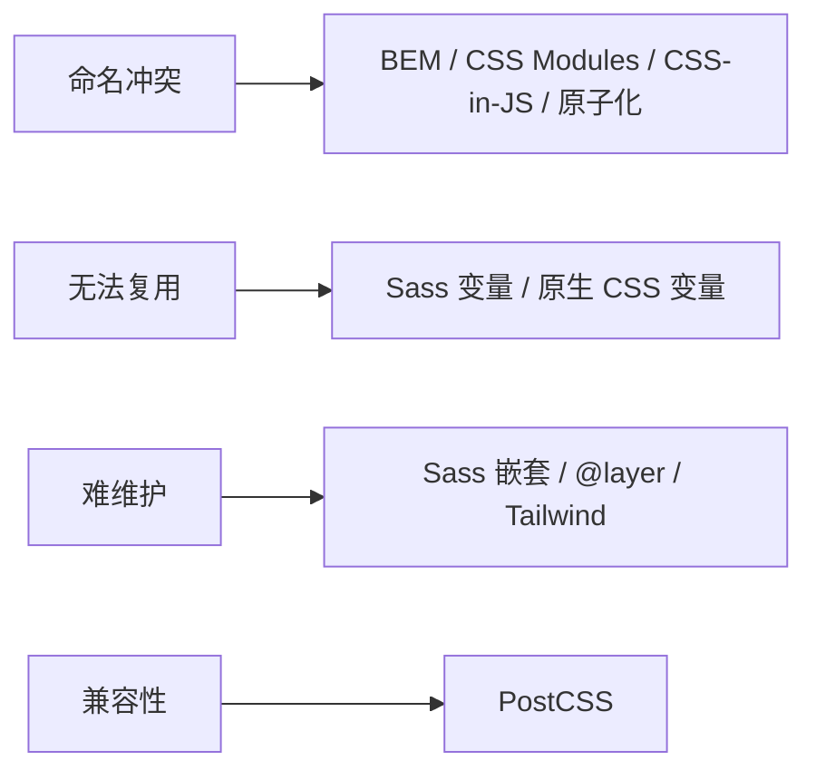

# 3.7 CSS 工程化

## 引言:当 CSS 写着写着就"失控"了

原生 CSS 三痛点:**全局污染、无法复用、难维护**。深挖要懂每个方案的**底层机制**——尤其 CSS-in-JS 为什么从火到冷,以及"零运行时"是什么。

---

## 一、痛点 → 路线



---

## 二、BEM 命名规范

`Block__Element--Modifier`:

```css
.card {} .card__title {} .card--featured {} .card__title--large {}
```

优点:冲突低、自描述、无工具;局限:类名长、软约束。是 CSS Modules/原子化的命名兜底。

---

## 三、Sass + 原生 CSS 变量(底层区别)

```scss
$primary: #4f46e5;              // Sass:编译期替换
```
```css
:root { --primary: #4f46e5; }   // 原生:运行时,支持继承/JS 读写
.btn { background: var(--primary); }
```

**底层:** Sass 变量是"**编译期宏替换**"(产物里是死值,运行时不存在);原生 CSS 变量是"**运行时真实值**",参与级联、可被 JS 读写 → 能动态换肤。

**Sass 的常用能力:**

```scss
// 嵌套(编译成后代选择器)
.card {
  &:hover { box-shadow: 0 0 8px; }      // & 引用父选择器
  .title { font-weight: bold; }
}

// mixin(复用一段样式,可带参数)
@mixin center {
  display: flex; justify-content: center; align-items: center;
}
.box { @include center; }

// @extend(共享同一选择器,减少重复)
.error { border: 1px solid red; }
.fatal { @extend .error; background: pink; }

// @use/@forward(模块化,替代旧的 @import)
@use "colors";        // 引入并命名空间隔离
@forward "theme";     // 转发
```

---

## 四、PostCSS:通用转换引擎

PostCSS 是 **CSS → AST → 转换** 的引擎,靠插件干活:`autoprefixer`(前缀)、`postcss-preset-env`(未来语法降级)、`tailwindcss`(本身就是 PostCSS 插件)。

---

## 五、三种"局部作用域/原子化"方案

| 方案 | 底层机制 | 特点 |
|------|---------|------|
| CSS Modules | 构建期**类名哈希化** | 局部作用域,原生心智 |
| Tailwind | 原子类 + 按需生成 + `@layer` | 令牌统一,产物小 |
| CSS-in-JS | **运行时**注入 style 标签 | 动态,但有运行时开销 |

```jsx
import styles from "./Button.module.css";      // CSS Modules
<button className={styles.primary}>…</button>
```

**CSS Modules 的配置(以 Vite 为例,开箱即用):**

```css
/* Button.module.css —— 文件名带 .module. 即启用 CSS Modules */
.primary { background: #4f46e5; }
```

```jsx
// 编译后类名变成局部哈希,不会全局污染
import s from "./Button.module.css";
s.primary;   // "_primary_1a2b3c" 类似的哈希类名
```

### CSS-in-JS 为什么"从火到冷"

CSS-in-JS(styled-components/Emotion)把样式写进 JS,**运行时**才能算出 class 并注入 `<style>`:

- **运行时开销**:每次渲染都要"算样式 → 生成类名 → 注入/更新 style 标签",拖慢首屏与 SSR
- **难以 SSR 流式**:样式在 JS 里,服务端要额外序列化再注入
- → 趋势转向"**零运行时**"方案:样式在**构建期**就产出静态 CSS(Tailwind、vanilla-extract、styleX),运行时零开销

> 选型结论:能"编译期解决"就别"运行时解决"——零运行时方案既得原子化/局部作用域的好处,又没运行时负担。

---

## 六、选型建议(务实)

| 场景 | 推荐 |
|------|------|
| 传统多页/后台 | Sass + BEM |
| React 组件库 | CSS Modules(或 Tailwind) |
| 快速出 UI、令牌统一 | Tailwind + 原生 CSS 变量(主题) |
| 强 JS 耦合/动态 | 优先零运行时(vanilla-extract),慎用运行时 CSS-in-JS |

---

## 七、小结

```
三痛:命名冲突 / 复用 / 维护
BEM(命名)→ Sass(编译期复用)+ 原生变量(运行时)→ PostCSS(兼容)
局部作用域:CSS Modules(哈希)/ Tailwind(原子按需)/ CSS-in-JS(运行时注入)
趋势:零运行时(Tailwind/vanilla-extract)取代运行时 CSS-in-JS
```

---

## 八、面试题

**Q1:CSS Modules 解决什么?底层如何实现?**

普通类名全局共享易冲突;CSS Modules 在**构建期把类名哈希化**(`Button_primary_1a2b`)实现局部作用域,同名不冲突,保留原生心智。

**Q2:原生 CSS 变量和 Sass 变量的本质区别?**

Sass 变量**编译期宏替换**(产物是死值,运行时不参与、不能 JS 改);原生 CSS 变量是**运行时真实值**,支持**继承、级联、JS 读写**,能做动态换肤。

**Q3:PostCSS 是预处理器吗?**

不是。PostCSS 是**通用 CSS 解析/转换引擎**(CSS→AST→处理),预处理(Sass)和后处理(autoprefixer/preset-env)都能基于或配合它。Tailwind 本身就是一个 PostCSS 插件。

**Q4:运行时 CSS-in-JS 的"运行时开销"具体在哪?**

每次组件渲染都要**算样式 → 生成哈希类名 → 注入/更新 `<style>` 标签**,JS 与 DOM 反复打交道;SSR 还需额外序列化样式注入 HTML,无法简单流式。这些都拖慢首屏。

**Q5:什么是"零运行时"CSS 方案?举例?**

样式在**构建期**就产出静态 CSS、运行时零计算/零注入的方案,如 Tailwind、vanilla-extract、styleX。它们既得局部作用域/原子化的好处,又没有运行时 CSS-in-JS 的开销,是当前主流趋势。

**Q6:为什么 Tailwind 能"体积小"?它是怎么做到的?**

Tailwind 是**按需生成**:扫描源码里实际用到的类名,只产出对应的 CSS(配合 `@layer` 管优先级)。没写到的类不生成,所以产物体积远小于"全套框架 CSS"。本质是"JIT 按需编译"。

**Q7:Sass 的 `@mixin` 和 `@extend` 有什么区别?**

`@mixin` 把一段样式**复制**到每个 `@include` 处(可带参数,灵活但重复);`@extend` 让多个选择器**共享同一个规则**(不复制,产物小但可能产生意想不到的连姻选择器)。简单复用用 mixin,减少重复用 extend。

**Q8:CSS Modules 的类名哈希是怎么生成的?能否自定义?**

构建期按"文件名 + 原类名 + 哈希"生成唯一类名(如 `_primary_1a2b`),实现局部作用域。可配置 `localIdentName` 自定义模板(开发环境常用可读的 `[name]__[local]` 方便调试)。

---

📎 参考:[MDN《Sass》](https://developer.mozilla.org/zh-CN/docs/Glossary/Sass)《CSS 自定义属性》、Tailwind 文档、PostCSS 官网、styled-components/vanilla-extract 文档