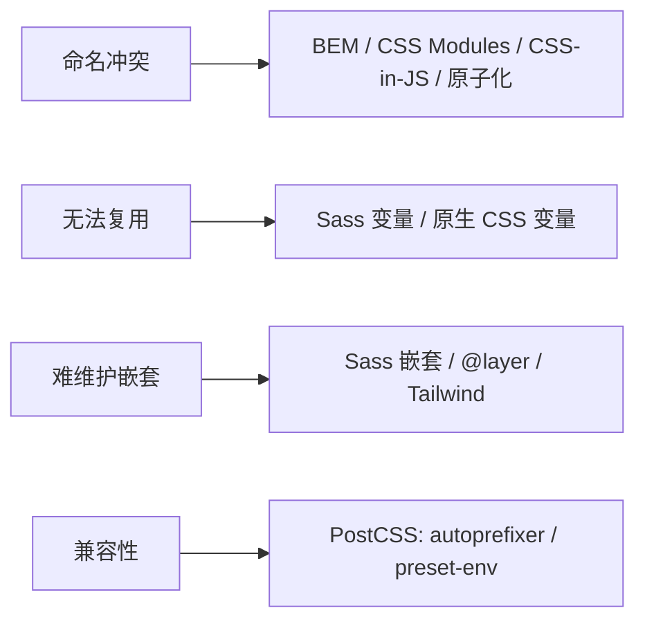

# 3.7 CSS 工程化

> 卷:卷三 · HTML 与 CSS
> 难度:⭐⭐ 进阶 | 阅读时间:20min | 状态:已深化

---

## 引言:当 CSS 写着写着就"失控"了

原生 CSS 三痛点:**全局污染(命名冲突)、无法复用、难以维护**。工程化就是围绕这三件事给方案。

---

## 一、痛点 → 路线(一图)



---

## 二、BEM 命名规范(方法论,非工具)

**Block__Element--Modifier:**

```css
.card {}                    /* 块 */
.card__title {}             /* 元素(用 __) */
.card--featured {}          /* 修饰符(用 --) */
.card__title--large {}      /* 元素的状态 */
```

**优点**:冲突概率低、结构自描述、无工具依赖;局限:类名长、软约束(不硬隔离)。它是 CSS Modules/原子化的命名兜底。

---

## 三、预处理器 Sass + 原生 CSS 变量

```scss
$primary: #4f46e5;              // Sass 变量(编译期)
.card { &:hover { color: $primary; } }
@mixin ellipsis { overflow:hidden; text-overflow:ellipsis; white-space:nowrap; }
```

```css
:root { --primary: #4f46e5; }   // 原生 CSS 变量(运行时)
.btn { background: var(--primary); }
```

> Sass 变量编译期替换(不能 JS 改);原生变量是**运行时**真实存在、支持继承与 JS 读写 → 能做动态换肤。

---

## 四、PostCSS:后处理器

PostCSS 是**通用 AST 转换引擎**,靠插件干活:

- `autoprefixer`:自动加前缀
- `postcss-preset-env`:未来语法降级
- `tailwindcss`:本质就是 PostCSS 插件

> Sass 是"**预**编译"(新语法→标准 CSS),PostCSS 是"**后**处理"(未来/标准→兼容 CSS)。

---

## 五、CSS Modules / Tailwind / CSS-in-JS

| 方案 | 思路 | 特点 |
|------|------|------|
| CSS Modules | 类名哈希化 | 局部作用域,心智近原生 |
| Tailwind | 原子工具类 | 按需生成、设计令牌统一 |
| CSS-in-JS | 样式进 JS | 动态,但运行时开销 |

```jsx
import styles from "./Button.module.css";
<button className={styles.primary}>…</button>   // 实际 ".Button_primary_1a2b"
```

```html
<!-- Tailwind -->
<button class="px-4 py-2 bg-blue-500 rounded hover:bg-blue-600">按钮</button>
```

---

## 六、选型建议(务实)

| 场景 | 推荐 |
|------|------|
| 传统多页/后台 | Sass + BEM/规范 |
| React 组件库,要局部作用域 | CSS Modules(或 Tailwind) |
| 快速出 UI、令牌统一 | Tailwind + 原生 CSS 变量(主题) |
| 强 JS 耦合、运行时动态 | CSS-in-JS(谨慎/零运行时方案) |

> 没有银弹,核心是把"命名冲突、复用、维护"三件事,选自己能长期维护的那条路。

---

## 七、小结

```
CSS 工程化 = 解三痛(命名/复用/维护)
BEM 命名 → Sass(写时复用)+ 原生变量(运行时)→ PostCSS(兼容)
CSS Modules(哈希局部作用域)/ Tailwind(原子按需)/ CSS-in-JS(动态但有开销)
```

---

## 八、面试题

**Q1:CSS Modules 解决什么?**

普通类名全局共享易冲突;CSS Modules 构建时把类名**哈希化**(`Button_primary_1a2b`)实现**局部作用域**,同名 class 不冲突,且保留写类名的原生心智。

**Q2:原生 CSS 变量和 Sass 变量的本质区别?**

Sass 变量**编译期**替换成固定值,运行时不参与(不能 JS 改、不能运行时主题);原生 CSS 变量是**运行时**真实值,支持**继承、级联、JS 读写**,能做动态换肤。

**Q3:PostCSS 是预处理器吗?**

不是。PostCSS 是**通用 CSS 解析/转换引擎**(CSS→AST→处理),预处理(Sass)和后处理(autoprefixer/preset-env)都能基于或配合它。Tailwind 本身就是一个 PostCSS 插件。

---

📎 参考:MDN《Sass》《CSS 自定义属性》、Tailwind 文档、PostCSS 官网