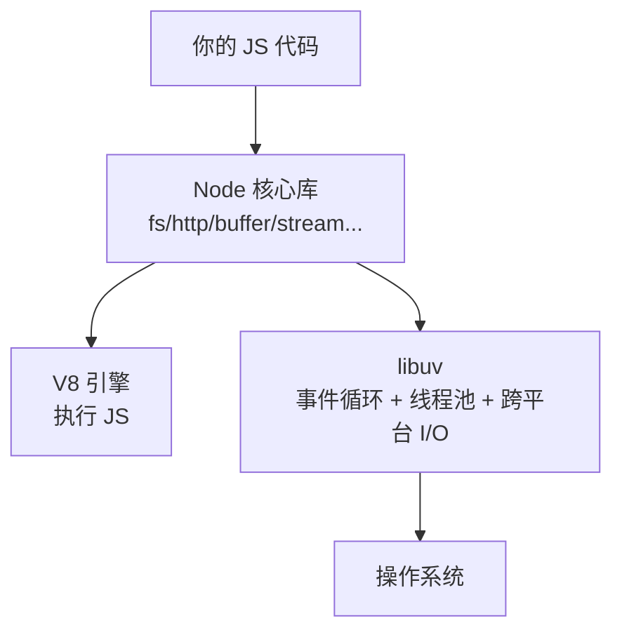

# 9.1 Node 架构与模块系统

> 卷:卷九 · Node.js 与运行时
> 难度:⭐ 基础 | 阅读时间:20min

---

## 引言:Node 不是一个"语言",是一个"运行时"

Node.js = **V8(JS 引擎)+ libuv(事件循环/异步 I/O)+ 一组核心模块**,把 JS 带到了服务器端。理解它的架构,才知道"为什么 Node 快"“为什么它适合 I/O 密集"。

---

## 一、Node 架构分层



- **V8**:执行 JS 代码(卷二 2.6 的 JIT/GC 那套)
- **libuv**:跨平台封装**事件循环、线程池、异步 I/O**,是 Node 异步能力的核心
- **核心模块**:`fs`/`http`/`buffer` 等,JS 可调用的能力

---

## 二、两个关键特性

1. **非阻塞 I/O**:发请求/读文件**不阻塞**主线程,结果回来再回调(靠事件循环)
2. **事件驱动**:一切异步操作的回调都通过事件循环调度执行

> **为什么 Node 适合 I/O 密集、不适合 CPU 密集?** I/O 密集(网络/文件)大多时间在"等",事件循环让单个线程就能并发处理海量连接;CPU 密集(大循环/加解密)会**占满唯一主线程**,阻塞其他任务(此时要用 worker_threads 或换语言)。

---

## 三、模块系统:CJS 与 ESM

### 1. CommonJS(历史默认)

```js
// a.js
module.exports = { x: 1 };
// b.js
const a = require("./a");
```

### 2. ESM(现代标准)

```js
// a.js
export const x = 1;
// b.js   (package.json 里设 "type": "module")
import { x } from "./a.js";   // 注意:ESM 要带扩展名
```

### 3. 互操作(易踩坑)

```js
// ESM 里 import CJS 模块:
import pkg from "./cjs.js";      // module.exports 变成 default

// CJS 里 require ESM:只能动态
const mod = await import("./esm.js");
```

> 经验:新项目统一 **ESM**(`"type": "module"`),避免混用;Node 社区正逐步全面转向 ESM。

---

## 四、常用全局对象

```js
console.log(process.cwd());     // 当前工作目录
console.log(__dirname);         // 当前文件所在目录(CJS)
console.log(__filename);        // 当前文件路径
process.env.NODE_ENV;           // 环境变量
process.argv;                   // 命令行参数
// ESM 下 __dirname 需自己构建:
import { fileURLToPath } from "url";
const __dirname = path.dirname(fileURLToPath(import.meta.url));
```

---

## 小结

```
Node = V8(执行 JS)+ libuv(事件循环/线程池/异步 I/O)+ 核心模块
非阻塞 I/O + 事件驱动 → 单线程高并发,适合 I/O 密集
模块:CJS(require/导出拷贝)vs ESM(import/静态);ESM 要带扩展名、新项目统一 ESM
```

## 面试题

**Q1:Node 为什么能"单线程"扛高并发?**

因为**非阻塞 I/O + 事件循环**:网络/文件等 I/O 交给 libuv 线程池与操作系统,**不占用主线程**,主线程只负责"调度回调"。所以一个线程就能同时管理成千上万个连接(大部分时间在等 I/O)。但要提一句:这是"**主线程单线程**",底层 libuv 有线程池。

**Q2:Node 里 `require` 和 `import` 能混用吗?**

能但有限制:ESM 可 `import` CJS(`module.exports` 变 default);CJS 只能通过**动态 `import()`**(异步)加载 ESM,不能同步 `require`。混用易踩坑,建议统一。

**Q3:为什么 Node 不适合 CPU 密集任务?**

CPU 密集(大循环、加解密)会**长时间占用唯一主线程**,阻塞事件循环,导致其他请求全部卡住。解法:用 `worker_threads` 开工作线程、或把计算交给子进程/其他语言;I/O 密集才是 Node 的主场。

---

📎 参考:Node.js 官方文档《About Node.js》《Modules》