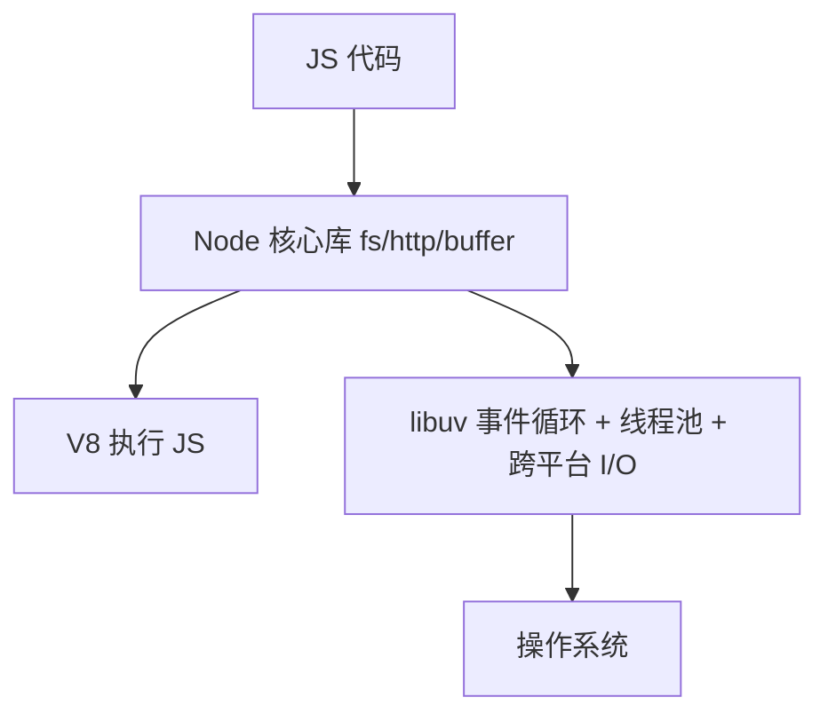

# 9.1 Node 架构与模块系统

## 引言:Node 不是"语言",是"运行时"

Node = **V8 + libuv + 核心模块**,把 JS 带到服务端。深挖要懂 **libuv 的线程池**、**CommonJS 的 module wrapper 与解析算法**、以及 CJS 与 ESM 的差异。

---

## 一、架构分层



- **V8**:执行 JS(JIT/GC,见 [2.6](/卷二-浏览器工作原理/2.6-V8引擎与内存))
- **libuv**:跨平台封装**事件循环、线程池、异步 I/O**——异步能力核心
- **核心模块**:`fs`/`http`/`buffer`

---

## 二、两个关键特性

1. **非阻塞 I/O**:发请求/读文件不阻塞主线程,结果回来再回调
2. **事件驱动**:异步回调经事件循环调度

**为什么 Node 适合 I/O 密集、不适合 CPU 密集?**

> I/O 密集大多时间在"等",单线程事件循环能并发管理海量连接;**CPU 密集**(大循环/加解密)会**占满唯一主线程**、阻塞事件循环。前者是"等待型"(可并发),后者是"计算型"(需多线程)——Node 的线程池只处理阻塞 I/O,不处理 JS 计算。

---

## 三、模块系统:CommonJS 与 ESM

Node 有两套模块系统:**CommonJS(CJS,历史默认)** 和 **ECMAScript Module(ESM,现代标准)**。

### 3.1 CommonJS(CJS)

#### module wrapper(为什么模块有那些"局部变量")

Node 加载每个模块时,会把模块代码**包进一个函数**里执行:

```js
(function (exports, require, module, __filename, __dirname) {
  // 你的模块代码就运行在这个函数作用域里
});
```

> 这解释了三个现象:① 模块内直接可用 `exports`/`require`/`module`/`__filename`/`__dirname`;② **模块内的变量默认私有**(是函数作用域,不泄漏到全局);③ 模块顶层 `this` 是 `module.exports`(不是 global)。

#### exports 与 module.exports 的区别(经典坑)

```js
// ✅ 给 exports 加属性:有效
exports.area = (r) => Math.PI * r ** 2;

// ❌ 直接给 exports 赋值:无效!(切断了 exports 与 module.exports 的引用)
exports = { area: (r) => Math.PI * r ** 2 };

// ✅ 要整体导出,必须用 module.exports
module.exports = class Square {
  constructor(w) { this.w = w; }
  area() { return this.w ** 2; }
};
```

> 本质:`exports` 只是 `module.exports` 的**引用别名**。`exports.xxx = ...` 是往同一对象上加属性;而 `exports = {...}` 是让 `exports` 变量指向新对象,`module.exports` 没变。所以**整体导出用 `module.exports`,逐项导出用 `exports.xxx`**。

#### require 的解析算法

`require(X)` 的查找顺序(从当前模块出发):

1. X 是**核心模块**(如 `fs`、`http`)→ 直接返回
2. X 以 `/` 或 `./` 或 `../` 开头 → 按**文件/目录**解析(文件 → 目录的 `package.json` `main` → `index.js`)
3. X 是**包名**(裸名)→ 沿 `node_modules` 目录**逐级向上**查找(`./node_modules` → `../node_modules` → ...)

```bash
# 目录结构解析示例
project/node_modules/lodash/          # 从 project 里的文件 require('lodash')
  └── package.json { "main": "index.js" }
```

#### 模块缓存与循环依赖

CJS 的 `require` 有**模块缓存**:第一次加载后缓存 `module.exports`,之后再 require 直接返回缓存,不重新执行:

```js
const a1 = require("./a");
const a2 = require("./a");
console.log(a1 === a2);   // true —— 单例,只执行一次
```

**循环依赖**:Node 用"**部分完成的对象(partially done)**"处理循环依赖——遇到循环时,返回**尚未填满的 exports**,避免死循环,但可能拿到"还没初始化完的值"。

```js
// a.js
exports.done = false;
const b = require("./b");   // 循环:加载 b
console.log("a 里 b.done =", b.done);   // true(b 已执行完的部分)
exports.done = true;

// b.js
exports.done = false;
const a = require("./a");   // 循环:拿到 a 的"部分完成"exports
console.log("b 里 a.done =", a.done);   // false(a 还没执行到 exports.done = true)
exports.done = true;
```

#### require.main 判断是否直接运行

```js
if (require.main === module) {
  console.log("直接运行 node a.js");
} else {
  console.log("被 require 引入");
}
```

---

### 3.2 ESM(ECMAScript Module)

```js
// 具名导出
export const name = "square";
export function draw() {}

// 默认导出(每个模块一个)
export default function () {}

// 导入
import { name, draw } from "./square.js";       // 具名导入(带扩展名)
import draw from "./square.js";                  // 默认导入(无大括号)
import * as Square from "./square.js";           // 命名空间导入
import { name as squareName } from "./square.js"; // 重命名导入
```

| 形式 | 语法 | 用途 |
|------|------|------|
| 具名导出 | `export const x` | 导出多个 |
| 默认导出 | `export default x` | 导出主功能(每个模块一个) |
| 重命名 | `export { a as b }` / `import { a as b }` | 避免命名冲突 |
| 命名空间 | `import * as M` | 整体导入成对象 |
| 聚合 | `export * from "./x.js"` | 转发合并多个子模块 |
| 动态导入 | `import("./x.js")` | 按需加载,返回 Promise |

**动态 import()(按需加载):**

```js
import("./mymodule.js").then((module) => {
  module.draw();
});
// 等价 async/await
const module = await import("./mymodule.js");
```

**import.meta(模块元信息):**

```js
console.log(import.meta.url);   // 当前模块的 file:// URL

// ESM 下没有 __dirname,需自己算:
import { fileURLToPath } from "node:url";
import { dirname } from "node:path";
const __dirname = dirname(fileURLToPath(import.meta.url));
```

**ESM 的两个固有特性:**

1. **自动严格模式**(`"use strict"` 隐式开启)
2. **导入值是只读的实时绑定(live binding)**:导入方不能重新赋值,但能读到导出方的最新值

```js
// counter.js
export let count = 0;
export function increment() { count++; }

// main.js
import { count, increment } from "./counter.js";
increment();
console.log(count);   // 1 —— 实时绑定,读到最新值
// count = 5;         // ❌ TypeError:导入绑定只读
```

---

### 3.3 CJS vs ESM 对比

| | CommonJS | ESM |
|---|----------|-----|
| 语法 | `require` / `module.exports` | `import` / `export` |
| 加载时机 | **运行时**同步加载 | **编译时**静态解析(可 tree-shaking) |
| 导出 | 值的**拷贝**(对象引用) | **实时绑定** |
| 作用域 | 函数作用域(module wrapper) | 模块作用域 |
| 严格模式 | 默认非严格 | **自动严格** |
| 顶层 this | `module.exports` | `undefined` |
| 动态加载 | 本身同步 | `import()` 动态 |
| 循环依赖 | 部分完成对象 | 实时绑定(更稳) |

---

### 3.4 模块系统判定规则

Node 如何判定一个 `.js` 文件是 CJS 还是 ESM:

| 文件 | 判定 |
|------|------|
| `.cjs` | 强制 CJS |
| `.mjs` | 强制 ESM |
| `.js` | 看最近的 `package.json` 的 `"type"`:`"module"` → ESM;`"commonjs"` 或无 → CJS |

```json
{ "type": "module" }   // 该目录下 .js 都按 ESM 解析
```

**互操作:**

- ESM `import` CJS:整个 `module.exports` 变成**默认导出**
- CJS `require` ESM:新版 Node(≥22)支持 `require(esm)`,但**顶层 await 的 ESM 不能被 require**(需用动态 `import()`)
- 新项目建议统一 ESM

---

## 四、常用全局对象

```js
process.cwd(); __dirname; __filename; process.env; process.argv;
// ESM 下 __dirname/__filename 需用 import.meta.url 换算(见 3.2)
```

---

## 五、小结

```
Node = V8(执行)+ libuv(事件循环/线程池/异步 I/O)+ 核心模块
非阻塞 I/O + 事件驱动 → 单线程高并发,适合 I/O 密集
CJS:module wrapper(变量私有)、exports 是 module.exports 别名、require 缓存+循环"部分完成"
ESM:静态解析(可摇树)、实时绑定、默认/具名/命名空间/聚合/动态 import、自动严格模式
判定:.cjs/.mjs/"type";互操作注意默认导出与 require(esm) 限制
```

---

## 六、面试题

**Q1:Node 为什么能"单线程"扛高并发?**

**非阻塞 I/O + 事件循环**:网络/文件 I/O 交 libuv 线程池/OS,不占主线程,主线程只调度回调,一线程管海量连接。但要澄清:这是"**主线程单线程**",底层 libuv 有线程池。

**Q2:`exports` 和 `module.exports` 有什么区别?**

`exports` 是 `module.exports` 的**引用别名**。`exports.xxx = ...` 是往同一对象加属性(有效);`exports = {...}` 只是让 `exports` 指向新对象,`module.exports` 没变(无效)。**整体导出用 `module.exports`,逐项导出用 `exports.xxx`**。

**Q3:为什么 Node 不适合 CPU 密集任务?**

CPU 密集会**占满唯一主线程**,阻塞事件循环,其他请求全卡。解法:`worker_threads`/子进程,或换语言;I/O 密集才是 Node 主场。

**Q4:CJS 的 `require` 和 ESM 的 `import` 有何本质区别?**

① 时机:`require` 运行时同步加载,`import` 编译时静态解析(可 tree-shaking);② 导出:`require` 拿值的拷贝(对象引用),`import` 是**实时绑定**;③ 严格模式:ESM 自动严格;④ 循环依赖:CJS 返回"部分完成"对象,ESM 实时绑定更稳。

**Q5:Node 如何处理循环依赖?**

CJS:返回**部分完成的对象**——遇到循环时,拿到尚未执行完的 `exports`,避免死循环(但可能拿到未初始化的值);ESM:靠实时绑定,循环时能拿到最终值,行为更可预测。

**Q6:module wrapper 是什么?它带来什么?**

Node 把每个模块包在 `(function(exports, require, module, __filename, __dirname){...})` 里执行。它让模块内变量**默认私有**、提供了这些"局部变量"、并决定模块顶层 `this` 是 `module.exports`。

**Q7:ESM 里为什么 import 要带扩展名,而 CJS 的 require 不用?**

这是 ESM 规范的设计:**显式文件路径**(带 `.js`),便于静态解析、与浏览器一致;而 CJS 的 require 有 Node 私有的"自动补全 .js/.json/.node"解析逻辑。

**Q8:`.cjs`、`.mjs`、`"type": "module"` 分别决定什么?**

`.cjs` 强制按 CJS、`.mjs` 强制按 ESM;`.js` 看最近 `package.json` 的 `"type"` 字段(`"module"` → ESM,否则 CJS)。这是 Node 判定模块系统的规则。

**Q9:`require` 查找模块的算法是怎样的?**

从当前模块出发:① 核心模块直接返回;② 以 `/`/`./`/`../` 开头 → 按文件/目录解析(目录看 `package.json` 的 `main` → `index.js`);③ 裸名(包名)→ 沿 `node_modules` 逐级向上查找。

**Q10:ESM 里导入的值是只读的吗?如何"改"它?**

导入绑定是**只读**的(`import { x }` 后不能 `x = ...`)。但若是对象,能改其属性;要改导出值本身,只能由**导出方**提供修改函数(如 `increment()`)来改,导入方通过调用它间接改变。

---

📎 参考:[Node.js《CommonJS modules》](https://nodejs.org/docs/latest/api/modules.html)、[Node.js《ECMAScript modules》](https://nodejs.org/docs/latest/api/esm.html)、[MDN《JavaScript 模块》](https://developer.mozilla.org/zh-CN/docs/Web/JavaScript/Guide/Modules)
