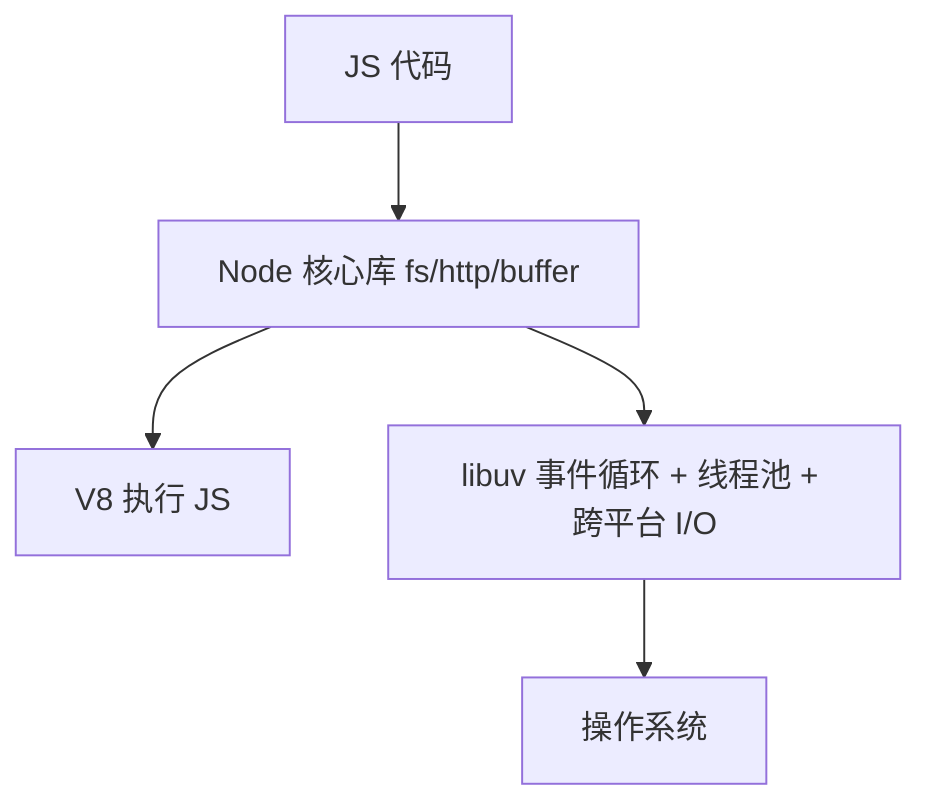

# 9.1 Node 架构与模块系统

> 卷:卷九 · Node.js 与运行时
> 阅读时间:20min

---

## 引言:Node 不是"语言",是"运行时"

Node = **V8 + libuv + 核心模块**,把 JS 带到服务端。深挖要懂 **libuv 的线程池** 与"为什么 I/O 密集是 Node 主场"。

---

## 一、架构分层



- **V8**:执行 JS(JIT/GC,见 [2.6](/卷二-浏览器工作原理/2.6-V8引擎与内存))
- **libuv**:跨平台封装**事件循环、线程池、异步 I/O**——异步能力核心
- **核心模块**:`fs`/`http`/`buffer`

---

## 二、两个关键特性

1. **非阻塞 I/O**:发请求/读文件不阻塞主线程,结果回来再回调
2. **事件驱动**:异步回调经事件循环调度

**为什么 Node 适合 I/O 密集、不适合 CPU 密集(底层)?**

> I/O 密集大多时间在"等",单线程事件循环能并发管理海量连接;**CPU 密集**(大循环/加解密)会**占满唯一主线程**、阻塞事件循环。前者是"等待型"(可并发),后者是"计算型"(需多线程)——Node 的线程池只处理阻塞 I/O,不处理 JS 计算。

---

## 三、模块系统:CJS vs ESM

```js
// CJS(历史默认)
module.exports = { x: 1 };
const a = require("./a");

// ESM(现代,"type":"module")
export const x = 1;
import { x } from "./a.js";   // ESM 要带扩展名
```

**互操作(需注意):** ESM `import` CJS 时 `module.exports` 变 `default`;CJS 只能异步 `import()` 加载 ESM。新项目统一 ESM。

**`require` 的模块缓存(底层):**

CJS 的 `require` 有**模块缓存**:第一次 `require("./a")` 会执行 `a.js` 并把 `module.exports` 缓存到 `require.cache`;之后再 `require` 同一个路径,直接**返回缓存的 exports**,不再重新执行。

```js
const a1 = require("./a");
const a2 = require("./a");
console.log(a1 === a2);   // true —— 同一个导出对象,只执行一次
```

> 影响:① 模块是**单例**(全局共享同一份状态);② 删 `require.cache[key]` 可强制重载;③ ESM 无此缓存语义(但按 URL 缓存模块实例)。

---

## 四、常用全局对象

```js
process.cwd(); __dirname; __filename; process.env; process.argv;
// ESM 下 __dirname 需 fileURLToPath(import.meta.url)
```

---

## 五、小结

```
Node = V8(执行)+ libuv(事件循环/线程池/异步 I/O)+ 核心模块
非阻塞 I/O + 事件驱动 → 单线程高并发,适合 I/O 密集
CJS(require/拷贝)vs ESM(import/静态);互操作需注意
```

---

## 六、面试题

**Q1:Node 为什么能"单线程"扛高并发?**

**非阻塞 I/O + 事件循环**:网络/文件 I/O 交 libuv 线程池/OS,不占主线程,主线程只调度回调,一线程管海量连接。但要澄清:这是"**主线程单线程**",底层 libuv 有线程池。

**Q2:require 和 import 能混用吗?**

能但有限制:ESM 可 import CJS(`module.exports` 变 default);CJS 只能动态 `import()` 加载 ESM,不能同步 require。混用需注意,建议统一。

**Q3:为什么 Node 不适合 CPU 密集任务?**

CPU 密集会**占满唯一主线程**,阻塞事件循环,其他请求全卡。解法:`worker_threads`/子进程,或换语言;I/O 密集才是 Node 主场。

**Q4:libuv 在 Node 里负责什么?**

跨平台封装**事件循环、线程池、异步 I/O**(文件/网络/DNS 等),是 Node 异步能力与跨平台兼容的核心底层。

**Q5:ESM 里为什么 import 要带扩展名,而 CJS 的 require 不用?**

这是 ESM 规范的设计:**显式文件路径**(带 `.js`),便于静态解析与浏览器一致;而 CJS 的 require 有"自动补全 .js/.json/.node"的 Node 私有解析逻辑。

**Q6:Node 的"线程池"默认多大?处理什么?**

默认 **4** 个线程(`UV_THREADPOOL_SIZE` 可调),处理**阻塞/昂贵操作**(文件 I/O、DNS、加解密),避免阻塞主线程。

---

📎 参考:Node.js 官方文档《About Node.js》《Modules》、libuv