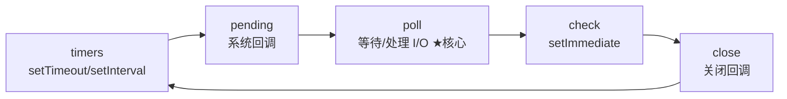
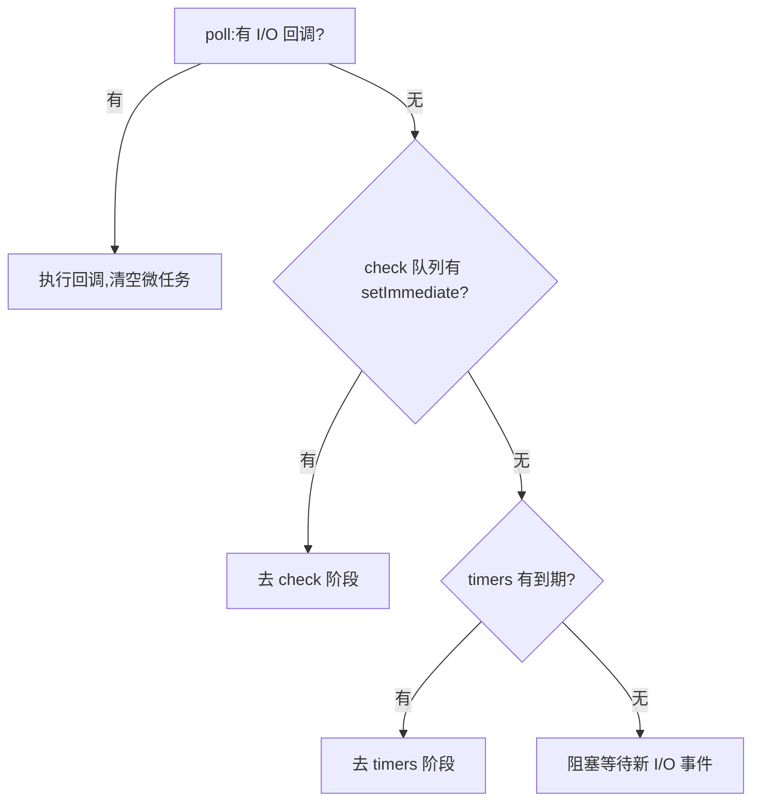

# 9.2 Node 事件循环与异步 I/O

## 引言:Node 事件循环 ≠ 浏览器事件循环

都叫"事件循环",但 Node 基于 **libuv**,是**六阶段轮询 + `process.nextTick` 微任务**。深挖要懂 **poll 阶段的核心地位**、`nextTick` 的"阶段间插队",以及**线程池**如何补单线程的短板。

---

## 一、六个阶段(libuv)



| 阶段 | 处理 |
|------|------|
| timers | 到期的 setTimeout/setInterval |
| pending | 上轮遗留的系统级回调(TCP 错误等) |
| **poll** | **核心:执行 I/O 回调,无 I/O 则阻塞等待** |
| check | setImmediate |
| close | 关闭类回调(`socket.on('close')`) |

**完整执行规则:**

```
进入事件循环 → 每经过一个阶段 → 清空 nextTick + Promise 微任务
→ 执行当前阶段回调 → 再清空微任务 → 进入下一阶段 → ...
```

> 关键:微任务在**每个阶段之间、每个回调之后**都会清空,而不是"六个阶段跑完后统一清空"。

---

## 二、微任务两级优先级

```
process.nextTick  >  Promise.then  >  各阶段宏任务
```

**为什么 nextTick 优先级最高?** 它在每个阶段之间、每个回调之后**插队**执行(不属任何阶段),保证"这些工作总是本次操作后立即继续"。但**滥用 nextTick 会饿死事件循环**(一直处理 nextTick 不进 I/O),官方建议少用。

```js
setTimeout(() => console.log("timeout"), 0);   // timers
setImmediate(() => console.log("immediate"));  // check
process.nextTick(() => console.log("nextTick"));
Promise.resolve().then(() => console.log("promise"));
// 输出:nextTick → promise → timeout → immediate
```

---

## 三、setTimeout vs setImmediate(经典)

```js
setTimeout(() => {}, 0);
setImmediate(() => {});
```

- **在 I/O 回调里**:`setImmediate` **先**(check 紧跟 poll 后)
- **在主模块顶层**:顺序**不确定**(取决于启动时是否已进入 poll)

**综合执行顺序题:**

```js
const fs = require("fs");
fs.readFile(__filename, () => {
  setTimeout(() => console.log("timeout"), 0);
  setImmediate(() => console.log("immediate"));
  process.nextTick(() => console.log("nextTick"));
});
console.log("start");
// 输出:start → nextTick → immediate → timeout
// 解释:I/O 回调在 poll 阶段执行;
//   nextTick 在回调后立即清空;
//   然后进入 check 阶段 → setImmediate;
//   再回到下一轮 timers → setTimeout。
```

---

## 四、poll 阶段(心脏)

poll 阶段做两件事:**执行到期的 I/O 回调**,若无 I/O 事件则**阻塞等待**。它是事件循环的"心脏",timers/check 都围绕它调度。



---

## 五、线程池(libuv threadpool)

Node 主线程是单线程,但**阻塞/昂贵操作**不在主线程做,交给**线程池**:

| 操作 | 走线程池? |
|------|----------|
| `fs` 文件读写 | ✅ |
| `crypto` 加密 | ✅ |
| `dns.lookup` | ✅ |
| `dns.resolve`(纯 DNS) | ❌(走 libuv 内部) |
| 网络 socket | ❌(非阻塞,事件驱动) |

```js
process.env.UV_THREADPOOL_SIZE = 8;   // 默认 4,可调大
```

> 这解释了"Node 单线程高并发"的准确含义:**主线程(事件循环)单线程调度,但阻塞 I/O 由线程池 + 操作系统异步完成**。CPU 密集计算(大循环)才会真正卡主线程,需 worker_threads。

---

## 六、小结

```
六阶段:timers→pending→poll(核心)→check(setImmediate)→close
微任务:nextTick(阶段间插队,最高)> Promise.then > 宏任务;每阶段之间都清空
setTimeout vs setImmediate:I/O 回调里 setImmediate 先;主模块顺序不定
线程池:fs/crypto/dns.lookup 走默认 4 线程;CPU 密集需 worker_threads
```

---

## 七、面试题

**Q1:Node 和浏览器的事件循环主要区别?**

① Node 基于 libuv,**六阶段** + `process.nextTick` 微任务;② 微任务**两级**(nextTick > Promise);③ Node 有**线程池**处理阻塞 I/O。

**Q2:process.nextTick 和 setImmediate 的区别?**

`nextTick` 是**微任务**,优先级最高,当前操作结束、进入下阶段前**立即清空**;`setImmediate` 是**宏任务**,在 **check 阶段**执行。

**Q3:为什么说 Node 高并发来自事件循环,而非多线程?**

事件循环用单线程并发调度**非阻塞 I/O**,每连接只是"注册回调",阻塞操作丢线程池/OS。相比"一线程一连接",省大量上下文切换与内存。

**Q4:为什么 `process.nextTick` 不建议滥用?**

它在**每个回调后都插队**,若 nextTick 里又嵌套 nextTick,会**一直处理 nextTick 队列**,饿死事件循环、I/O 永远不被处理。

**Q5:同一脚本里 setTimeout(fn,0) 和 setImmediate 谁先?为什么不确定?**

主模块顶层执行时,进程可能**尚未进入 poll 阶段**,相对先后取决于启动时序;而 **I/O 回调里** check 紧跟 poll 后,setImmediate 稳定先执行。

**Q6:libuv 的线程池和事件循环是什么关系?**

事件循环在**主线程**跑,处理非阻塞的任务调度;线程池(默认 4 线程)在**后台**处理阻塞/昂贵操作(文件 I/O、加密),完成后把回调交回事件循环。二者协作实现"单主线程 + 异步"。

**Q7:哪些操作会走线程池?哪些不会?**

走线程池:**fs 文件读写、crypto 加密、dns.lookup**(阻塞/昂贵);不走:**网络 socket、dns.resolve**(本身异步/事件驱动)。用 `UV_THREADPOOL_SIZE` 可调线程池大小。

**Q8:Node 的 CPU 密集计算会卡主线程吗?怎么解决?**

会。大循环/复杂计算**占满唯一主线程**,阻塞事件循环,所有 I/O 回调都排队。解法:① `worker_threads` 开工作线程;② `child_process` 子进程;③ 换语言/服务化。I/O 密集才是 Node 主场。

---

📎 参考:[Node.js《The Node.js Event Loop》](https://nodejs.org/en/learn/asynchronous-work/event-loop-timers-and-nexttick)、[libuv design overview](https://docs.libuv.org/en/v1.x/design.html)