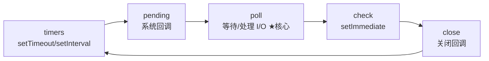

# 9.2 Node 事件循环与异步 I/O

## 引言:Node 事件循环 ≠ 浏览器事件循环

都叫"事件循环",但 Node 基于 **libuv**,是**六阶段轮询 + `process.nextTick` 微任务**。深挖要懂 **poll 阶段的核心地位** 与 `nextTick` 的"阶段之间插队"。

---

## 一、六个阶段(libuv)



| 阶段 | 处理 |
|------|------|
| timers | 到期的 setTimeout/setInterval |
| pending | 上轮遗留系统回调 |
| **poll** | **核心:等并处理 I/O 事件** |
| check | setImmediate |
| close | 关闭类回调 |

---

## 二、微任务两级优先级

```
process.nextTick  >  Promise.then  >  各阶段宏任务
```

**为什么 nextTick 优先级最高?** 它在**每个阶段之间、以及每个回调之后**插队执行(不属任何阶段),保证"这些工作总是在本次操作后再继续"。但**滥用 nextTick 会饿死事件循环**(一直处理 nextTick 不进入 I/O),所以官方建议少用。

```js
setTimeout(() => console.log("timeout"), 0);   // timers
setImmediate(() => console.log("immediate"));  // check
process.nextTick(() => console.log("nextTick"));
Promise.resolve().then(() => console.log("promise"));
// 输出:nextTick → promise → timeout → immediate
```

---

## 三、setTimeout vs setImmediate(经典)

```js
setTimeout(() => {}, 0);
setImmediate(() => {});
```

- **在 I/O 回调里**:`setImmediate` **先**(check 紧跟 poll 后)
- **在主模块顶层**:顺序**不确定**(取决于启动时是否已进入 poll)

> 标准答法:"I/O 回调中 setImmediate 先于 setTimeout;主模块中顺序不保证"。

---

## 四、poll 阶段

poll 阶段做两件事:**执行到期的 I/O 回调**,若无 I/O 事件则**阻塞等待**。它是事件循环的"心脏",timers/check 都是围绕它调度。

---

## 五、小结

```
六阶段:timers→pending→poll(核心)→check(setImmediate)→close
微任务:nextTick(阶段间插队,最高)> Promise.then > 宏任务
setTimeout vs setImmediate:I/O 回调里 setImmediate 先;主模块顺序不定
线程池:阻塞操作交默认 4 线程
```

---

## 六、面试题

**Q1:Node 和浏览器的事件循环主要区别?**

① Node 基于 libuv,**六阶段** + `process.nextTick` 微任务;② 微任务**两级**(nextTick > Promise);③ Node 有**线程池**处理阻塞 I/O。

**Q2:process.nextTick 和 setImmediate 的区别?**

`nextTick` 是**微任务**,优先级最高,当前操作结束、进入下阶段前**立即清空**;`setImmediate` 是**宏任务**,在 **check 阶段**执行。nextTick="尽快",setImmediate="下轮事件循环"。

**Q3:为什么说 Node 高并发来自事件循环,而非多线程?**

事件循环用单线程并发调度**非阻塞 I/O**,每连接只是"注册回调",阻塞操作丢线程池/OS。相比"一线程一连接",省大量上下文切换与内存。

**Q4:为什么 `process.nextTick` 不建议滥用?**

它在**每个回调后都插队**,若 nextTick 里又嵌套 nextTick,会**一直处理 nextTick 队列**,饿死事件循环、I/O 永远不被处理。所以官方建议"能用微任务/其他就别用 nextTick"。

**Q5:同一脚本里 setTimeout(fn,0) 和 setImmediate 谁先?为什么不确定?**

主模块顶层执行时,进程可能**尚未进入 poll 阶段**,timers 与 check 的相对先后取决于启动时序(是否已注册 timer/是否要等 I/O),所以顺序不保证;而在 I/O 回调里,check 紧跟在 poll 后,setImmediate 稳定先执行。

**Q6:libuv 的线程池和事件循环是什么关系?**

事件循环在**主线程**跑,处理"非阻塞"的任务调度;线程池(默认 4 线程)在**后台**处理阻塞/昂贵操作(文件 I/O、加密),完成后把回调交回事件循环。二者协作,共同实现"单主线程 + 异步"。

---

📎 参考:Node.js《The Node.js Event Loop》、libuv design overview