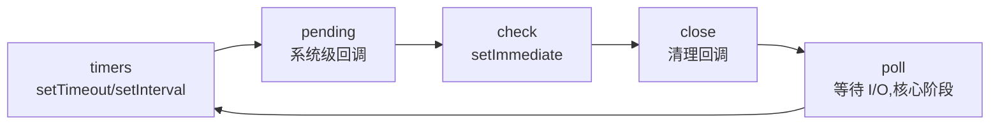

# 9.2 Node 事件循环与异步 I/O

> 卷:卷九 · Node.js 与运行时
> 难度:⭐⭐⭐ 专家 | 阅读时间:30min

---

## 引言:Node 的事件循环 ≠ 浏览器的事件循环

都叫"事件循环",但 Node 基于 **libuv**,比浏览器的"宏任务/微任务"更复杂:**六个阶段轮询 + `process.nextTick` 微任务插队**。搞懂它,才能答好 `setImmediate` vs `setTimeout` 这类经典题。

---

## 一、六个阶段(libuv)



| 阶段 | 处理什么 |
|------|---------|
| **timers** | 到期的 `setTimeout`/`setInterval` |
| **pending** | 上一轮遗留的系统回调(如 TCP 错误) |
| **poll** | **核心**:等待并处理 I/O 事件 |
| **check** | `setImmediate` 回调 |
| **close** | 关闭类回调(`socket.on('close')`) |

> 记忆:timers → poll(等 I/O)→ check(setImmediate)→ close → 循环。

---

## 二、微任务的两级优先级(key!)

```
每个阶段之间,会先清空「process.nextTick 队列」,再清空「Promise 微任务队列」
```

**优先级顺序(从高到低):**

```
process.nextTick  >  Promise.then  >  各阶段宏任务
```

```js
console.log("1");
setTimeout(() => console.log("timeout"), 0);   // timers 阶段
setImmediate(() => console.log("immediate"));  // check 阶段
process.nextTick(() => console.log("nextTick"));
Promise.resolve().then(() => console.log("promise"));
console.log("2");
// 1 2 nextTick promise timeout immediate
```

> 关键:`nextTick` 优先于 `Promise`;`setImmediate` 在 check 阶段、`setTimeout` 在 timers 阶段。

---

## 三、setTimeout vs setImmediate(经典面试)

```js
setTimeout(() => console.log("timeout"), 0);
setImmediate(() => console.log("immediate"));
```

**结果依"调用位置"而变:**

- **在 I/O 回调里**:`setImmediate` **先**执行(check 阶段紧跟 poll 后)
- **在主模块顶层**:顺序**不确定**(取决于进程启动时是否已进入 poll 阶段)

> 所以标准答法:**"在 I/O 回调中,setImmediate 先于 setTimeout;在主模块中顺序不保证。"**

---

## 四、线程池(libuv threadpool)

文件 I/O、DNS、加解密等**阻塞/昂贵**操作不在主线程做,交给**线程池**(默认 4 线程)处理:

```js
process.env.UV_THREADPOOL_SIZE = 8;   // 可调线程池大小
```

> 这也是"Node 单线程"的更准确表述:**主线程(事件循环)单线程,但底层有线程池处理阻塞操作。**

---

## 小结

```
Node 事件循环(libuv)六阶段:timers → pending → poll(核心)→ check(setImmediate)→ close
微任务两级:process.nextTick ＞ Promise.then ＞ 各阶段宏任务
setTimeout vs setImmediate:I/O 回调里 setImmediate 先;主模块顺序不保证
线程池:文件/加密等阻塞操作交给默认 4 线程
```

## 面试题

**Q1:Node 和浏览器的事件循环主要区别?**

① Node 基于 **libuv**,是**六阶段**轮询加 `process.nextTick` 微任务,比浏览器的"宏/微任务"更细;② Node 微任务有**两级**优先级(`nextTick` > `Promise`),浏览器没有 `nextTick`;③ Node 有**线程池**处理阻塞 I/O,浏览器靠 Web Worker 等。

**Q2:`process.nextTick` 和 `setImmediate` 的区别?**

`nextTick` 是**微任务**,优先级**最高**,在当前操作结束后、进入下一阶段前**立即清空**;`setImmediate` 是**宏任务**,在 **check 阶段**执行。两者语义完全不同:`nextTick` 是"尽快",`setImmediate` 是"下轮事件循环"。

**Q3:为什么说 Node 的"高并发"来自事件循环,而不是多线程?**

事件循环用**单线程**即可并发调度成千上万个**非阻塞 I/O**——每个连接只是"注册一个回调",真正阻塞的操作丢给线程池/操作系统,主线程永不阻塞等待。相比"一线程一连接"的多线程模型,它省去大量上下文切换与内存开销。

---

📎 参考:Node.js 官方文档《The Node.js Event Loop》、libuv design overview