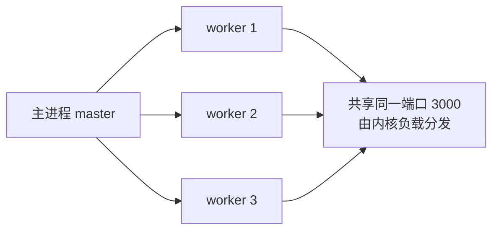

# 9.5 部署与运维(pm2 / Docker / 负载均衡)

> 卷:卷九 · Node.js 与运行时
> 难度:⭐⭐ 进阶 | 阅读时间:20min

---

## 引言:代码跑起来,只是第一步

上线后要解决:**进程崩了谁拉起?多核怎么用?流量大了怎么扛?怎么回滚?** 这一章讲 Node 服务部署运维的关键件。

---

## 一、进程管理(pm2)

Node 服务进程一旦**未捕获异常就退出**,需要守护进程自动拉起:

```bash
pm2 start app.js -i max     # -i max:按 CPU 核数开多实例(集群)
pm2 list                    # 查看
pm2 logs                    # 日志
pm2 restart app
pm2 save                    # 保存进程列表,开机自启
```

- **自动重启**:进程崩溃自动拉起
- **集群模式(cluster)**:多进程共享端口,利用多核(补 Node 单线程短板)
- **日志聚合、负载均衡**内置

---

## 二、多进程与 cluster

Node 单线程只能吃满一个核;`cluster` 模块让**主进程 fork 多个工作进程**,共享一个端口:



```js
import cluster from "cluster";
import http from "http";
import { cpus } from "os";

if (cluster.isPrimary) {
  cpus().forEach(() => cluster.fork());   // 开 N 个 worker
} else {
  http.createServer((req, res) => res.end("ok")).listen(3000);
}
```

---

## 三、Docker 部署

```dockerfile
FROM node:20-alpine
WORKDIR /app
COPY package*.json ./
RUN npm ci --omit=dev
COPY . .
CMD ["node", "dist/index.js"]
```

- **`.dockerignore`** 排除 `node_modules`(让 `npm ci` 在容器内干净安装)
- **多阶段构建**:build 阶段产 dist,运行阶段只放产物,镜像更小
- 环境变量走 `-e`/环境注入,不硬编码

---

## 四、负载均衡与反向代理(Nginx)

单实例扛不住时,前面加 **Nginx 反向代理**分发流量:

```nginx
upstream app {
    server 127.0.0.1:3001;
    server 127.0.0.1:3002;
    server 127.0.0.1:3003;
}
server {
    listen 80;
    location / {
        proxy_pass http://app;   # 轮询分发到多个 Node 实例
    }
}
```

> 架构组合:多台机器 × 每台 pm2 集群 × Nginx 负载均衡,水平扩展。

---

## 五、健壮性三板斧

1. **未捕获异常兜底**:`process.on('uncaughtException')` 记日志 + 优雅退出(别硬扛)
2. **优雅退出**:收到 SIGTERM → 停止接收新请求 → 处理完存量 → 退出(配合 k8s/pm2)
3. **日志与监控**:结构化日志 + `prom-client`(Prometheus 指标)+ 错误上报

---

## 小结

```
pm2:守护 + 集群(-i max)+ 日志,利用多核
cluster:主进程 fork worker 共享端口
Docker:多阶段构建 + .dockerignore;Nginx:反向代理负载均衡
健壮性:uncaughtException 兜底 + 优雅退出 + 日志监控
```

## 面试题

**Q1:pm2 的 cluster 模式解决了什么问题?**

解决 Node **单线程只能用一个核**的问题:cluster 让主进程 fork 多个 worker,共享同一端口,由内核分发请求,从而**吃满多核 CPU**、提升吞吐;同时提供崩溃自动重启与负载均衡。

**Q2:为什么容器里推荐 `npm ci` 而不是 `npm install`?**

`npm ci` **严格按 lockfile 安装**,删除旧 `node_modules` 后全新安装,结果**可复现一致**;`npm install` 可能顺手改 lockfile。CI/容器里要确定性,所以用 `npm ci --omit=dev`。

**Q3:如何做 Node 服务的"优雅退出"?**

监听 `SIGTERM`/`SIGINT` → 停止接受新请求(`server.close()`)→ 等待存量请求处理完/超时 → 释放连接与资源 → 退出。目的是**不中断正在处理的请求**,配合容器编排实现平滑发布/滚动更新。

---

📎 参考:pm2 官方文档、Node.js《cluster》《graceful shutdown》、Docker 官方文档