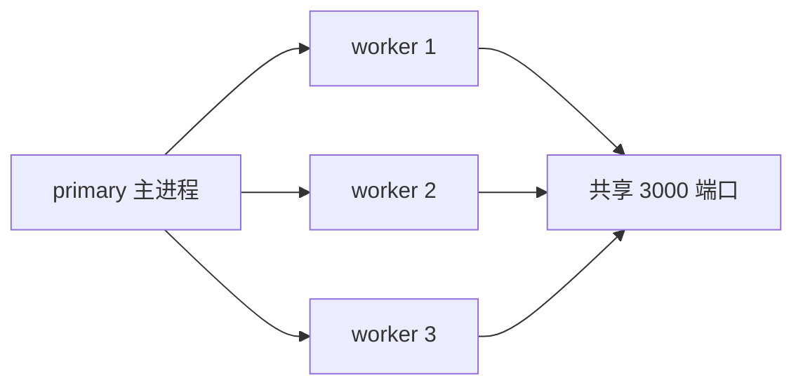

# 9.5 部署与运维(pm2 / Docker / 负载均衡)

## 引言:代码跑起来,只是第一步

上线后要解决:**进程崩了谁拉起?多核怎么用?流量大了怎么扛?** 深挖要懂 **cluster 的两种分发策略与 IPC**、**优雅退出**、以及**健康检查**。

---

## 一、进程管理(pm2)

```bash
pm2 start app.js -i max      # 按 CPU 核数开多实例(集群模式)
pm2 list / logs / restart / monit
pm2 save                     # 保存进程列表,配合 startup 开机自启
```

pm2 核心能力:

| 能力 | 说明 |
|------|------|
| 守护 | 进程崩溃自动拉起 |
| 集群 | `-i max` 吃满多核 + 负载均衡 |
| 日志 | 聚合 stdout/stderr + 时间戳 |
| 重启策略 | 重启间隔 + 最大重启次数防"重启风暴" |

```bash
pm2 start app.js --max-restarts 10 --restart-delay 1000   # 防无限重启
```

---

## 二、多进程与 cluster

### 2.1 基本用法



```js
import cluster from "node:cluster";
import http from "node:http";
import { availableParallelism } from "node:os";

if (cluster.isPrimary) {
  const n = availableParallelism();      // 现代替代 cpus().length
  for (let i = 0; i < n; i++) cluster.fork();

  cluster.on("exit", (worker, code, signal) => {
    console.log(`worker ${worker.process.pid} 挂了,重启...`);
    if (!worker.exitedAfterDisconnect) cluster.fork();   // 意外崩溃才重启
  });
} else {
  http.createServer((req, res) => res.end("hello")).listen(3000);
}
```

### 2.2 两种分发策略(底层)

| 策略 | 机制 | 特点 |
|------|------|------|
| **round-robin**(默认,除 Windows) | primary 监听端口、接受连接,轮询分发给 worker(带内置智能防单点过载) | 负载均衡、稳定 |
| shared socket | primary 创建 socket 发给 worker,worker 直接 accept | 理论更快,但 OS 调度导致**负载严重不均**(曾观测 70% 连接集中在 2 个进程) |

> 所以默认 round-robin 是更务实的选择。worker 进程由 `child_process.fork()` 创建,通过 **IPC** 通信。

### 2.3 IPC 通信(主从传消息)

```js
// primary 统计所有 worker 的请求数
if (cluster.isPrimary) {
  let numReqs = 0;
  for (const id in cluster.workers) {
    cluster.workers[id].on("message", (msg) => {
      if (msg.cmd === "notifyRequest") numReqs++;
    });
  }
} else {
  http.createServer((req, res) => {
    process.send({ cmd: "notifyRequest" });   // worker → primary
    res.end("ok");
  }).listen(3000);
}
```

### 2.4 状态共享的坑(无路由逻辑)

cluster 的 worker 是**独立进程**,内存不共享,且 **Node 不提供路由逻辑**。所以:

- **别把 session/登录态/缓存放进程内存**——请求可能落到不同 worker,状态丢失
- 共享状态必须放**外部存储**:Redis、数据库、消息队列

---

## 三、Docker 部署

### 3.1 基础 Dockerfile

```dockerfile
FROM node:20-alpine
WORKDIR /app
COPY package*.json ./
RUN npm ci --omit=dev          # 严格按 lockfile,只装生产依赖
COPY . .
CMD ["node", "dist/index.js"]
```

- `.dockerignore` 排除 `node_modules`、`.git`、日志
- 环境变量走 `-e` / 编排注入,不硬编码进镜像

### 3.2 多阶段构建(减镜像)

```dockerfile
# 阶段 1:构建
FROM node:20-alpine AS build
WORKDIR /app
COPY package*.json ./
RUN npm ci
COPY . .
RUN npm run build

# 阶段 2:运行(只放产物 + 生产依赖)
FROM node:20-alpine
WORKDIR /app
COPY --from=build /app/dist ./dist
COPY --from=build /app/package*.json ./
RUN npm ci --omit=dev
CMD ["node", "dist/index.js"]
```

> 好处:运行镜像**不含源码、构建工具链**,体积更小、攻击面更小。

---

## 四、负载均衡(Nginx)

### 4.1 反向代理

```nginx
upstream app {
  server 127.0.0.1:3001;
  server 127.0.0.1:3002;
}
server {
  listen 80;
  location / {
    proxy_pass http://app;
    proxy_set_header X-Real-IP $remote_addr;
    proxy_set_header X-Forwarded-For $proxy_add_x_forwarded_for;
  }
}
```

### 4.2 负载均衡策略

| 策略 | 指令 | 适用 |
|------|------|------|
| 轮询(默认) | — | 无状态、性能相近的节点 |
| 加权轮询 | `weight=3` | 节点性能不一 |
| IP 哈希 | `ip_hash` | 需要"同用户固定节点"(粘性) |
| 最少连接 | `least_conn` | 长连接/耗时差异大 |
| 随机 | `random` | 大量无状态请求 |

---

## 五、健壮性三板斧

### 5.1 异常兜底(区分两类)

```js
// 同步异常 / 未捕获的 throw
process.on("uncaughtException", (err) => {
  log.error("uncaughtException", err);
  // 记日志 + 优雅退出(状态可能已损坏,别硬扛)
  process.exit(1);
});

// 未处理的 Promise 拒绝
process.on("unhandledRejection", (reason, promise) => {
  log.error("unhandledRejection", reason);
  // 记日志;是否退出视策略(新版 Node 默认会抛)
});
```

> **最佳实践**:别在 `uncaughtException` 里继续跑(状态可能不一致),记日志后**优雅退出**,交给 pm2/编排重启。

### 5.2 优雅退出(完整流程)

```js
process.on("SIGTERM", () => {
  // 1. 停止接受新请求
  server.close(() => {
    // 2. 存量请求处理完 → 释放资源(DB/连接) → 退出
    db.close().then(() => process.exit(0));
  });
  // 3. 兜底:超时强退(避免长连接卡死)
  setTimeout(() => process.exit(1), 10000).unref();
});
```

> `SIGTERM` 是容器/编排的"请退出"信号(通常有 10~30s 宽限期),应用要在这期间完成优雅收尾。`SIGKILL` 无法捕获,是强制杀。

### 5.3 健康检查(readiness / liveness)

```js
// Kubernetes 两类探针
app.get("/healthz", (req, res) => res.status(200).end("ok"));   // liveness:进程还活着吗
app.get("/readyz", (req, res) => {
  res.status(db.ready ? 200 : 503).end();                       // readiness:能接流量吗
});
```

| 探针 | 问什么 | 失败后果 |
|------|--------|---------|
| liveness | 进程还活着吗 | 重启容器 |
| readiness | 能接流量吗 | 摘除流量(不重启) |

### 5.4 日志与监控

- **结构化日志**(JSON):便于检索、聚合,别打无结构字符串
- **traceId**:一次请求贯穿各服务的链路 ID,方便排查
- **指标**:`prom-client` 暴露 metrics(Prometheus 拉取),监控 QPS/延迟/错误率/内存

---

## 六、小结

```
pm2:守护 + 集群(-i max)+ 日志 + 防重启风暴(max_restarts)
cluster:master fork worker 共享端口;round-robin(默认均衡)vs shared socket(易不均)
IPC:worker.send/process.send;无路由 → session 放外部存储(Redis)
Docker:多阶段构建减镜像;Nginx:反向代理 + 轮询/ip_hash/least_conn
健壮性:uncaughtException 记日志退出 + 优雅退出(SIGTERM→server.close→超时强退)+ 健康检查 + 结构化日志
```

---

## 七、面试题

**Q1:pm2 的 cluster 模式解决了什么问题?**

Node 单线程只能用一个核;cluster 让 master fork 多 worker 共享端口、内核分发,吃满多核、提吞吐,并提供崩溃自动重启与负载均衡。

**Q2:为什么容器里推荐 npm ci 而非 npm install?**

`npm ci` **严格按 lockfile** 安装(删旧 node_modules 全新装),结果可复现一致;`npm install` 可能顺手改 lockfile。CI/容器要确定性。

**Q3:如何做 Node 服务的"优雅退出"?完整流程?**

监听 `SIGTERM`/`SIGINT` → `server.close()` 停止新请求 → 等存量处理完 → 释放 DB/连接 → 退出;加 `setTimeout` 兜底超时强退。不中断正在处理的请求,配合容器编排平滑发布。

**Q4:cluster 有哪两种连接分发策略?各自优劣?**

**round-robin**(默认):primary 接受连接轮询分发,负载均衡稳定;**shared socket**:primary 发 socket 给 worker 直接 accept,理论更快,但 OS 调度导致**负载严重不均**。所以默认用 round-robin。

**Q5:Docker 多阶段构建的好处?**

build 阶段产 dist,运行阶段**只放产物 + 生产依赖**,镜像更小、攻击面更小、不含构建工具链。

**Q6:服务崩溃了 pm2 如何保证"自动拉起"?怎么防"崩了又崩"死循环?**

pm2 监听进程退出事件自动重启;用**重启间隔 + 最大重启次数**(`max_restarts`)防无限重启风暴,超阈值标记错误停止。

**Q7:cluster 模式下为什么不能把 session 存进程内存?**

worker 是**独立进程、内存不共享**,且无路由逻辑,请求可能落到不同 worker → session 丢失。共享状态必须放**外部存储**(Redis/DB)。

**Q8:liveness 和 readiness 探针的区别?**

**liveness** 问"进程还活着吗",失败就**重启容器**;**readiness** 问"能接流量吗",失败就**摘流量**但不重启(如 DB 暂不可用、正在预热)。

**Q9:uncaughtException 里为什么不该"硬扛继续跑"?**

未捕获异常意味着进程状态可能已**不一致/损坏**,继续跑可能产生更坏后果(数据错乱)。正确姿势:记日志 → 优雅退出 → 交给 pm2/编排重启。

**Q10:cluster 主进程如何区分 worker 是"主动退出"还是"意外崩溃"?**

看 `worker.exitedAfterDisconnect`:为 `true` 是主动 `disconnect()` 退出(如优雅关闭),为 `false` 是意外崩溃。据此决定是否 `fork()` 重启。

---

📎 参考:[Node.js《cluster》](https://nodejs.org/docs/latest/api/cluster.html)、[pm2 文档](https://pm2.keymetrics.io/)、[Docker 多阶段构建](https://docs.docker.com/build/building/multi-stage/)、[Nginx 负载均衡](https://nginx.org/en/docs/http/load_balancing.html)
