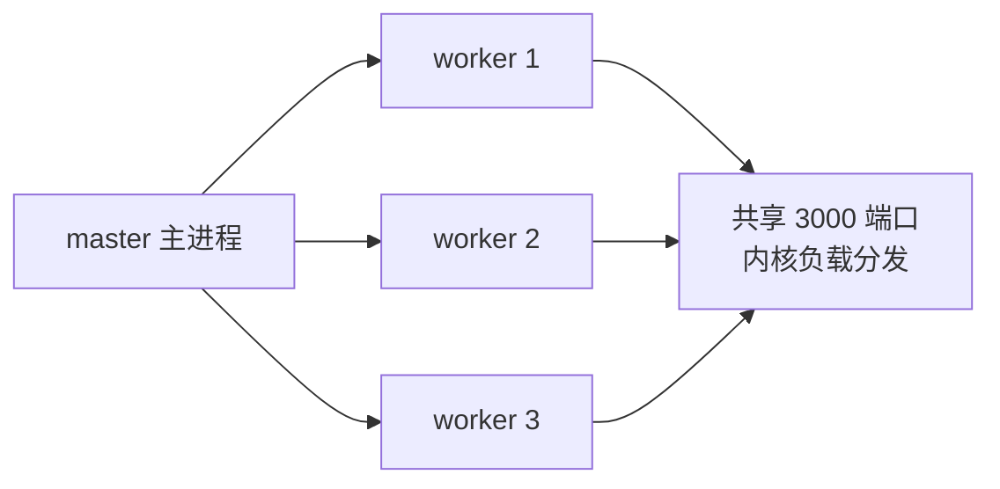

# 9.5 部署与运维(pm2 / Docker / 负载均衡)

## 引言:代码跑起来,只是第一步

上线后要解决:**进程崩了谁拉起?多核怎么用?流量大了怎么扛?** 深挖要懂 **cluster 多进程共享端口** 与 **优雅退出**。

---

## 一、进程管理(pm2)

```bash
pm2 start app.js -i max      # 按 CPU 核数开多实例(集群)
pm2 list / logs / restart
pm2 save                     # 保存,开机自启
```

- **自动重启**(崩溃拉起)、**集群**(多核)、日志聚合、负载均衡

---

## 二、多进程与 cluster



```js
import cluster from "cluster"; import http from "http"; import { cpus } from "os";
if (cluster.isPrimary) cpus().forEach(() => cluster.fork());
else http.createServer((req, res) => res.end("ok")).listen(3000);
```

**为什么能"多进程共享一个端口"?** cluster 的 master 持有端口,把连接**分发给各 worker**(内核/主进程调度),worker 之间不抢端口——这是 Node 用满多核的标准姿势。

---

## 三、Docker 部署

```dockerfile
FROM node:20-alpine
WORKDIR /app
COPY package*.json ./
RUN npm ci --omit=dev
COPY . .
CMD ["node", "dist/index.js"]
```

- `.dockerignore` 排除 node_modules;多阶段构建减镜像
- 环境变量走 `-e`/注入,不硬编码

---

## 四、负载均衡(Nginx)

```nginx
upstream app { server 127.0.0.1:3001; server 127.0.0.1:3002; }
server { location / { proxy_pass http://app; } }
```

---

## 五、健壮性三板斧

1. **未捕获异常兜底**:`uncaughtException` 记日志 + 优雅退出(别硬扛)
2. **优雅退出**:SIGTERM → 停止接新请求 → 处理完存量 → 退出
3. **日志监控**:结构化日志 + [prom-client](https://github.com/siimon/prom-client) + 错误上报

**优雅退出(底层):**

```js
process.on("SIGTERM", () => {
  server.close(() => process.exit(0));  // 停止新请求,处理完存量再退
  setTimeout(() => process.exit(1), 10000).unref();  // 兜底超时强退
});
```

---

## 六、小结

```
pm2:守护 + 集群(-i max)+ 日志
cluster:master fork worker 共享端口(满多核)
Docker:多阶段构建;Nginx:反向代理负载均衡
健壮性:uncaughtException 兜底 + 优雅退出(SIGTERM→server.close)+ 监控
```

---

## 七、面试题

**Q1:pm2 的 cluster 模式解决了什么问题?**

Node 单线程只能用一个核;cluster 让 master fork 多 worker 共享端口、内核分发,吃满多核、提吞吐,并提供崩溃自动重启与负载均衡。

**Q2:为什么容器里推荐 npm ci 而非 npm install?**

`npm ci` **严格按 lockfile** 安装(删旧 node_modules 全新装),结果可复现一致;`npm install` 可能顺手改 lockfile。CI/容器要确定性。

**Q3:如何做 Node 服务的"优雅退出"?**

监听 `SIGTERM`/`SIGINT` → `server.close()` 停止新请求 → 等存量处理完/超时 → 释放资源退出。不中断正在处理的请求,配合容器编排平滑发布。

**Q4:cluster 里"多进程共享一个端口"是怎么做到的?**

master 进程**持有监听端口**,把进来的连接**分发给各 worker**(内核调度),worker 各自处理连接但不重复 listen 同端口。这是 Node 用满多核的标准方式。

**Q5:Docker 多阶段构建的好处?**

build 阶段产 dist,运行阶段**只放产物 + 依赖**,镜像更小、攻击面更小、不含构建工具链。

**Q6:服务崩溃了 pm2 如何保证"自动拉起"?怎么防止"崩了又崩"的死循环?**

pm2 监听进程退出事件自动重启;并用**重启间隔 + 最大重启次数**(如 `max_restarts`)防止无限重启风暴,超过则标记错误。

---

📎 参考:pm2 文档、Node.js《cluster》《graceful shutdown》、Docker 文档