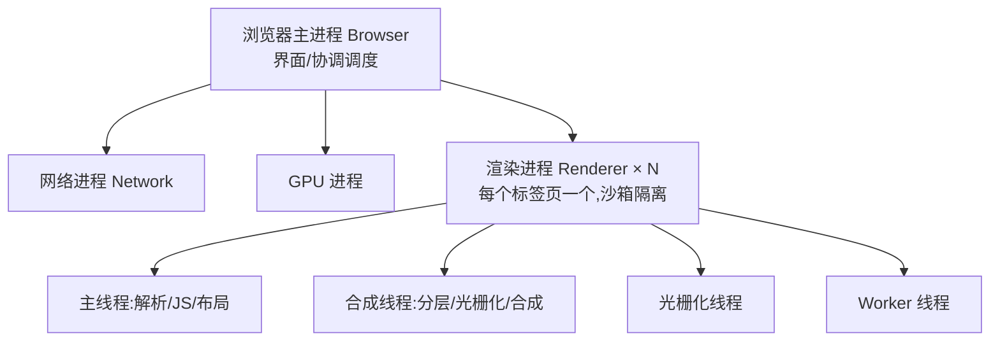

# 2.1 浏览器多进程架构

> 卷:卷二 · 浏览器工作原理
> 难度:⭐⭐ 进阶 | 阅读时间:20min | 状态:已深化

---

## 引言:从"一页卡死全崩"到"多进程隔离"

早期浏览器单进程:一个标签页崩溃整个浏览器全挂。现代 Chrome 改**多进程 + 多线程**,正是为稳定、安全、性能。

---

## 一、进程 vs 线程

| | 进程 | 线程 |
|---|------|------|
| 关系 | 资源分配最小单位 | CPU 调度最小单位 |
| 资源 | 独立内存空间,进程间隔离 | 共享所属进程内存 |
| 隔离 | 一进程崩溃不影响其他 | 一线程崩溃可能拖垮进程 |

> 一句话:进程是"套房",线程是房里一起干活的"人"。

---

## 二、Chrome 多进程模型(一图)



| 进程 | 职责 |
|------|------|
| 浏览器主进程 | 界面、地址栏、协调调度 |
| 渲染进程 | 解析 HTML/CSS/JS、绘制页面(每标签一个,沙箱) |
| GPU 进程 | GPU 合成、光栅化加速 |
| 网络进程 | 统一网络请求 |

**为什么多进程(三个理由):**

1. **稳定**:一个渲染进程崩溃只影响那个标签页(崩溃隔离)
2. **安全**:渲染进程跑在**沙箱**里,即使被攻破也拿不到系统权限
3. **性能**:多核并行,GPU 独立进程加速合成

**代价**:内存占用更高(每进程都有开销)。

---

## 三、渲染进程内部的线程

| 线程 | 职责 |
|------|------|
| 主线程 | 解析 HTML、构建 DOM/CSSOM、执行 JS、布局——事件循环就在这 |
| 合成线程 | 分层、分块、调度光栅化、合成位图(不碰 JS,可并行) |
| 光栅化线程 | 指令转位图像素 |
| Worker 线程 | 跑 Web Worker(2.7) |

> 主线:**主线程管"逻辑和布局",合成线程管"像素合成"**——"为什么 transform 快"正是因为它绕过主线程(2.5)。

---

## 四、站点隔离(Site Isolation)

不同"站点(eTLD+1)"分到不同渲染进程:

- 跨站 iframe 隔离到独立进程,防 **Spectre/Meltdown** 侧信道攻击
- 代价:更多进程 = 更多内存(安全税)

---

## 五、小结

```
浏览器多进程:主进程/网络/GPU/各标签渲染进程(沙箱)
渲染进程多线程:主线程(逻辑布局)+ 合成(像素)+ 光栅化 + Worker
多进程意义:稳定(崩溃隔离)+ 安全(沙箱/站点隔离)+ 性能(并行)
```

---

## 六、面试题

**Q1:为什么浏览器要采用多进程模型?**

三个词:**稳定**(崩溃隔离)、**安全**(渲染进程沙箱化 + 站点隔离防侧信道)、**性能**(多核并行、GPU 独立)。代价是内存开销。

**Q2:一个标签页的 JS 卡死,为什么不会卡死整个浏览器?**

该页 JS 只在自己渲染进程的主线程跑,卡死的是这一个渲染进程;其他标签页各自独立进程照常响应。这是进程隔离的直接体现。

**Q3:渲染进程里为什么还要分"主线程"和"合成线程"?**

主线程管**逻辑重**的(解析/JS/布局),合成线程管**像素重**的(分层/光栅化/合成)。分离后,像素/合成可**并行且不碰 JS**,纯合成属性(transform/opacity)就能完全绕过主线程,实现不掉帧动画。

---

📎 参考:Chrome Developers《Inside look at modern web browser》、MDN《多进程架构》