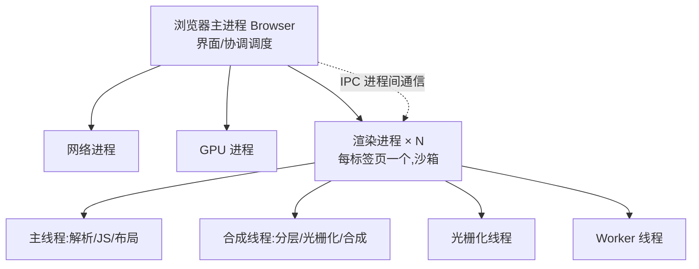

# 2.1 浏览器多进程架构

> 卷:卷二 · 浏览器工作原理
> 阅读时间:20min

---

## 引言:从"一页卡死全崩"到"多进程隔离"

早期浏览器单进程:一个标签页崩溃整个浏览器全挂。现代 Chrome 改**多进程 + 多线程**,为稳定、安全、性能。要深挖,得懂 OS 层面的进程/线程,以及进程间怎么通信。

---

## 一、进程 vs 线程(OS 层面)

| | 进程 | 线程 |
|---|------|------|
| 关系 | 资源分配最小单位 | CPU 调度最小单位 |
| 内存 | 独立地址空间 | 共享所属进程内存 |
| 隔离 | 进程崩溃互不影响 | 线程崩溃可能拖垮进程 |
| 通信 | 需 IPC(进程间通信) | 直接共享内存 |

> 进程是"套房"(隔音),线程是房里一起干活的"人"(共享客厅)。

---

## 二、Chrome 多进程模型



| 进程 | 职责 |
|------|------|
| 浏览器主进程 | 界面、地址栏、协调调度 |
| 渲染进程 | 解析 HTML/CSS/JS、绘制(每标签一个,沙箱) |
| GPU 进程 | GPU 合成、光栅化加速 |
| 网络进程 | 统一网络请求 |

---

## 三、为什么多进程(三个理由 + 代价)

1. **稳定**:一渲染进程崩溃只影响那个标签页(崩溃隔离)
2. **安全**:渲染进程跑在**沙箱**里,即使被攻破也拿不到系统权限、读不了别的进程内存
3. **性能**:多核并行,GPU 独立进程加速合成

**代价**:内存占用更高(每个进程都有独立开销)。

**底层:进程间通信(IPC)** 用 **Mojo**(Chrome 的 IPC 框架)在进程间传消息——渲染进程要发网络请求,是通过 IPC 转给网络进程,而非自己直接碰网络栈。这既是架构分层,也是安全边界。

---

## 四、渲染进程内部线程(为何主/合成分离)

| 线程 | 职责 |
|------|------|
| 主线程 | 解析、构建 DOM/CSSOM、执行 JS、布局——事件循环在此 |
| 合成线程 | 分层、分块、调度光栅化、合成位图(不碰 JS) |
| 光栅化线程 | 指令转位图像素 |
| Worker 线程 | 跑 Web Worker |

> **为什么主/合成要分线程?** 主线程管"逻辑重"(解析/JS/布局),合成线程管"像素重"(光栅化/合成)。分离后合成可**并行且不碰 JS**——纯合成属性(transform/opacity)就能完全绕过主线程、不掉帧(2.5 的根基)。

---

## 五、站点隔离(Site Isolation)

不同"站点(eTLD+1)"分到不同渲染进程:跨站 iframe 隔离到独立进程,防 **Spectre/Meltdown** 侧信道攻击。代价:更多进程 = 更多内存。

---

## 六、小结

```
多进程:主进程/网络/GPU/各标签渲染进程(沙箱),通过 Mojo IPC 通信
渲染进程多线程:主线程(逻辑布局)+ 合成(像素)+ 光栅化 + Worker
多进程意义:稳定(隔离)+ 安全(沙箱/站点隔离)+ 性能(并行)
```

**怎么亲眼看到这些进程:**

1. **Chrome 任务管理器**:`Shift + Esc`(或菜单 → 更多工具 → 任务管理器),能看到每个标签页对应的进程、内存、CPU
2. **系统任务管理器/活动监视器**:能看到 Chrome 的多个进程(主进程、GPU、多个渲染进程)

> 验证:开 10 个不同网站标签,任务管理器里会看到 10+ 个渲染进程,内存总占用明显高于单进程浏览器——这就是"多进程换稳定/安全"的代价。

---

## 七、面试题

**Q1:为什么浏览器要采用多进程模型?**

① 稳定(崩溃隔离);② 安全(渲染进程沙箱 + 站点隔离防侧信道);③ 性能(多核并行、GPU 独立)。代价是内存开销加大。

**Q2:一个标签页 JS 卡死,为什么不会卡死整个浏览器?为什么不会卡死同页的其他标签页?**

该页 JS 只在自己**渲染进程的主线程**跑,卡死的是这一个渲染进程;其他标签页各自独立进程照常响应。正是进程隔离的体现。(同进程内的多标签已被站点隔离尽量拆开。)

**Q3:渲染进程的主线程和合成线程为什么要分开?**

主线程管逻辑(解析/JS/布局),合成线程管像素(光栅化/合成)。分离后合成可并行、不碰 JS,`transform/opacity` 等纯合成属性就能完全绕过主线程,实现不掉帧动画(见 [2.5](/卷二-浏览器工作原理/2.5-合成与GPU加速))。

**Q4:什么是"沙箱"?渲染进程的沙箱靠什么实现?**

沙箱是一种**权限隔离机制**:渲染进程只能做它被允许的事,无法直接访问系统资源(文件、网络栈大多受限)。靠 OS 的安全机制(如 Windows Job Object / macOS Seatbelt / Linux 命名空间与 seccomp)+ Chrome 的进程权限模型实现。

**Q5:既然多进程省心,为什么浏览器还要做"进程复用/限制进程数"?**

因为**内存开销**:每个渲染进程都有独立的基础内存。Chrome 会在内存紧张时**合并/回收**同站点的渲染进程,在"隔离"与"内存"间做权衡——这正是后台标签页会被"冻结/丢弃"的原因之一。

---

📎 参考:Chrome Developers《Inside look at modern web browser》、Chromium 项目文档(Mojo / Site Isolation / Sandbox)

📎 权威延伸阅读:
- 《Inside look at modern web browser》(Chrome Developers) https://developer.chrome.com/blog/inside-browser-part1/
- 《Populating the page: how browsers work》(MDN) https://developer.mozilla.org/zh-CN/docs/Web/Performance/How_browsers_work
- 《Multi-process Architecture》(Chromium) https://www.chromium.org/developers/design-documents/multi-process-architecture/