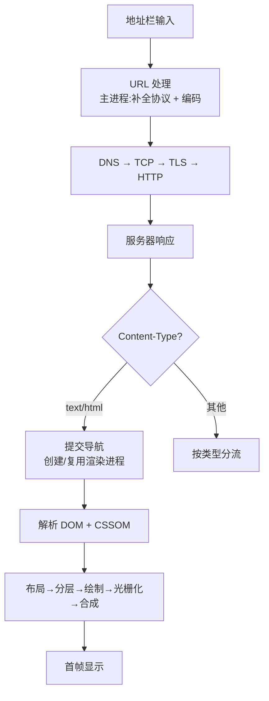

# 2.2 导航与资源加载(URL → 首帧)

> 卷:卷二 · 浏览器工作原理
> 阅读时间:25min

---

## 引言:一道必考题,一条完整链路

"从输入 URL 到页面显示"是前端第一高频面试题。要拿下它,除了主线链路,还要补三个"深层细节":导航提交机制、`DOMContentLoaded`/`load` 时序、HTML 解析器的容错。

---

## 一、总览



---

## 二、阶段要点

### 1. URL 处理(主进程):补全、编码、交网络进程

### 2. 网络请求(网络进程):DNS→TCP→TLS→HTTP

### 3. 解析响应(按 Content-Type 分流)

| `Content-Type` | 动作 |
|----------------|------|
| `text/html` | 提交导航,启动渲染进程 |
| `text/css` | 样式表 |
| `application/javascript` | JS 执行 |
| `image/*` | 图片 |
| `application/octet-stream` / `attachment` | 下载 |

---

## 三、深层细节一:提交导航(Commit Navigation)

`Content-Type: text/html` 到达后,浏览器主进程会**发起一个"提交导航"**,创建**新的渲染进程**(或复用同站点进程),把 HTML 数据交过去。**提交导航前后是分水岭:**

- **提交前**:页面还在"旧文档",地址栏可能已显示新 URL,但旧页面仍可交互
- **提交后**:渲染进程开始解析 HTML,`window`/`document` 换成新文档

> 这解释了"为什么切换页面时,旧页面不是瞬间消失"——因为从发起到"提交导航"这段网络时间,旧页面仍在位。

---

## 四、深层细节二:解析阻塞与事件时序

- `<link>`(CSS)→ 异步下载,**不阻塞解析**,但 CSS 未就绪**阻塞渲染**
- `<script>`(JS)→ **阻塞解析**(除非 async/defer)

会带出两个**关键事件**:

| 事件 | 触发时机 |
|------|---------|
| `DOMContentLoaded` | DOM 树解析完成(同步脚本执行完,`defer` 也在此前执行) |
| `load` | 所有资源(图片/CSS 等)加载完毕 |

```html
<script src="a.js"></script>           <!-- 同步,阻塞 -->
<script src="b.js" defer></script>     <!-- 不阻塞,DC L 前按序执行 -->
<script src="c.js" async></script>     <!-- 不阻塞,下载完乱序执行 -->
```

> 面试话术:同步脚本阻塞解析 **→** `DOMContentLoaded` 延后;CSS 阻塞渲染但不阻塞 DOM 构建;`load` 要等全部子资源。

**预加载扫描器(Preload Scanner):**

HTML 主解析器逐步构建 DOM 的同时,浏览器还有一条**预加载扫描器**在**提前扫描 HTML 文本**,尽早发现 `<link>`/``/`<script>` 等资源并**提前发起请求**——不等主解析器走到那里。

- 效果:资源加载与 DOM 解析**并行**,首屏更快
- 局限:它只扫"**静态写死**"的资源;JS 动态插入的(`document.createElement('script')`)扫不到

---

## 五、深层细节三:HTML 解析器的"容错"

HTML 解析器**极其宽容**(不同于严格的 XML),能自动修复错误 DOM:

```html
<p>第一段          <!-- 忘记闭合 p -->
<p>第二段
<table>            <!-- 缺失的 tbody 会自动补 -->
  <tr><td>单元格
</table>
```

> **为什么 HTML 要容错?** Web 是用"宽容"换"鲁棒":海量早期网页都不规范,若像 XML 一样遇错即停,你半个互联网都打不开。这是 HTML 规范(WHATWG)明确要求的**错误恢复算法**——也解释了为什么 `<p>` 自动闭合、`<tbody>` 自动补、乱嵌套会被纠错。

---

## 六、面试答题的层次

> "输入 URL 后:主进程补全编码 → 网络进程 DNS→TCP→TLS→HTTP → 按 Content-Type 分流,text/html **提交导航**到渲染进程 → 渲染主线程解析 DOM/CSSOM(JS 阻塞解析、CSS 阻塞渲染)→ 样式计算、布局、分层、绘制、光栅化、合成,最终显示;期间 `DOMContentLoaded`(DOM 就绪)先于 `load`(资源全齐)。"

能讲到"**进程分工 + 提交导航 + 解析阻塞 + 事件时序**"几点,就远超 90% 答案。

---

## 七、小结

```
URL → 主进程(编码)→ 网络进程(DNS→TCP→TLS→HTTP→响应)
    → Content-Type 分流(text/html → 提交导航,创建渲染进程)
    → DOM+CSSOM(JS 阻塞解析,CSS 阻塞渲染,HTML 解析器容错)
    → 布局→分层→绘制→光栅化→合成→显示
事件:DOMContentLoaded(DOM 就绪)< load(资源全齐)
```

**DevTools 里看资源加载与阻塞:**

1. **Network 面板**:看每个资源的水柱图(排队→DNS→连接→等待→下载各阶段耗时),定位慢资源
2. **Performance 录制**:看主线程上 "Parse HTML" 被哪些脚本阻塞,以及 DOMContentLoaded / load 的触发时刻
3. **Network 里看阻塞**:对比 `<script>` 加 `defer` 前后,DOMContentLoaded 的时间差

> 实操:给一个 `<script src>` 分别用同步/`defer`/`async`,看 Network 水柱图和 DOMContentLoaded 时间的变化,就能直观理解"阻塞解析"。

---

## 八、面试题

**Q1:`defer` 和 `async` 的区别?**

`defer`:异步下载,`DOMContentLoaded` 前按文档顺序执行(保证顺序);`async`:下载完立刻执行,顺序不定。两者都不阻塞解析(async 执行瞬间短暂阻塞)。

**Q2:为什么 `<script>` 放 `</body>` 前能"更快看到页面"?**

同步 script 阻塞 DOM 解析:放 head 等下载+执行完才渲染 body;放底部先解析渲染完结构再执行。现代更优:`defer` + head。

**Q3:`DOMContentLoaded` 和 `load` 的区别?各自何时触发?**

`DOMContentLoaded`:DOM 树解析完成即触发(同步/defer 脚本已执行);`load`:**所有资源**(图片、CSS、iframe)加载完才触发,更晚。前者适合"DOM 就绪即可干"的初始化,后者适合"全资源就绪"。

**Q4:为什么 HTML 解析器要"容错",而不是像 XML 严格?**

因为海量历史网页不规范,严格解析会大面积报错打不开。HTML 规范因此内置**错误恢复算法**(自动闭合、补 tbody 等),用"宽容"换"鲁棒",保证任何网页都能尽力渲染。

**Q5:从输入 URL 到旧页面消失,中间为什么还有一段"旧页面仍在"?**

因为"网络往返(提交导航前)"这段,新页面还没到渲染进程,旧页面仍是当前文档、可交互。只有 `Content-Type: text/html` 到达并**提交导航**后,旧文档才被替换——这是"导航提交"机制的直接体现。

**Q6:为什么中文 URL 能正常访问?**

浏览器对非 ASCII 字符做了**百分号编码(URL 编码)**,把中文转成 `%XX` 的 ASCII 形式再发请求——这是主进程在地址栏后干的第一件事。

---

📎 参考:Chrome Developers《Page Lifecycle》《导航》、[MDN《script》](https://developer.mozilla.org/zh-CN/docs/Web/HTML/Element/script)《DOMContentLoaded》、[WHATWG HTML 解析规范](https://html.spec.whatwg.org/)

📎 权威延伸阅读:
- 《Inside look》(Part 2: Navigation)(Chrome Developers) https://developer.chrome.com/blog/inside-browser-part2/
- 《Populating the page: how browsers work》(MDN) https://developer.mozilla.org/zh-CN/docs/Web/Performance/How_browsers_work
- 《Page Lifecycle API》(MDN) https://developer.mozilla.org/zh-CN/docs/Web/API/Page_Visibility_API