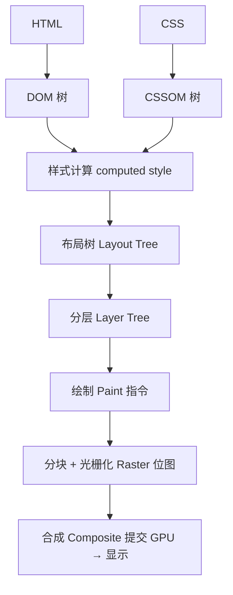

# 2.3 渲染管线详解

> 卷:卷二 · 浏览器工作原理
> 阅读时间:30min

---

## 引言:从两棵树到屏幕像素的流水线

渲染主流程不复杂,但每段都有易误解的细节。本章把每一段拆透,重点讲清「布局树≠DOM 树」「分层」「绘制≠像素」,并补三个深层细节:样式计算的来源、绘制的"指令"具体是什么、合成的"帧"怎么提交。

---

## 一、渲染管线六段



---

## 二、① DOM 树 & ② CSSOM 树

- DOM:解析 HTML 得到(结构);CSSOM:解析 CSS 得到(样式规则)
- 两者缺一不可:CSSOM 没就绪渲染得等("CSS 阻塞渲染"根源,2.2)

**关键渲染路径(Critical Rendering Path, CRP):**

首屏渲染的完整依赖链:**HTML→DOM,CSS→CSSOM,DOM+CSSOM→渲染树→布局→绘制→合成**。CRP 优化的核心是**缩短这条链**:

- **减少阻塞**:CSS 尽早就绪、JS 用 `async`/`defer`(2.2)
- **减少关键资源**:内联关键 CSS、延迟非关键 CSS/JS
- **减少往返**:关键资源走 HTTP/2 多路复用、CDN(4.3/4.4)

> 为什么叫"关键"?因为**只有这条链上的资源会影响首屏时间**——非关键资源(图片、非首屏 JS)不该阻塞它。这是性能优化里"加载"与"渲染"的桥(呼应 [10.2](/卷十-性能优化与工程质量/10.2-加载性能)/10.3)。

---

## 三、③ 样式计算(computed style)+ 布局树

**样式计算**:把 DOM 每个节点 + 所有匹配 CSS + 继承 + 默认值,合并成最终样式——就是卷三 3.5 的「属性计算过程」。DevTools 的 "Computed" 面板即产物。

**布局树(Layout Tree)三误区:**

> - `display:none` **不在布局树**;`::before/::after` **在**(DOM 里没有);`<head>`/`<script>` 不在
> - 布局树带**几何信息**(位置/尺寸)——这是"布局(layout)"的产物

---

## 四、④ 分层(Layer Tree)

```css
transform: translateZ(0);        /* 3D 变换 */
will-change: transform, opacity;
filter: blur(5px);
position: fixed / sticky;
video / canvas / iframe;
```

**为什么分层(深层)?** 把"高频变化的部分"独立成层,实现**独立重绘 + GPU 合成**:动画在专属层跑不影响其他层;滚动直接移图层位图。这是"用内存换渲染效率"的权衡——所以有 2.5 的"层爆炸"风险。

---

## 五、⑤ 绘制(Paint):指令不是像素

绘制的产物是**绘制指令(draw commands)**:画矩形、画文字、画圆角……按图层与 Z 序记录。这一步仍在**渲染主线程**。

**深层:指令具体长什么样?** 本质是告诉合成线程"**在哪个图层、按什么顺序、画什么**"的几何描述(类似 Canvas 的 `moveTo/lineTo/fill` 那套 draw operations)。到这一步,主线程工作完成,移交合成线程。

---

## 六、⑥ 光栅化 + 合成(交给合成线程/GPU)

```
合成线程 → 分块 Tiling → 多线程光栅化(指令→位图)→ 计算层级/滚动偏移 → 合成 Compositor Frame → 提交 GPU
```

**深层:合成产出的是"Compositor Frame"**——一个描述"各图层位图如何叠加、位置与区域如何"的数据结构,交给 GPU 进程最终上屏。滚动的本质就是**合成线程直接复用已光栅化位图、只改滚动偏移、重发一帧**,不动主线程。

**为什么"绘制"和"光栅化"要分开?** 绘制是**逻辑**(主线程,画什么);光栅化是**算力**(合成线程/GPU,转像素)。解耦换来:① 像素生成不占主线程;② 可**按视口分块、优先光栅化可见区**,滚到哪补哪。

---

## 七、小结

```
HTML→DOM + CSS→CSSOM →样式计算→布局树(仅可见+几何)→分层→绘制(指令)
→分块→光栅化(位图)→合成(Compositor Frame)→GPU 显示

三误区:布局树≠DOM;分层为性能;绘制≠像素
深层:绘制=draw commands;合成=Compositor Frame;滚动=合成线程改偏移重发帧
```

**DevTools 里怎么看渲染管线:**

1. **Performance 面板**:录制后看主线程轨道上的 **Layout / Paint / Composite** 各阶段耗时,以及合成线程的 **Raster** 块
2. **Layers 面板**:看页面被拆成了多少个图层(层爆炸的直观体现),点开某层看它的绘制区域
3. **Rendering 面板**:勾选"Paint flashing"实时看哪些区域在被重绘;勾选"Layer borders"看图层边界

> 实操:勾上 Paint flashing,滚动页面会看到绿色的重绘区域;用 Layers 面板看 `will-change: transform` 的元素是否被提升为独立图层。

**Q1:`display:none`、`visibility:hidden`、`opacity:0` 谁在布局树?**

`display:none` **不在**(不占位不渲染);`visibility:hidden` **在**(占位不可见);`opacity:0` **在**(占位,合成层处理,通常不触发 layout)。

**Q2:为什么说"绘制"和"光栅化"是两回事?**

绘制在主线程**生成绘制指令**(画什么、按什么顺序);光栅化在合成线程把指令**转成位图像素**。一个重逻辑、一个重计算,分离才能并行加速。

**Q3:如果动画只改 `opacity`,管线的哪一步会执行?**

只走**合成阶段**:布局、绘制都不重来,直接调图层透明度并合成,全程合成线程/GPU,主线程零参与——这是 transform/opacity 流畅的根本(2.5)。

**Q4:简述"滚动"在渲染管线里是如何高效实现的?**

滚动**不触发布局**:合成线程直接**复用已光栅化位图、只改变滚动偏移、重发一帧 Compositor Frame**。因为没布局变动,所以滚动在很多场景下主线程几乎无感。

**Q5:为什么把元素"提升为合成层"能加速动画,但也可能变慢?**

加速:动画只在独立层 + 合成线程跑,不动布局/不打扰其他层。变慢(层爆炸):层太多 → 位图内存暴涨、光栅化开销增加,甚至隐式提升雪球。所以只在真正的动画元素上用。

**Q6:从管线角度,为什么"首屏快"要减少 JS 阻塞 + CSS 尽早就绪?**

JS 阻塞 → DOM 树构建推迟(DOMContentLoaded 延后);CSS 未就绪 → 样式计算/渲染等 CSSOM 全卡。两者都会推迟"布局树→绘制→合成"这条链的启动,首屏随之变慢。

---

📎 参考:Google Web Fundamentals《渲染性能》、Chrome Developers《Inside look》渲染篇、chromium Compositor 文档

📎 权威延伸阅读:
- 《Critical rendering path》(web.dev) https://web.dev/articles/critical-rendering-path
- 《Rendering performance / The pixel pipeline》(web.dev) https://web.dev/articles/rendering-performance
- 《Inside look》(Part 3: Inner workings of a renderer)(Chrome Developers) https://developer.chrome.com/blog/inside-browser-part3/