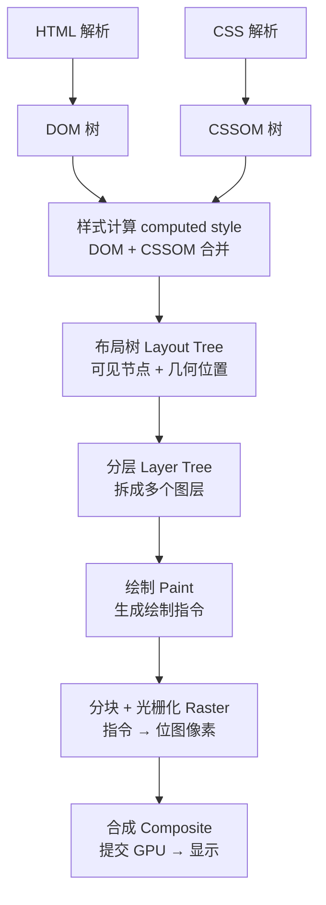

# 2.3 渲染管线详解

> 卷:卷二 · 浏览器工作原理
> 难度:⭐⭐⭐ 专家 | 阅读时间:30min | 状态:进行中

---

## 引言:从两棵树到屏幕像素的流水线

浏览器渲染的主流程并不复杂,但每一步都有容易被误解的细节。本章把每一段拆开讲透,重点讲清**「布局树 ≠ DOM 树」「分层」「绘制 ≠ 画像素」**这三个最容易被误解的环节,并解释每一步"为什么这么设计"。

---

## 一、渲染管线六段(总览)



---

## 二、① DOM 树 & ② CSSOM 树

- **DOM**:解析 HTML 得到,描述文档结构(标签嵌套关系)
- **CSSOM**:解析 CSS 得到,描述样式规则,含继承/层叠结果(卷三 3.5 的级联在这里生效)

> 两者缺一不可:CSSOM 没就绪,渲染就得等(这就是"CSS 阻塞渲染"的根源,见 2.2)。

---

## 三、③ 样式计算 + 布局树

**先做样式计算(computed style)**:把 DOM 每个节点,和所有匹配到的 CSS 规则 + 继承 + 默认值,合并成最终样式(即卷三 3.5 的「属性计算过程」)。你在 DevTools 的 "Computed" 面板看到的就是它。

**再生成布局树(Layout Tree)** —— 三个关键误区:

> **误区 1:布局树 ≠ DOM 树。** 布局树**只包含可见元素**:
> - `display: none` → **不在布局树**
> - `::before/::after` 等伪元素 → DOM 里没有,但**会在布局树**(它们可见)
> - `<head>`、`<script>` 等不可见节点 → 不在布局树

布局树里的每个节点,带上**几何信息**(位置 `x/y`、尺寸 `width/height`)——这就是"布局(layout/reflow)"这一步干的活。

---

## 四、④ 分层(Layer Tree)

为了性能,浏览器把页面拆成**多个图层**,每个图层**可以独立重绘/合成**,避免一处改动重画全页。

**哪些元素会单独成层(或"提升"为合成层)?**

```css
.elem {
  /* 以下任一都可能触发独立图层 */
  transform: translateZ(0);
  will-change: transform, opacity;
  filter: blur(5px);
  position: fixed / sticky; /* 视口滚动不重绘 */
  /* video、canvas、iframe 等也天然成层 */
}
```

> 注意:这是"**可能**"成层,由浏览器的层策略决定,不是写了就一定单独成层。

**为什么这样设计?**

> 把页面切层,是为了让"高频变化的部分"能**独立、并行地**重画:**动画在专属图层跑,不影响其他图层**;滚动时直接移动图层位图。否则任何一个像素变化都得重走整条管线。这是"用内存换渲染效率"的典型权衡(所以才有 2.5 说的"层爆炸"风险)。

---

## 五、⑤ 绘制(Paint):生成的是「指令」不是「像素」

绘制的产物**不是位图像素**,而是**一系列绘制指令**(在哪个位置画什么:画矩形、画文字、画圆角…)。这一阶段还在**渲染主线程**,它做的是"告诉合成线程在哪些图层、按什么顺序画什么"。

> 类比:`Canvas` 的 `ctx.moveTo / lineTo / fill` 也是"记录指令",最后才一次性渲染成像素——和这里的思路一致。

到这一步,**渲染主线程的工作就完成并移交**给合成线程了。

---

## 六、⑥ 光栅化 + 合成(交给合成线程/GPU)

```
合成线程收到指令
  → 分块(Tiling):把图层切成小方块
  → 分块分配给多个光栅化线程
  → 光栅化(Raster):把指令转成「位图」(真正的像素)
  → 合成线程计算各位图的层级/位置/滚动偏移
  → 提交 GPU 呈现
```

**为什么"绘制"和"光栅化"要分开?(关键设计)**

> 绘制是**逻辑**(画什么、按什么顺序),在主线程;光栅化是**算力**(把描述转像素),可交给合成线程 + GPU **并行**。这一步解耦,换来两个收益:① 像素生成不占用主线程,不影响 JS/布局;② 可以**按视口分块、优先光栅化可见区域**,滚到哪补哪,省内存、快首屏。

---

## 七、主线程 vs 合成线程:为什么能"并行"

```
渲染主线程 :DOM/CSSOM → 布局 → 分层 → 绘制(逻辑重)
合成线程   :分块 → 光栅化 → 合成(像素重,可并行、不碰 JS)
```

关键:**合成线程不碰 JS、不碰主线程**,所以只要某属性只影响"合成"阶段,就能**完全绕过主线程**——这正是 2.5 讲 `transform` 高效的底层原因。

---

## 八、小结

```
HTML ─▶ DOM ─┐
              ├─样式计算─▶ 布局树(仅可见,含伪元素/几何信息)
CSS  ─▶ CSSOM┘              │
                            ▼
              分层(transform/will-change 成层)→ 独立重绘/Gpu
                            ▼
              绘制(生成绘制指令,仍在主线程)→ 移交合成线程
                            ▼
              分块 → 光栅化(位图)→ 合成 → GPU 显示

三误区:布局树≠DOM(display:none 不在;伪元素在);
       分层为性能(独立重绘);
       绘制≠像素(是指令,像素来自光栅化)
为什么:分层=独立并行重绘;绘制/光栅化分离=像素生成不占主线程+按视口分块
```

---

## 九、面试题

**Q1:`display: none`、`visibility: hidden`、`opacity: 0` 三者,谁在布局树里?**

- `display: none`:**不在布局树**,不占位、不参与渲染
- `visibility: hidden`:**在布局树**,占位,只是不可见(不触发重绘)
- `opacity: 0`:**在布局树**,占位、可见性为 0,但仍在合成层处理,通常不触发布局

**Q2:为什么说"绘制"和"光栅化"是两回事?**

绘制是在主线程**生成绘制指令**(画什么、按什么顺序),产物是"描述";光栅化是在合成线程把指令**转成位图像素**,产物是"像素"。前者重逻辑,后者重计算,两者分离才能让合成线程并行、加速。

**Q3:如果一段动画只改 `opacity`,渲染管线会走到哪一步?**

只走到**合成阶段**:布局、绘制都不用重来。浏览器直接调整该图层的透明度并合成,全程在合成线程/GPU,主线程零参与——这就是 `transform/opacity` 动画流畅的原因(完整见 2.5)。

---

📎 参考:Google Web Fundamentals《渲染性能》、Chrome Developers《Inside look》之渲染篇