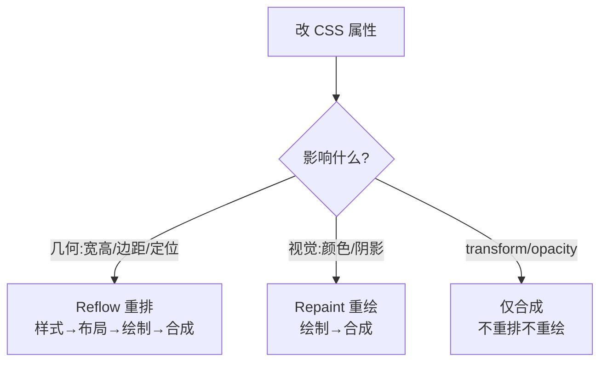

# 2.4 重排(Reflow)与重绘(Repaint)

> 卷:卷二 · 浏览器工作原理
> 阅读时间:25min

---

## 引言:改一行 CSS,要重跑多远

"重排/重绘"是性能核心:**重排代价远大于重绘**,优化就是让改动尽量停在流水线末端(合成)。要深挖,得懂"强制同步布局"的机制与浏览器的"脏标记 + 批处理"。

---

## 一、改动分级(一图)



**铁律:`reflow 一定 repaint`,反之不一定。** 几何变了像素必重画;改颜色只动像素不动布局。

---

## 二、什么触发重排

```css
width/height/padding/margin/border
top/left/right/bottom/position
font-size/line-height/display/float/overflow
```

**JS 陷阱:读"布局属性"强制同步重排:**

```js
el.style.width = "100px";
el.style.height = "50px";
const w = el.offsetWidth;   // 读!强制先重排
```

> `offsetWidth/offsetHeight/client*/scroll*/getBoundingClientRect/getComputedStyle` 都会**强制立即布局**。

---

## 三、底层机制:脏标记 + 批处理 + 强制同步布局

浏览器不是"你一写就立刻重排",而是有套机制:

1. **脏标记(dirty flag)**:改样式先标记"布局已脏",**缓到下一帧**统一计算
2. **批处理**:一轮变更合并,渲染时机(宏任务后、微任务清空后)统一重排一次
3. **强制同步布局(forced synchronous layout)**:一旦代码**读取**布局属性,浏览器**被迫立即清空脏标记、立刻重排**——这打断了批处理,是性能杀手

```js
// 触发强制同步布局的经典反例:读读写写交替
for (let i = 0; i < 100; i++) {
  el.style.width = i + "px";
  total += el.offsetWidth;   // 每次都强制立即重排 → 100 次重排
}
```

> **为什么读会强制重排?** `offsetWidth` 等返回的是"**当前**几何值",要拿到准确值就必须先把"脏的布局"算完——所以读 = 立刻算。这就是"读写分离"的底层依据。

---

## 四、减少重排/重绘的策略

1. **读写分离**:先读后写,避免交替强制重排
2. **批处理 DOM**:`DocumentFragment` / 拼字符串一次插入
3. **隐藏后操作**:`display:none` → 改 → 显示
4. **transform 代位移**:`translateY` 替代 `top/left`
5. **动画选合成属性**:`transform/opacity`
6. **will-change 预告**(别滥用防层爆炸)
7. **`requestAnimationFrame`**:把读写错开到渲染前

---

## 五、框架为什么发明 vDOM

vDOM + Diff **批量更新真实 DOM**:先算差异,再**一次性**打最小变更——本质"**把多次重排合并成一次(或尽量少次)**"。

---

## 六、小结

```
改动分级:几何(重排)> 视觉(重绘)> 合成(transform/opacity)
底层:脏标记 + 批处理 + 强制同步布局(读即算)
陷阱:读 offsetWidth 等强制重排;读写作交替 → N 次重排
优化:读写分离/离线DOM/transform/动画合成属性/rAF 错开读写
```

---

## 七、面试题

**Q1:力同步重排是什么?举一个触发它的代码?**

改样式后**读布局属性**(`offsetWidth`/`clientWidth`/`getBoundingClientRect` 等)会迫使浏览器**立即完成一次重排**以返回准确值,打断批处理。例:循环里 `el.style.width=...; el.offsetWidth;` 反复交替读写。

**Q2:为什么动画用 transform 比 left 流畅?**

`left` 是布局属性,改它重排(样式→布局→绘制→合成),占主线程;`translateX` 只影响合成,合成线程/GPU 完成,不碰主线程、不重排(2.5)。

**Q3:`display:none` 的元素如何做显隐动画?**

`display` 无法过渡(离散),用 `opacity + visibility` 组合保留过渡;或现代 `@starting-style` 支持 `display:none` 过渡。

**Q4:浏览器何时执行"重排"?是每次写样式都重排吗?**

不是。浏览器用**脏标记 + 批处理**:改样式先标脏,缓到一帧的渲染时机(宏任务后、微任务清空后)统一重排。只有**读布局属性**才触发"强制同步重排"立即算。

**Q5:为什么"读写分离"能减少重排?**

写样式只标脏(批量合并);读布局属性会**强制立即重排**。若读写交替,每次读都打断批处理、立刻重排一次(读 N 次 → 重排 N 次);把读集中、写集中,就只剩"一次读时算一次 + 一次最终重排"。

**Q6:如何用 DevTools 定位"布局抖动(layout thrashing)"?**

Performance 录制 → 看主线程的 **Layout/Recalculate Style** 是否高频穿插,或直接看出现了多少紫色 Layout 块;具体点开调用栈定位到"读写交替"的代码。

---

📎 参考:Google Web Fundamentals《避免大型复杂布局与布局抖动》、MDN《Reflow》

📎 权威延伸阅读:
- 《Avoid large, complex layouts and layout thrashing》(web.dev) https://web.dev/articles/avoid-large-complex-layouts-and-layout-thrashing
- 《Rendering performance》(web.dev) https://web.dev/articles/rendering-performance
- 《Reflow / Repaint》(MDN Glossary) https://developer.mozilla.org/zh-CN/docs/Glossary/Reflow