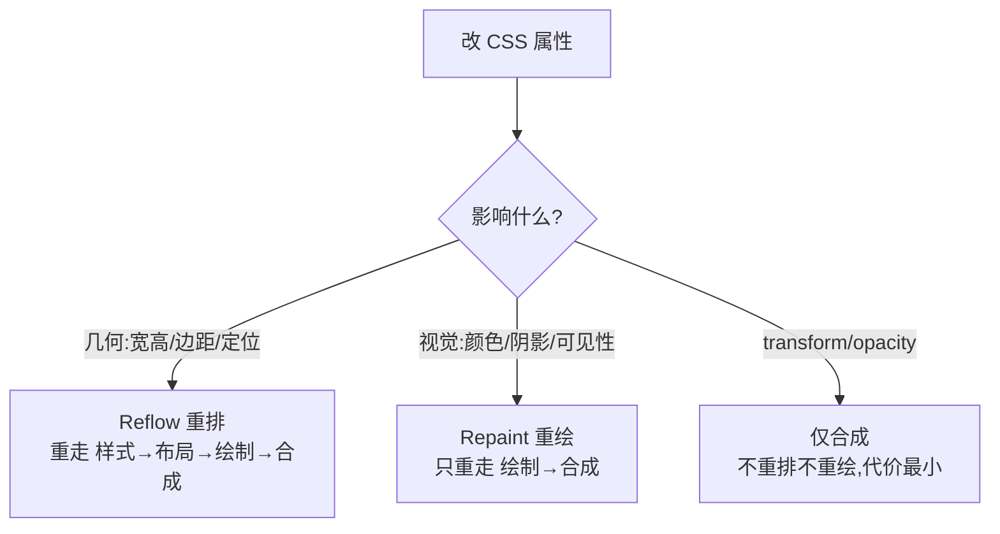

# 2.4 重排(Reflow)与重绘(Repaint)

> 卷:卷二 · 浏览器工作原理
> 难度:⭐⭐ 进阶 | 阅读时间:20min | 状态:已深化

---

## 引言:改一行 CSS,要重跑多远

"重排/重绘"是性能优化核心概念。一句话:**重排代价远大于重绘**,优化就是让改动尽量停在流水线末端(合成),别往回倒带。

---

## 一、改动分级(一图)



| | 重排 Reflow | 重绘 Repaint |
|---|-------------|--------------|
| 触发 | 改几何信息 | 只改外观 |
| 代价 | **高**(全链路) | 较低(绘制→合成) |

**铁律:`reflow 一定 repaint`,反之不一定。**

**为什么 reflow 必触发 repaint?** 几何变了(位置/尺寸),像素必然要重新画;但改颜色只影响像素不动布局,所以只 repaint 不 reflow。

---

## 二、什么触发重排

```css
width/height/padding/margin/border
top/left/right/bottom/position
font-size/line-height/display/float/overflow
```

**JS 陷阱:读"布局属性"强制同步重排(强制回流):**

```js
el.style.width = "100px";
el.style.height = "50px";
const w = el.offsetWidth;   // 读!浏览器必须先立刻重排
const h = el.offsetHeight;  // 又一次读 → 又重排
```

> `offsetWidth/offsetHeight/offsetTop/client*/scroll*/getBoundingClientRect/getComputedStyle` 都会强制立即完成布局,把"批处理"拆成多次。

---

## 三、减少重排/重绘的策略

1. **读写分离**:先读后写,避免读写交叉
2. **批处理 DOM**:`DocumentFragment` / 拼字符串一次性插入
3. **隐藏后操作**:`display:none` → 改 → 显示(只重排两次)
4. **transform 代位移**:`translateY` 替代 `top/left`
5. **动画选合成属性**:`transform/opacity`
6. **will-change 预告**:预提升合成层(别滥用,防层爆炸)

---

## 四、框架为什么发明 vDOM

Vue/React 用 vDOM + Diff **批量更新真实 DOM**:先在新旧 vDOM 算好差异,再**一次性**打最小变更到真实 DOM——本质是"**把多次重排合并成一次(或尽量少次)**"。

---

## 五、小结

```
改动分级:几何(重排,代价最高)> 视觉(重绘)> 合成(transform/opacity)
陷阱:读 offsetWidth 等会强制同步重排
优化:读写分离/离线DOM/transform代位移/动画选合成属性
```

---

## 六、面试题

**Q1:哪些操作会触发强制同步重排?如何避免?**

读 `offsetWidth/offsetHeight/clientWidth/scrollTop/getBoundingClientRect/getComputedStyle` 会强制立即布局。避免:读集中、写分离;或用 `requestAnimationFrame` 错开读写。

**Q2:为什么动画用 transform 比 left 流畅?**

`left` 是布局属性,改它**重排**(样式→布局→绘制→合成全流程),占主线程;`translateX` 只影响**合成**,合成线程/GPU 独立完成,不碰主线程、不重排。(详见 2.5)

**Q3:`display:none` 的元素如何做显隐动画?**

`display` 无法过渡(离散属性),用 `opacity + visibility` 组合:`opacity:0; visibility:hidden` → 过渡到显示,保留合成层动画。现代也支持 `@starting-style` 处理 `display:none` 过渡。

---

📎 参考:Google Web Fundamentals《避免布局抖动》、卷二 2.5