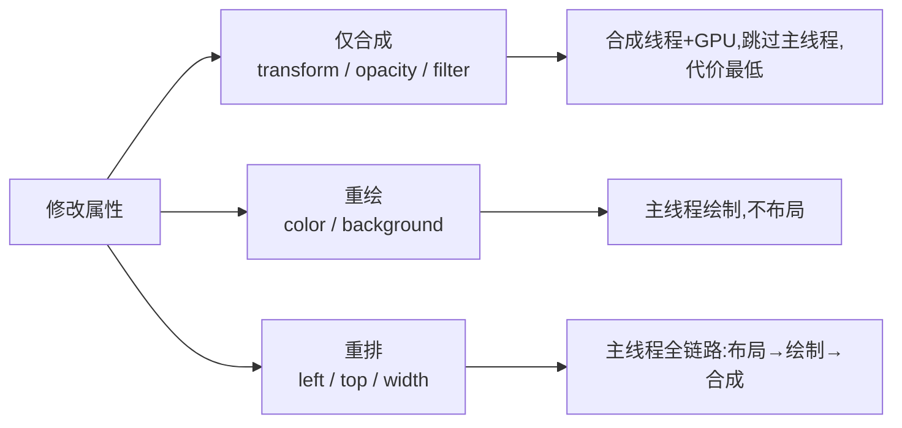

# 2.5 合成与 GPU 加速

> 卷:卷二 · 浏览器工作原理
> 难度:⭐⭐⭐ 专家 | 阅读时间:20min | 状态:深度增强

---

## 引言:为什么 transform 能"不重排不重绘"还快

`transform`/`opacity` 只在合成线程完成。这是做流畅动画、优化滚动的核心武器,也是"合成层"双刃剑的正确用法。要深挖,得懂"层提升"与"Compositor Frame"的机制。

---

## 一、属性代价分级(一图)



| 属性 | 阶段 | 主线程 | 代价 |
|------|------|--------|------|
| `left/top` | 布局→绘制→合成 | ✅ | 高 |
| `color` | 绘制→合成 | ✅ | 中 |
| `transform/opacity` | **仅合成** | ❌ | **最低** |

---

## 二、为什么 transform/opacity 能绕过主线程(深层)

- 它们只改变"**像素的几何变换/透明度**",不改变布局几何、不改变内容
- 因此被设计成只在合成阶段处理,而合成线程**不碰 JS/布局**、可独立并行
- 产物是 **Compositor Frame**:各图层位图 + 变换/透明度/层级,交 GPU 上屏

> 所以改 `transform: translateX(10px)`,只是"重发一个带新偏移的 Compositor Frame",**布局、绘制、甚至主线程都不动**。

---

## 三、层提升(Layer Promotion)的判定

```css
transform: translateZ(0);        /* 3D 变换 */
will-change: transform, opacity; /* 显式预告 */
filter / backdrop-filter;
video / canvas / iframe;
position: fixed / sticky;
```

**深层:层提升为什么经常伴随"新的层叠上下文/包含块"?** 一个元素被提升为合成层,常需**独立的绘制与定位基准**(重算包含块,见 3.2),所以 `transform`/`filter` 会"劫持"后代的包含块——这就是 3.2 里"transform 偷走 fixed 包含块"的底层原因。

---

## 四、双刃剑:层爆炸

- 每层要独立**位图内存**,层越多内存越大
- 每层要独立**光栅化**,层巨多/超大反而拖慢
- **隐式提升**:一层被提升,重叠元素可能被连带提升 → 雪球式"层爆炸"

**合理用法**:只给真正会动的元素;动画结束移除 `will-change`;DevTools→Layers 面板测图层数量/内存再优化。

---

## 五、小结

```
属性分级:left/top(布局)> color(绘制)> transform/opacity(仅合成)
深层:仅合成=重发 Compositor Frame,不动布局/绘制/主线程
层提升:transform/will-change/filter/video/sticky
风险:层爆炸(内存↑光栅化↑)→ 只给必要元素,先测再优化
```

---

## 六、面试题

**Q1:`will-change` 是什么?为什么不能滥用?**

提前告诉浏览器"该元素即将变化",使其**预提升合成层**,动画开始不卡顿。不能滥用:长期占用图层内存,大量使用导致层爆炸、内存飙升;应只在即将动画的元素上、结束后移除。

**Q2:滚动性能为什么推荐"合成层滚动"而非 JS 改 top?**

原生滚动在合成线程直接移位图、重发 Compositor Frame,不动布局;JS 在 `scroll` 里改 `top/left` 会触发一串重排。正确:原生滚动 + `position: sticky`/`transform`。

**Q3:一个元素动画只改 `opacity`,会触发布局和绘制吗?**

不会。`opacity` 是纯合成属性,只重发 Compositor Frame,布局、绘制都不重来,全程合成线程+GPU。

**Q4:为什么有时候"给元素加 transform 后,里面 fixed 定位的元素跑偏了"?**

transform 会让元素**成为合成层并建立新的包含块**(见 3.2),内部 `fixed` 后代改以它为参照,不再相对视口,于是"跑偏"。这是层提升与包含块机制的联动。

**Q5:如何判断一个页面是否"层爆炸"?**

DevTools → **Layers** 面板,看合成层数量与各层内存。若图层异常多、大量元素被隐式提升(尤其一堆 `will-change`),就是层爆炸信号;据此清理无必要的 `will-change`/`translateZ(0)`。

**Q6:`will-change` 和直接写 `transform: translateZ(0)` 都能提升层,有何区别?**

后者是"**持续**"把元素固定成层(一直占用内存);`will-change` 是"**预告**"即将变化(浏览器按需预提升),更适合"动画期间开、结束关"。工程上 `will-change` 更可控。

---

📎 参考:Google Web Fundamentals《合成与绘制》、Chrome DevTools Layers 文档、chromium Compositor 文档