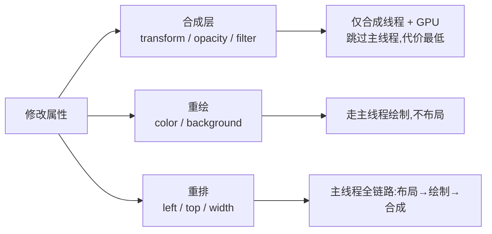

# 2.5 合成与 GPU 加速

> 卷:卷二 · 浏览器工作原理
> 难度:⭐⭐⭐ 专家 | 阅读时间:20min | 状态:已深化

---

## 引言:为什么 transform 能"不重排不重绘"还快

`transform`/`opacity` 只在合成线程完成。这是前端做流畅动画、优化滚动的**核心武器**,也是"合成层"这把双刃剑的正确用法。

---

## 一、属性代价分级(一图)



| 属性 | 阶段 | 主线程 | 代价 |
|------|------|--------|------|
| `left/top` | 布局→绘制→合成 | ✅ | 高(重排) |
| `color` | 绘制→合成 | ✅ | 中(重绘) |
| `transform/opacity` | **仅合成** | ❌ | **最低** |

> 这就是 transform 高效的底层答案:**跳过布局和绘制,直接在合成线程 + GPU 完成,且能和主线程并行。**

---

## 二、哪些属性"只影响合成"

```css
transform      /* 位移/缩放/旋转 */
opacity        /* 透明度 */
filter         /* 滤镜(部分) */
```

**为什么 transform/opacity 能绕过主线程?** 它们只改变"像素的几何变换或透明度",不改变布局几何、不改变内容,因此被设计成只在合成阶段处理——合成线程不碰 JS、不碰布局,可独立并行。

---

## 三、合成层(Layer)的判定

```css
transform: translateZ(0);        /* 3D 变换 */
will-change: transform, opacity; /* 显式预告 */
filter / backdrop-filter;
video / canvas / iframe;
position: fixed / sticky;
```

提升为合成层后,**该元素的重绘/动画可独立进行**,不打扰其他图层。

---

## 四、双刃剑:层爆炸

"合成层性能好" ≠ "无脑 `will-change: transform`"。

- 每个图层要**独立位图内存**,层越多内存越大
- 每个图层要**独立光栅化**,层巨多/超大反而拖慢
- **隐式提升**:一个层被提升,重叠元素可能被连带提升 → 雪球式"层爆炸"

**合理用法**:只给真正会动的元素;动画结束移除 `will-change`;用 DevTools→Layers 面板测量图层数量/内存再优化。

---

## 五、小结

```
属性分级:left/top(布局)> color(绘制)> transform/opacity(仅合成)

合成层触发:transform/will-change/filter/video/sticky
好处:独立重绘、动画不打扰其他层、跳过主线程
风险:层爆炸(内存↑,光栅化↑)→ 只给必要的,先测再优化
```

---

## 六、面试题

**Q1:`will-change` 是什么?为什么不能滥用?**

提前告诉浏览器"该元素即将变化",使其**预提升合成层**,动画开始不卡顿。不能滥用:长期占用图层内存,大量使用导致层爆炸、内存飙升;应只给即将动画的元素,结束后移除。

**Q2:滚动性能为什么推荐"合成层滚动"而非 JS 改 top?**

原生滚动在合成线程直接移动位图,不动布局;JS 在 `scroll` 里改 `top/left` 会触发一串重排(主线程),卡顿。正确:交给原生滚动 + `position: sticky`/`transform`。

**Q3:一个元素的动画只改 `opacity`,会触发布局和绘制吗?**

不会。`opacity` 是纯合成属性,直接调整该图层透明度并合成,布局、绘制都不重来,全程合成线程 + GPU——所以 `transform/opacity` 动画最流畅。

---

📎 参考:Google Web Fundamentals《合成与绘制》、Chrome DevTools Layers 文档